# Ember: Prayer, Plan of Life, and preserving Catholic heritage

> A beautiful companion for the Catholic life of prayer — helping souls grow in holiness, one day at a time.

**We need your help!** We're preserving and translating the Catholic literary tradition — spiritual classics, Church Fathers, liturgical texts — and making it all free and open. You can help by [sponsoring the project](https://github.com/sponsors/gustavo-depaula), contributing translations, or even running our AI-assisted pipeline with your own tokens. See the [content pipeline](docs/content/PIPELINE.md) for what's published, what's in progress, and how to get involved.

<table>
  <tr>
    <td align="center">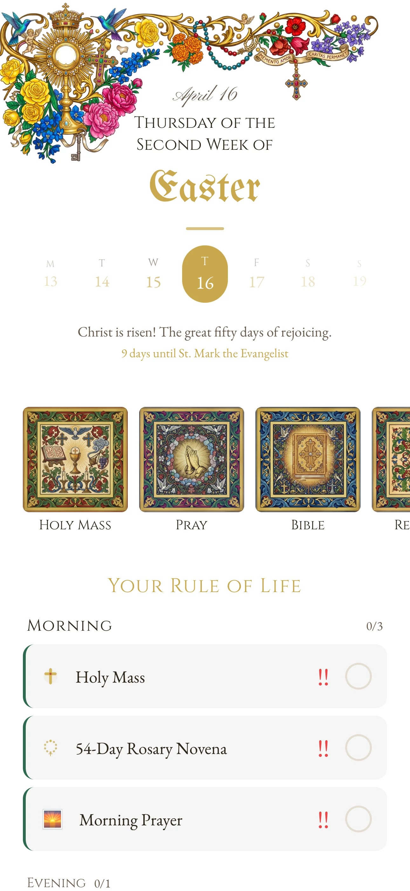<br><sub>Easter</sub></td>
    <td align="center">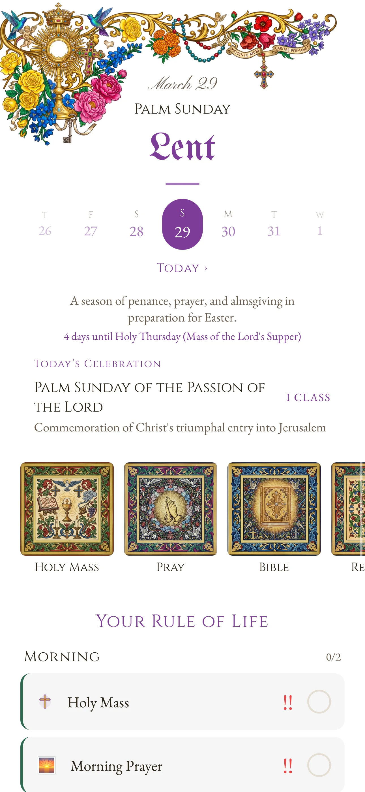<br><sub>Lent</sub></td>
    <td align="center">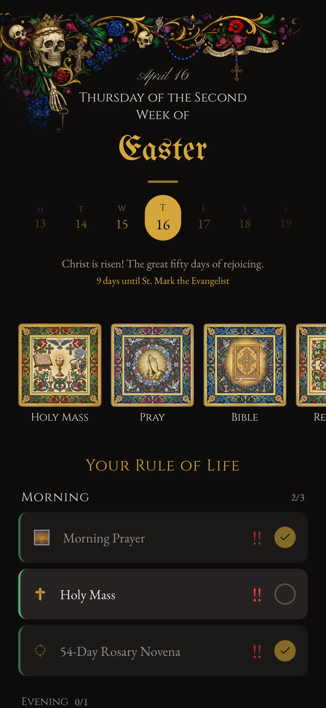<br><sub>Dark mode</sub></td>
    <td align="center">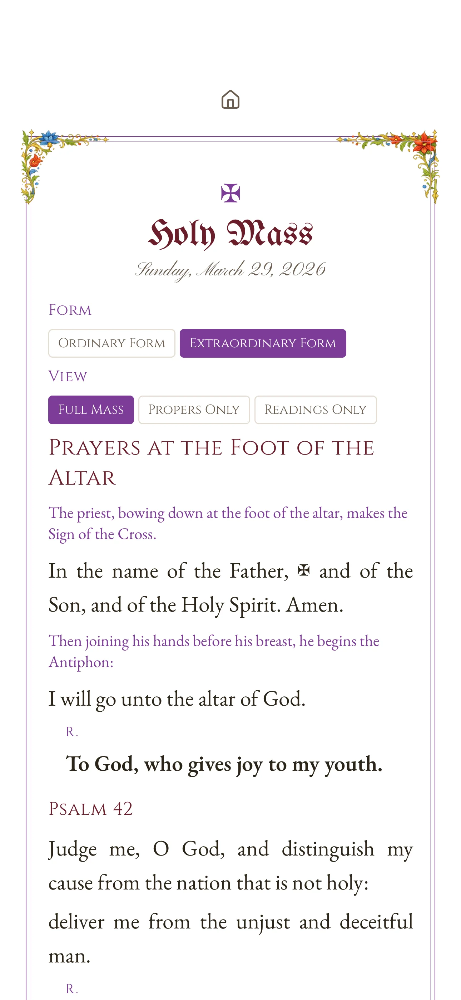<br><sub>Holy Mass (EF)</sub></td>
  </tr>
  <tr>
    <td align="center">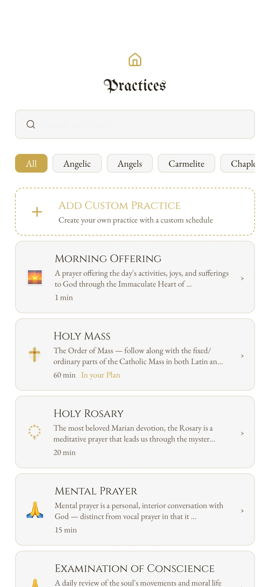<br><sub>Practices</sub></td>
    <td align="center">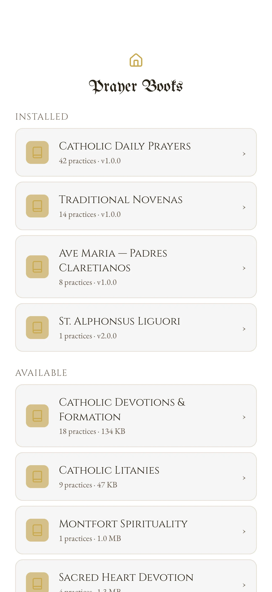<br><sub>Browse</sub></td>
    <td align="center">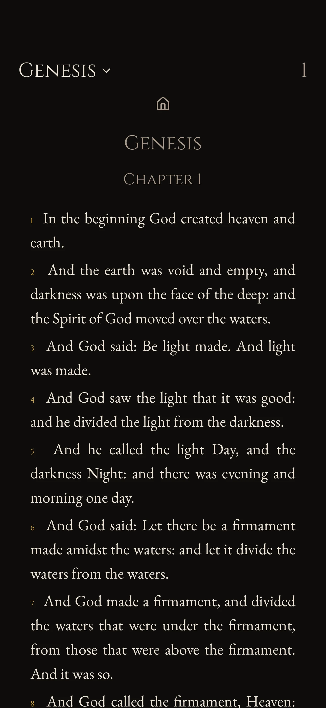<br><sub>Bible</sub></td>
    <td align="center">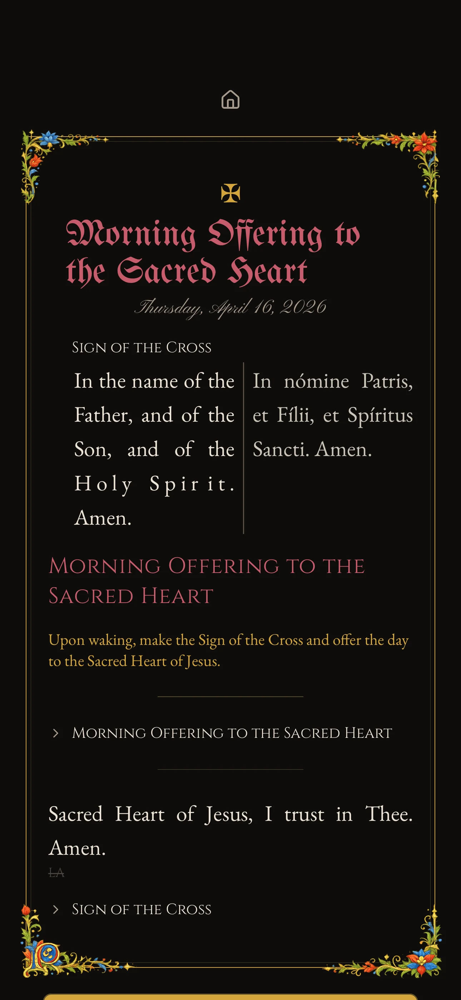<br><sub>English + Latin</sub></td>
  </tr>
</table>

---

## What is Ember?

Ember is a free, open-source Catholic prayer app that meets you where you are — from first steps in prayer to deep devotion — and walks with you daily.

Available on iOS, Android, and the web.

### Build and keep your rule of life

The heart of Ember. Build a structured daily rhythm of prayer — a Plan of Life — and track your fidelity over time. Morning Offering, Rosary, Angelus, Divine Office, Mass, Lectio Divina, Examination of Conscience... an open content corpus covers the breadth of Catholic devotional life, with offline pinning for the practices and books you keep close.

<table>
  <tr>
    <td align="center">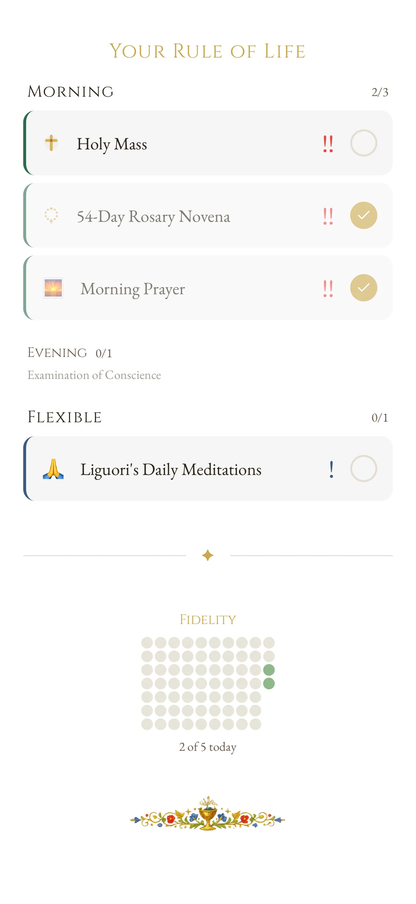<br><sub>Daily checklist</sub></td>
    <td align="center">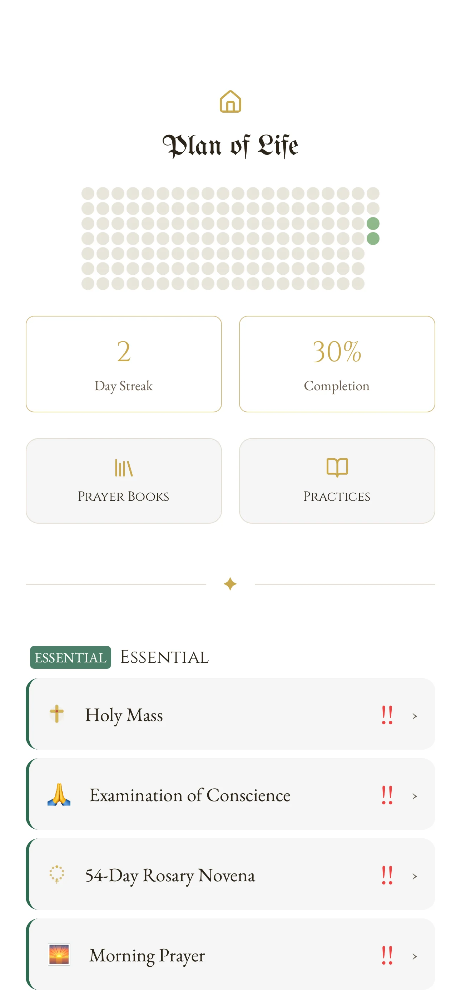<br><sub>Fidelity wall & stats</sub></td>
    <td align="center">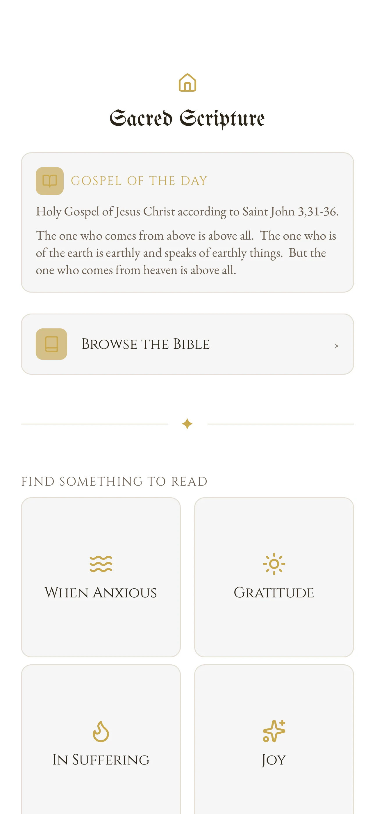<br><sub>Gospel of the Day</sub></td>
  </tr>
</table>

### Preserve and share 2,000 years of Catholic heritage

Ember is also a platform for the Catholic literary tradition — spiritual classics, Church Fathers, formation guides, liturgical texts, hagiographies — translated into multiple languages, structured in open formats, and freely available for anyone to use, extend, and build upon. Authors in the corpus already include St. Alphonsus Liguori and St. Louis de Montfort, with many more to come.

The fruits of Catholic tradition should be freely available to all. No one should own what belongs to the Church and to humanity. This translation work is ongoing and needs support — if you believe in preserving Catholic heritage in the open, consider sponsoring the project.

<table>
  <tr>
    <td align="center">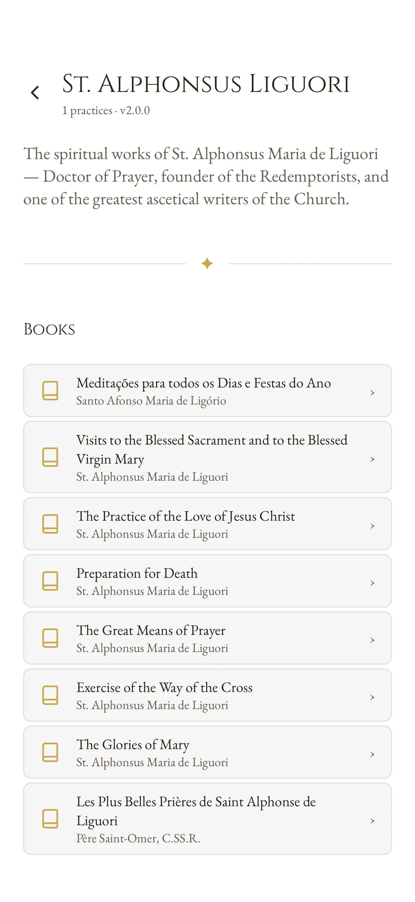<br><sub>Liguori works</sub></td>
    <td align="center">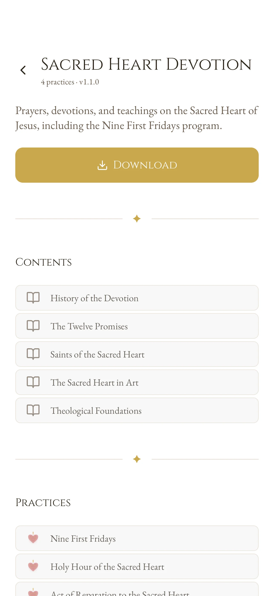<br><sub>Devotion collection</sub></td>
    <td align="center">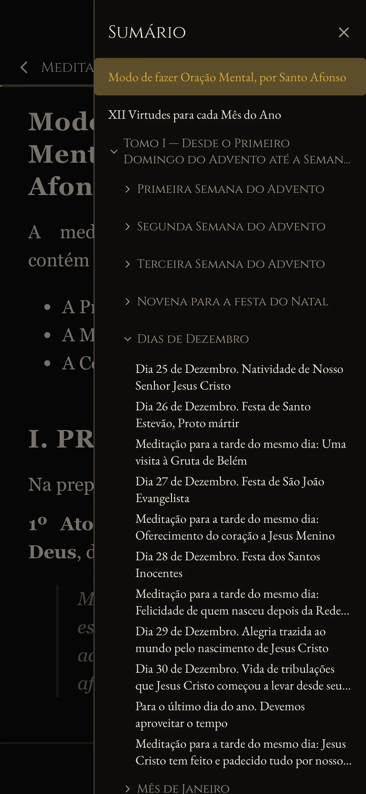<br><sub>Book reader</sub></td>
    <td align="center">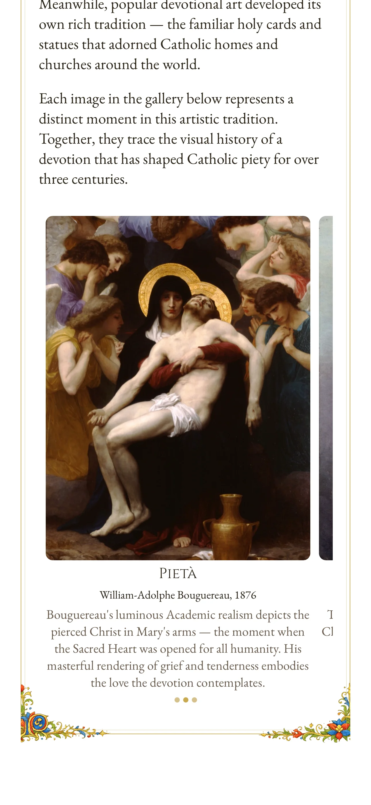<br><sub>Sacred art</sub></td>
  </tr>
</table>

### A practice-agnostic prayer engine

Practices are defined in pure JSON — no app code needed. A flexible flow DSL with primitives like `select`, `repeat`, `cycle`, and `proper` can describe anything from a three-line Guardian Angel prayer to a 33-day consecration program to the complete Mass with daily EF/OF propers. Adding a new practice means writing content files, not code.

All content is open and lives in this repo as plain JSON and Markdown — practices, prayers, books, and collections. Anyone can contribute their own prayer traditions by opening a pull request; the next deploy hashes the new content into the Hearth corpus and ships it to every user.

<table>
  <tr>
    <td align="center"><br><sub>Holy Mass (EF)</sub></td>
    <td align="center"><br><sub>Morning Offering</sub></td>
    <td align="center">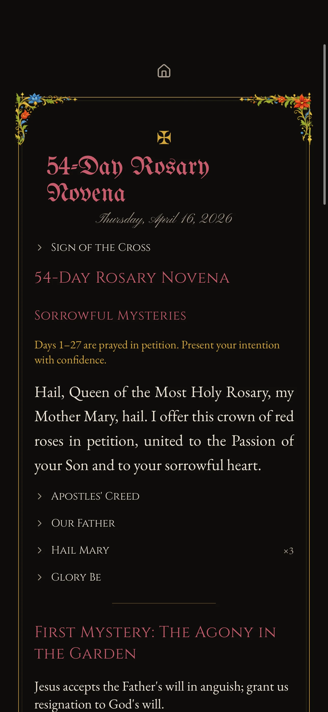<br><sub>54-Day Rosary Novena</sub></td>
    <td align="center">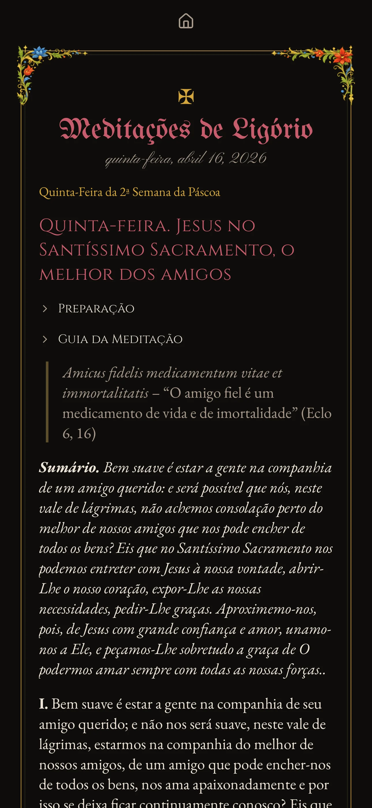<br><sub>Daily meditation (PT-BR)</sub></td>
  </tr>
</table>

### Beautiful, devotional, and engaging

An illuminated manuscript aesthetic — ornamental dividers, gold accents, curated serif typography — because prayer deserves beauty. Collectible holy cards earned through sustained practice carry real hagiographic content — not trophies, but introductions to holy lives that inspire your own. Liturgical seasons shape the app's mood with seasonal theming and daily saint commemorations.

<table>
  <tr>
    <td align="center"><br><sub>Our Lady of Fatima</sub></td>
    <td align="center"><br><sub>St. Michael</sub></td>
    <td align="center"><br><sub>St. Joseph</sub></td>
  </tr>
  <tr>
    <td align="center">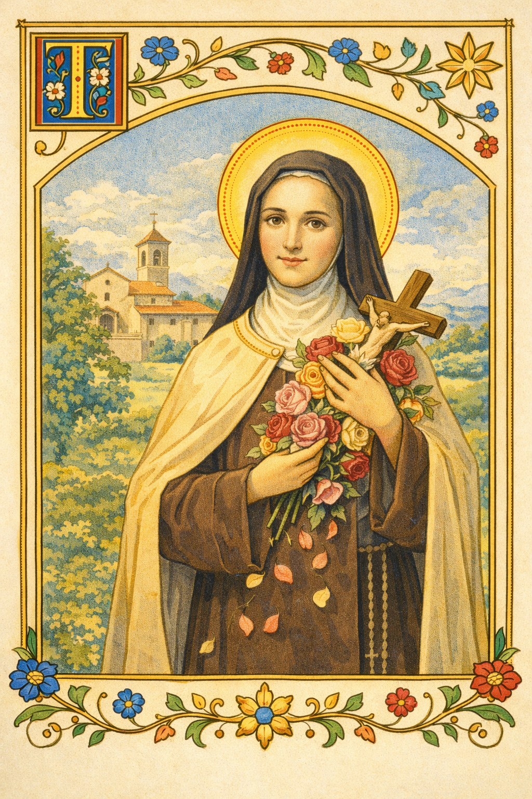<br><sub>St. Therese of Lisieux</sub></td>
    <td align="center">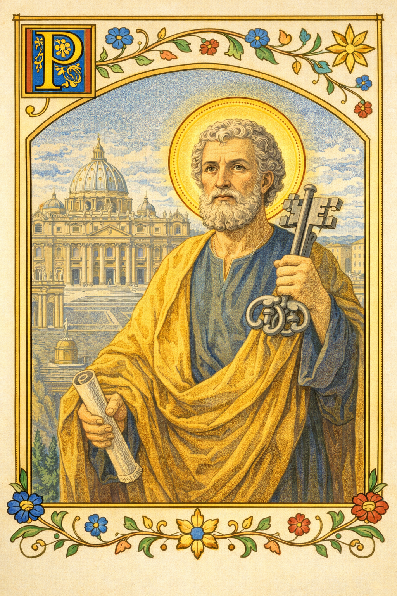<br><sub>St. Peter</sub></td>
    <td align="center">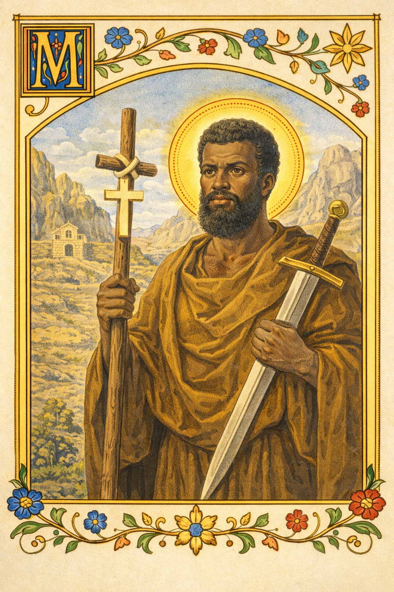<br><sub>St. Moses the Black</sub></td>
  </tr>
</table>

---

## Features

- **Plan of Life** — tier-based daily checklist, multi-hue fidelity wall, streaks, time blocks, notifications
- **Content Corpus** — content-addressed Hearth corpus of practices, prayers, books, and chapters; opened directly in `/browse`, pinned for offline use
- **Flow Engine** — a flexible DSL that describes any prayer from a simple devotion to the Mass
- **Bible Reader** — bundled Douay-Rheims (73 books) + online translations via Bolls.life
- **Catechism Reader** — full CCC (2,865 paragraphs) with 5-level collapsible TOC
- **Mass (Ordo Missae)** — complete ordinary (OF + EF), daily EF propers, OF propers (PT-BR complete, EN readings)
- **Book Reader** — long-form prose with CSS column pagination
- **Liturgical Calendar** — OF + EF seasons, 347-entry sanctoral cycle, seasonal theming
- **Multilingual** — English + Brazilian Portuguese
- **Offline-first** — local storage only, no backend, no accounts

<!-- TODO: Add download/install links when available -->
<!-- ## Get Ember -->
<!-- - [Web](https://ember.dpgu.me) -->
<!-- - iOS (coming soon) -->
<!-- - Android (coming soon) -->

---

## Support the Mission

Ember and Salty are built in the open and dedicated to the public domain. The translation and preservation work — turning centuries of Catholic writing into structured, multilingual, freely available content — is an ongoing effort that needs sustained support.

If you believe this work matters, consider sponsoring the project.

[GitHub Sponsors](https://github.com/sponsors/gustavo-depaula)

---

## For Developers

### Monorepo Structure

| Directory | Description |
|-----------|-------------|
| `apps/app/` | Expo app (iOS, Android, web) |
| `packages/content-engine/` | Practice-agnostic flow resolution engine |
| `packages/liturgical/` | Liturgical calendar, seasons, psalter |
| `packages/mass-propers/` | EF Mass propers resolution engine |
| `content/` | Corpus source — flat by kind: `prayers/`, `practices/`, `chapters/`, `books/`, `collections/`, `masses/`, `of-library/`, `of-data/` |
| `docs/` | Architecture, specs, conventions, dev journal |

### Tech Stack

Expo (SDK 55) · Expo Router · Tamagui · Zustand + immer · TanStack Query · expo-sqlite · TypeScript

### Getting Started

```bash
pnpm install
pnpm start          # Expo dev server
pnpm start:web      # Web dev server
pnpm ios            # iOS simulator
pnpm android        # Android emulator
pnpm test           # Run all tests
```

### Documentation

- [Project overview & roadmap](docs/README.md)
- [Architecture](docs/ARCHITECTURE.md) — tech stack, corpus model, data model
- [Features](docs/features/features-overview.md) — flow DSL, schedules, programs, plan of life
- [Content & Collections](docs/features/corpus.md) — corpus format, pinning, content distribution
- [Book format](docs/content/book-format.md) — book manifest, chapter format, ID conventions
- [Conventions](docs/CONVENTIONS.md) — code style guide
- [Design system](docs/design/design-system.md) — colors, typography, layout
- [Content sources](docs/content/content-sources.md) — Bible, CCC, hymns, daily readings
- [Dev journal](docs/journal.md) — accumulated learnings
- [Contributing](CONTRIBUTING.md) — how to contribute code and content

---

## License

Everything here — code, content, prayers, liturgical data — is [dedicated to the public domain](LICENSE). In jurisdictions where that is not recognized, code falls back to [0BSD](https://opensource.org/license/0bsd) and content to [CC BY 4.0](https://creativecommons.org/licenses/by/4.0/). See [CONTRIBUTING.md](CONTRIBUTING.md) for contributor licensing details.

*Ad maiorem Dei gloriam.*
