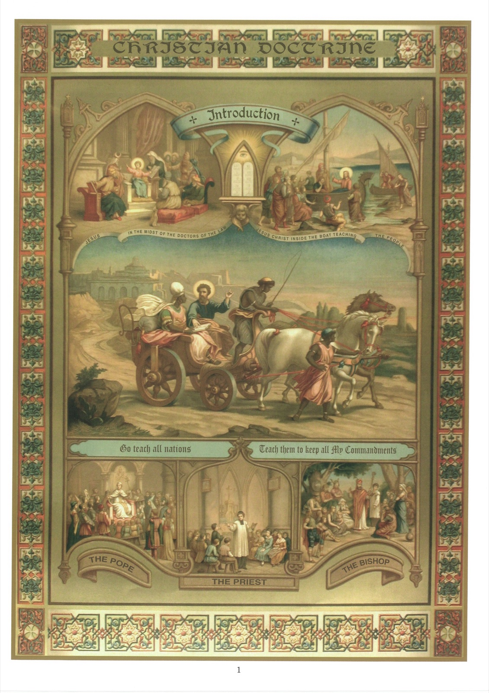

# Plate 1 — Introduction

1. Although this work is really a Catechism, which is, as we know, a familiar form of instruction by question and answer, the question have been omitted in order to save space.

2. The doctrine explained in these pages is the very same doctrine that Our Lord himself taught when early nineteen hundred years ago He preached in Judea.

## Explanation of the Plate

3. Years before He began to teach His doctrine He set to all children an example of the way they should attend at Catechism. As a child of twelve He accompanied Mary and Joseph to Jerusalem for the feast of the Pasch. The top picture on the left shows Him seated in the temple in the midst of the doctors of the law, listening to them and asking questions. The Gospel tells us that He astonished them with the wisdom of His answers. (Luke II, 46-47.)

4. At the age of thirty He began His journeys through Judea, expounding His doctrine. He preached usually in the synagogues where the Jews assembled for prayer, at times in the mountains, at other times on the sea shore. In the top pictures on the right He is represented seated in a boat on the Sea of Galilee, surrounded by His disciples, and preaching to the Jews from a neighbouring village, who are following His teaching with rapt attention. (Luke IV, 1-3.)

5. After His Ascension the teaching of His doctrine was continued by the apostles and by bishops, priests and deacons. In the picture in the center we see the deacon Philip seated in a chariot beside a high official of Candace, Queen of Ethiopia. This latter had been reading Holy Scripture, but entirely unable to grasp its meaning. On Philip explaining it to him, he begged to be baptised, saying: « I believe that Jesus Christ is the Son of God. » (Acts VIII, 27 et seq.)

6. At the bottom, we see on the left the Sovereign Pontiff teaching the Christian doctrine to the world at large; on the right, a bishop proclaiming the Gospel to men not yet civilized; in the middle, a priest giving a Catechism lesson to children.

## The Destiny of Man

7. A knowledge of the Christians, for without it we cannot attain to the high destiny for which God has created us.

8. God has created us in order that we may know Him, love Him and serve Him and serve Him, and thereby gain life eternal.

9. To serve God we must (1) observe His commandments, (2) discharge faithfully the duties of our Station, and (3) work for His glory by doing all and every kind of good in our power.

10. We must serve God, 1stly., because He has created us for this purpose, and 2ndly., because if we do not serve Him, we render ourselves liable to be eternally miserable in hell.

11. Unfortunately there are many who do not serve God, but attach themselves to the things of the earth, preferring them before God.

12. Such individuals give themselves up mainly to the pursuit of honours to gratify their pride, to that of riches to indulge their avarice, to that of pleasure to pander to their lust and gluttony.

13. But they will miserably fail to find any happiness in such things because the human heart has been fashioned for God, and every earthly good, all the honours and riches and pleasures the world can give, can never satisfy it.

14. God alone can make us happy, because He alone is the Sovereign Good.

15. Already in this life itself God grants to all those who serve Him the peace the peace arising out of a good conscience. He watches over them in all their undertakings, consoles them in all their troubles and showers down upon them every blessing.

16. Perfect happiness will be ours only when we shall life eternal, i. e., when we shall be face to face with God in heaven for all eternity.

## The title and sign of the Christian

17. A Christian is one who has been baptised and professes the Christian religion.

18. It is a great happiness to be a Christian, for the Christian is a child of God, a brother of Jesus Christ, and heaven is his heritage.

19. The sign by which the Christian is recognised is the sign of the Cross: In the name of Father, and of the Son and of the Holy Ghost. Amen.

20. The sign of the Cross reminds us of the two great cardinal facts that there is but one God in Three Persons and that Jesus Christ, the Son of God made man, died on the Cross to redeem us.

21. We ought to make the sign of the Cross in the morning on rising, at night on going to bed, at the commencement and conclusion of every important act and in the presence of danger.

22. The sign of the Cross made with faith and due piety removes from our path all dangers and temptations and brings down upon God's blessings.
