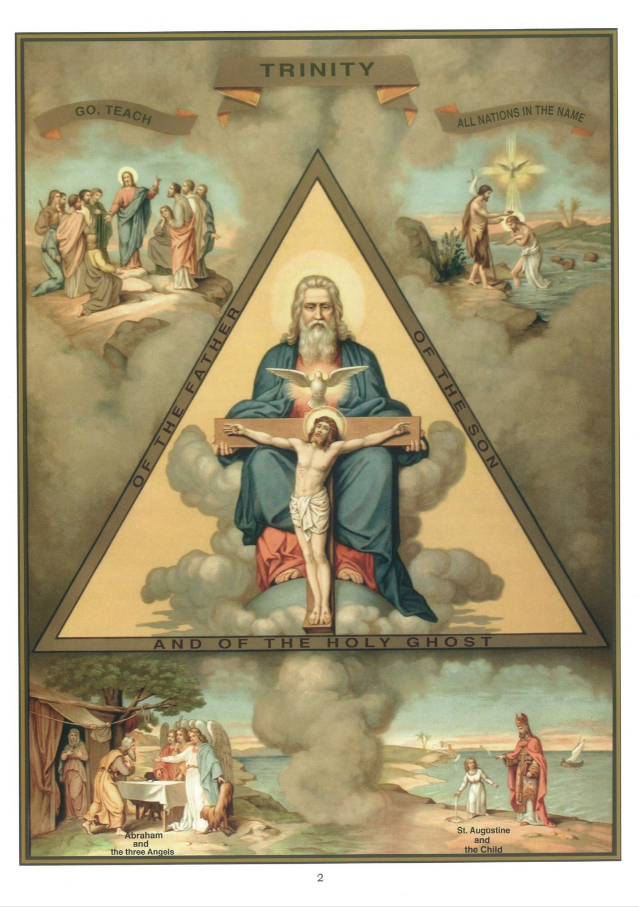

# Plate 2 — The Trinity

*Art. 1: I believe in God, the Father Almighty...*

## Revelation

1. Man having been endowed with speech, it has been possible for God to hold communication with him.

2. And actually God has spoken to men, and what he has thus communicated to him we call Revelation.

3. Without this Revelation our salvation would have been an impossibility, for we could not of ourselves have discovered what it is that we must believe and do in order to be saved.

4. There have been three district revelations, viz (1) primitive revelation, being that which God gave to Adam and the patriarchs; the Mosaic revelation, which He gave to Moses and the prophets; and (3) the Christian revelation, which we have received from Jesus Christ.

## The Apostles' Creed

5. The Apostles' Creed is a profession of faith that has come down to us from the Apostles and embodies in its twelve articles the principal truths we have to believe.

6. The first of these truths is that there is a God, and only one God.

7. We believe in God because He Himself has revealed His existence to us.

8. Our reason also tells us that God exists, for if there were no God, there would be no earth, which indeed could not have created itself any more than a house or a watch can make itself.

9. God is pure spirit, infinitely perfect, Creator of heaven and earth and Sovereign Lord of all things.

10. We say that God is a pure spirit, because He has no body and can neither be seen with our eyes nor felt with our hands.

11. We say that God is infinitely perfect, because He is possessed of all the perfections and there is no limit to these perfections.

12. God has always existed: He has never had a beginning and will never have an end.

13. God is in heaven, here on earth, and everywhere else.

14. God knows all things, the past, the present and the future, and even our inmost thoughts and desires. He always sees us, even when we try to hide ourselves away from Him in order to commit sin.

## Mystery of the Holy Trinity

15. A mystery is a truth revealed by God which we are bound to believe, although it surpasses our comprehension.

16. The mystery of the Holy Trinity is the mystery of one God in three Persons, who are the Father, the Son and the Holy Ghost.

17. The Father is God, the Son is God, the Holy Ghost is God, but all three, the father, the Son and the Holy Ghost, are only one and the same God, equal in all things, because they are one and the same substance and consequently one and the same Godhead.

## Explanation of the Plate

18. The triangle in the middle represents the Holy Trinity. In it, we see God the Father seated on the terrestrial sphere, holding on his knees the arms of the cross, on which hangs Jesus Christ, His Son, while the Holy Ghost, shedding around His effulgence, is seen as a dove between the Father and the Son, thus showing that He proceeds from the Father and the Son.

19. The top picture on the left shows Christ just before going up to heaven, charging His apostles with the mission to teach all nations, baptising them in the name of the Father and the Son and of the Holy Ghost. (Matth. XXVIII, 19.)

20. To the right of the above is represented the baptism of Jesus, wherein all three Persons were manifested. (See also Plate. 19.)

21. At the bottom on the left we see Abraham receiving the three angels (Gen. XVIII, 3). Although there stood before him three, he spoke as if to only one: « Lord, if I have found favour in thy sight, pass not away from thy servant. » In this manner he paid honour to One God in Three Persons.

22. On the right illustrated the story of St. Augustine and the child. One day the holy bishop of Hippo was pacing along the sea shore, trying to fathom the mystery of the Holy Trinity, when all of a sudden he perceived before him a little child, who with a shell was taking out water from the sea and emptying it into a hole that he had made in the sand.

« What are you trying to do with this water, my child? » asked the saint. « I want to put into this hole all the water that is in the sea » was the reply.

« But », rejoined the bishop, « you see for yourself that this hole is far too small to contain all that water ». « Just so », answered the child, 'but I shall succeed sooner is emptying the sea into this hole, than you in understanding the mystery of the Blessed Trinity. » Saying this, the child vanished. It was an angel who had thus appeared to the saint to convince him that this mystery is not to be penetrated by any created intelligence.
