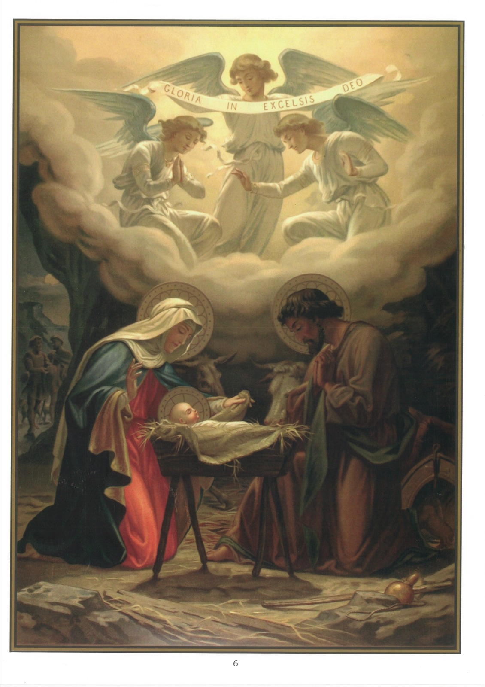

# Plate 4 (iii) — The Nativity

*Art. 3 (cont.): ... Born of the Virgin Mary.*

## Explanation of the Plate

1. In the middle we see the infant Jesus, just born in a stable at Bethlehem. He is the centre of all the solicitude and attentions of Mary, His Mother and of St. Joseph, His foster-father. Near the crib in which He lies are depicted, in accordance with an accepted tradition, an ox and an ass.

2. Shepherds are seen coming to adore Him and in heaven above angels are singing the joyous hymn: « Glory to God in the highest and peace on earth to men of good will. » (Luke II, 14.)

## Birth of Jesus Christ

3. « In those days there went out a decree from Caesar Augustus, that the whole world should be enrolled. This enrolling was first made by Cyrinus, the governor of Syria. And all went to be enrolled, every one into his own city. And Joseph also went up from Galilee, out of the city of Nazareth into Judea, to the city of David, which is called Bethlehem, because he was of the house and family of David, to be enrolled with Mary his espoused wife, who was with child. And it came to pass that when they were there, her days were accomplished, that she should be delivered. And she brought forth her first-born Son, and wrapped Him up in swaddling clothes, and laid Him in a manger, because there was no room for them in the inn. » (Luke II, 1-7)

## His hidden Life

4. The Magi, three in number, guided by a miraculous star, came to adore the Infant Jesus and offered Him gold as to a king, incense for the Deity, and myrrh as to a mortal man (myrrh being used in embalming dead bodies). (Matt. II, 1-11.)

5. Our Lord was presented in the Temple forty days after He was born, i, e., on February 2. On that day the Blessed Virgin Mary went through the ceremony of her Purification as prescribed by the law of Moses. (Luke II, 22)

6. After the presentation of Jesus in the Temple His parents took Him to Egypt to save Him from Herod, who wished to kill Him.

7. To effect his purpose Herod, caused all children under two years old to be massacred at Bethlehem and in the immediate neighbourhood. These were the children whom we speak of as the Holy Innocents.

8. After the death of Herod the Child Jesus was brought back to Nazareth in Galilee, where He lived till the age of thirty. (Matt.2, 19-23)

9. The life of Jesus at Nazareth was a hidden life, one of poverty and constant toil.

10. The Gospel tells us that during this period Jesus always went to the Temple on feast days, was submissive to His parents, and, as He grew up, increased in wisdom and holiness. (Luke II, 40)

## His public Life

11. At the age of thirty Jesus was baptised by St. John the Baptist in the waters of the Jordan (see Plate 19).

12. Immediately after He retired into the desert, where He Fasted for forty days (see Plate 51) and allowed the devil to tempt Him so that we might learn from Him how to resist temptation (see Plate 53).

13. After coming out of the desert Jesus chose His twelve apostles and began to preach the Gospel in Judea.

14. Our Lord chose as His apostles mostly poor illiterate fishermen who had to work from their living.

15. These twelve apostles were - Simon, called Peter, and Andrew, his brother; James the son of Zebedee, and John, his brother; Philip and Bartholomew, Thomas and Matthew the publican; James, the son of Alpheus, and Thaddeus; Simon the Canaanite; and Judas Iscariot, who betrayed Him.

16. The Gospel is God's own story conveying to man the great message that Jesus is the Son of God, the Messiah or Saviour promised to us from the very beginning of the world.

17. In support of His teaching Jesus performed numerous miracles. His first miracle was wrought at the prayer of His Blessed Mother when, at the wedding feast at Cana in Galilee, He changed water into wine. (John II, 1-11.)

18. To show His love for little children He would lay His hands on them, and would embrace and bless them. « Suffer little children to come unto Me », He said, « for of such is the Kingdom of Heaven. » (Matt. XIX, 14.)

19. When speaking to the unfortunate, He would say: « Come to Me, all ye that labour, and I will refresh you. » (Matt. XI, 28.)

20. Jesus was good to sinners. He sometimes ate with them, and when He was blamed for doing so, His reply was: 'I am not come to call the just, but sinners.' (Matt. IX, 13.)
