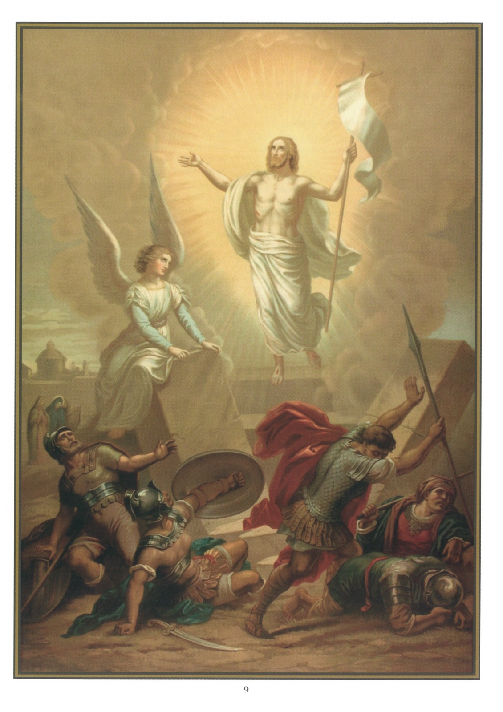

# Plate 7 — The Resurrection

*Art. 5 (contd.): The third day He rose again from the dead.*

1. These words mean that on the third day after His death Jesus, by His own omnipotence, re-united His soul to His body and issued forth from the tomb alive and glorious.

2. Our Lord's body remained in the tomb not quiet three days, viz., part of Friday, the whole of Saturday and part of Sunday.

3. We have here a fact that must not be overlooked. Just as Jesus, in order to prove His divinity, did not put off His resurrection till the end of the world, so He did not desire to rise at once from the dead, but only on the third day, in order to show that He was really and truly man and that He had been really and truly dead, this short lapse of time being amply sufficient to establish the fact.

## Our Lord's Re-appearances

4. That Christ rose again from the dead we know from the testimony of His apostles and disciples, to whom He appeared several times after His resurrection.

5. On the day itself of His resurrection He appeared in the midst of His apostles, who were met together in the Cenacle, and invested them with the power to remit sins. (John XX, 19-23.)

6. A few days later He appeared to several of the apostles as they were engaged in fishing on the Sea of Galilee. It was on this occasion that He raised St. Peter to the dignity of supreme Head of His entire Church. (John XXI, 15-16.)

7. Before His ascension He appeared once more to His apostles and commanded them to preach the Gospel to all nations. (Matt. XXVIII, 19.)

8. We are bound to accept the testimony of the apostles in regard to His resurrection, for they laid down their lives in witness to the fact that they had seen Him again in the body. Witnesses who gladly lay down their lives in confirmation of the testimony they have given can obviously not be impostors.

## Characteristics of a risen body

9. The body of Jesus after His resurrection possessed Our Lord's body possessed all the attributes special to such bodies, viz., impassibility, brightness, agility and subtility.

10. By impassibility we mean that Jesus' body in no longer subject to suffer or die.

11. By brightness we mean that Jesus' body shines like the sun, although He veiled this splendour.

12. Jesus proved His agility (power of unimpeded movement) by transporting Himself over vast distances, even going up from earth to heaven with the rapidity of lightning.

13. By subtility is meant the power of passing through the most compact bodies. Thus, Jesus left the tomb without moving away the sealed stone which closed its entrance. He entered the room where the apostles were, although the doors were closed.

14. In re-uniting His soul to His body, Jesus caused the marks of the many wounds He had received during His Passion to disappear, all save five, viz., those in His hands, feet and side.

15. These He preserved in order (1) to show them to His apostles in proof of His resurrection, (2) to exhibit them to His Father when interceding for us, and (3) to confound sinners on the Judgment Day so that they might with their own eyes see that it was not alone for the just, but also for them that He suffered.

16. It was necessary that Christ should rise again from the dead as a proof of divine justice, for it was in every respect befitting that justice He who in obedience to the divine decree had been despised and loaded with every opprobrium and ignominy, should be exalted. St. Paul says as much in his Epistle to the Philippians (II, 8-9): - « He humbled Himself,

becoming obedient unto death, even to the death of the cross. For which cause God also hath exalted Him and hath given Him a name which is above all names. »

## Explanation of the Plate

17. Here we have the Resurrection represented.

18. Several holy women (seen on the left) came, says the Gospel, to embalm His body, when all of a sudden the earth trembled and the angel of the Lord coming down from heaven rolled back the stone which covered the entrance to the Sepulchre and sat upon it. The guards fell to the ground terror-stricken and remained like dead. When the holy women went inside the Sepulchre they were frightened at the sight of the angel, who however said to them: « Fear not you, for I know that you seek Jesus who was crucified. He is not here, for He is risen, as He said. Come and see the place where the Lord was laid. » (Matt. XXVIII, 5-6; Mark XVI, 5.)
