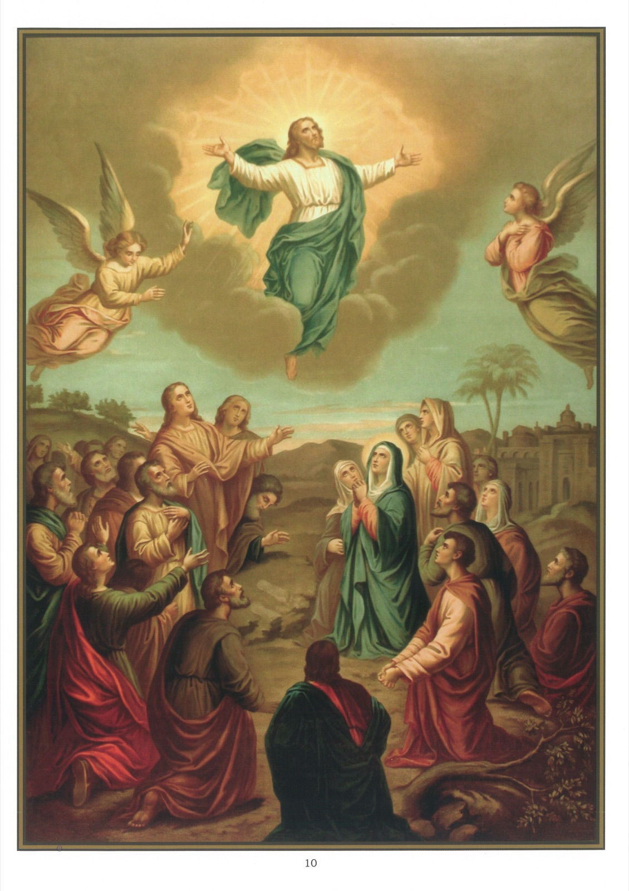

# Plate 8 — The Ascension

*Art. 6: He ascended into heaven.*

1. By this first part of Article 6, He ascended into heaven, it is to be understood that on the fortieth day after His resurrection, Jesus, by His own power, rose up into heaven in the sight of His disciples.

2. This Happened on the day of the Ascension.

3. Before the Ascension, Jesus was in heaven as God, but as man He was not there. After the Ascension, He was there both as God and man.

4. Our Lord ascended into heaven in order 1) to possess Himself on the glory that was his due; 2) to prepare a place for us there; 3) to intercede for us with His Father; and 4) to send us the Holy Ghost.

5. The Ascension of Our Lord is thus described at the beginning of the Acts of the Apostles (I, 1-11): « The former treatise I made, O Theophilus, of all things which Jesus began to do and to teach until the day on which, giving commandments by the Holy Ghost to the apostles whom He had chosen, He was taken up. »

« To whom also He showed Himself alive after His passion, by many proofs, for forty days appearing to them and speaking of the kingdom of God, and eating with them; He commanded them that they should not depart from Jerusalem, but should wait for the promise of the Father which you have heard (saith He) by my mouth. »

« They therefore who were come together asked Him, saying: Lord, wilt Thou at this time restore again the kingdom to Israel? But He said to them: It is not for you to know the times or moments which the Father hath put in His power. But you shall receive the power of the Holy Ghost coming upon you, and you shall be witnesses unto Me in Jerusalem and in all Judea and Samaria, and even to the uttermost part of the earth. »

« And when He had said these things, while they looked on, He was raised up, and a cloud received Him out of their sight. »

« And while they were beholding Him going up to heaven, behold two men stood by them in white garments, who also said: Ye men of Galilee, why stand you looking up to heaven? This Jesus who is taken up from you unto heaven, shall so come as you have seen Him going into heaven. »

6. Jesus rose upwards of His own might without any exterior aid, such as had been required, for instance, by Elias, who was taken up to heaven in a fiery chariot (2 Kings II, 11), or by Habacuc or the deacon Philip, who were carried over great distances, the former by the « Angel of the Lord » (Dan. XIV, 35), the latter by the «Spirit of the Lord » (Acts VIII, 39).

7. Jesus ascended into heaven not only by the might of His omnipotence as God, but also by the new powers His human body had acquired at, and as the direct result of, His resurrection.

8. A prodigy such as this was beyond ordinary human capacity, but the power wherewith was endowed the blesse soul of the Saviour enabled Him to transport His body wheresoever He willed, and His body had become glorified to such a transcendent degree that it was at once obedient to every impulse conveyed to it by His soul.

9. It was during the interval between His Resurrection and Ascension that Our Lord more especially prepared His apostles for their coming ministry, directing them what they were to do and empowering them to forgive sins (John XX, 23) and to go among all nations, preaching and baptizing (Matt. XXVIII, 19).

10. The first three of the six articles which relate to Our Lord remind us of His unexampled humility and the terrible abasements to which He submitted himself. For what indeed could be imagined more humiliating and debasing than that the Son of God should assume our poor human nature with all its weaknesses and should consent to suffer and die the death of a male-factor for us! But immediately after, in the 5th. and 6th. Articles, we read that he rose again from the dead, ascended into heaven and is now sitting at the right hand of His Father. Could anything be conceived more sublime, more befitting His glory and divine majesty!

## Explanation of the Plate

11. Here we have the Ascension represented. The Mount of Olives consists of three peaks and it was from the central one of these peaks that Our Lord went up to heaven in the sight of His disciples and of the holy women, leaving, a legend says, the imprint of His left foot in the rock at the point He quitted the earth.

12. At the moment He disappeared from sight, enveloped in a luminous cloud, two angels appeared before His disciples and said to them: « Ye men of Galilee, why stand you looking up to heaven? This Jesus who is taken up from you into heaven, shall so come as you have seen Him going into heaven. » (Acts I, 10-11)
