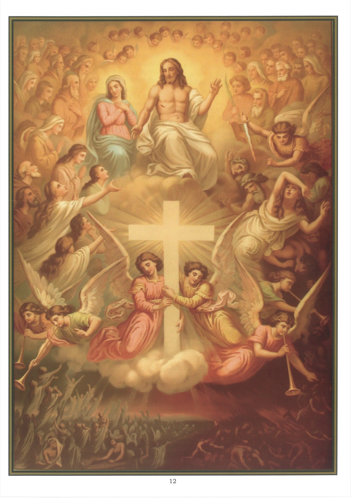

# Plate 10 — The Last Judgment

*Art. 7: From whence He shall come to judge the living and the dead.*

1. The article reminds us that at the end of the world Jesus Christ will come visibly and in great majesty to judge all men and render to each one according to his works.

2. The words living and dead must be taken in a spiritual sense, the former meaning those living in grace, i.e., the just, the latter those dead in mortal sin, i.e., the wicked.

3. At this judgment we shall appear before the Judge with our bodies reunited to our souls (see p. 15). Those still alive on earth at the coming of Christ (for His coming will be sudden and unexpected - see Matt. XXIV; Luke XXI; Mark XIII) will at once die and come again to life immediately after.

4. We shall be judged on the good or evil we have done in thought, word and deed, or by omission. The trial will be so strict that, as Christ himself declares, we shall be called to account for « every idle word » (Matt. XII, 36), that is, every word we have let fall that has been of no benefit either to us or to others.

5. We know that this general judgment will take place at the end of the world, but what we do not never shall know is when the world will come to an end. God is unwilling to reveal that much to us so that we may be always prepared for the event.

6. Many portents foretold in the Gospels will mark the near advent of the Sovereign Judge - the sun will be darkened, the moon will give no more light, the stars will fall from heaven, there will be earthquakes, and the roar of the waves of the sea will be terrible.

7. These portents are thus described by St. Mark: « For in those days there shall be such tribulations as were not from the beginning of the creation which God created until now, neither shall be. And unless the

Lord had shortened the days, no flesh should be saved: but for the sake of the elect which He hath chosen, he hath shortened the days. »

« And then if any man shall say to you: « Lo, here is Christ » or « Lo, He is there », do not believe. For there will rise up false christs and false prophets, and they shall show signs and wonders to seduce, if possible, even the elect. Take you heed therefore; I have foretold you all things. »

« But in those days, after the tribulation, the sun shall not give her light, and the stars of heaven, shall be falling down and the powers that are in heaven shall be moved. And then shall they see the Son of Man coming in the clouds, with great power and glory. And then shall He send His angels and shall gather together His elect from the four winds, from the uttermost part of the earth to the uttermost part of heaven. « But of that day of hour no man knoweth, neither the angels in heaven, nor the Son, but the Father. Take ye heed; watch and pray for ye know not when the time is. »

« Even as a man who, going into a far country, left his house and gave authority to his servants over every work, and commanded his porter to watch.

Watch ye therefore (for you know not when the Lord of the house cometh: in the evening, or at midnight, or at the cock-crowing, or in the morning), lest coming on a sudden, He find you sleeping. And what I say to you, I say to all - Watch. » (Mark XIII, 19-37)

8. Besides the general judgment, which will be held for all men at the end of the world, there is also another, the private or particular judgment, which takes place for each individual immediately after death.

9. At this particular judgment, the bodiless soul appears before God alone, whereas at the general judgment the soul, now at the last reunited to the body, will be judged in the sight of all.

10. The general judgment will not modify the sentence passed on each person at the particular judgment, but it will render to the whole world the justice of God, the divinity of Jesus Christ, the glory of the good and the confusion of the wicked.

## Explanation of the Plate

11. The picture represents the General judgment.

12. Jesus is seated on the clouds, surrounded by angels and saints and more immediately by His apostles, who will judge with Him the twelve tribes of Israel. (Luke XXII, 30.)

13. Jesus is preceded by a cross and by four angels sounding the trumpet to summon all men to the judgment.

14. The Blessed Virgin Mary is placed on His right and at the head of the elect. To these He addresses the consoling words: « Come, ye blessed of My Father, receive ye the kingdom prepared for you from the foundation of the world. » (Matth. XXV, 34.)

15. The avenging angel is on His left, driving before Him into the abyss of hell the wicked, after the Sovereign Judge has passed on them this terrible sentence: « Depart from Me, ye cursed, into everlasting fire prepared for the devil and his angels. » (Matt. XXV, 41.)
