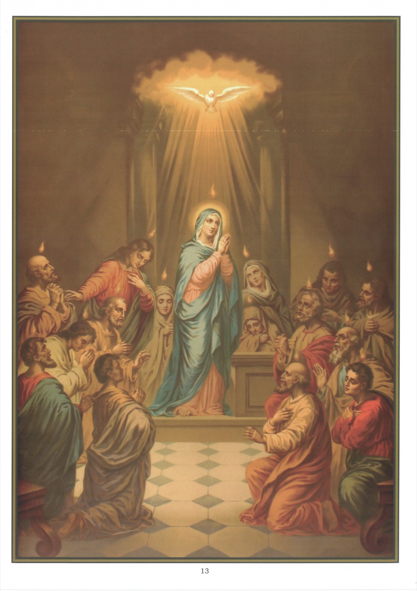

# Plate 11 — Pentecost

*Art. 8: I believe in the Holy Ghost.*

1. The Holy Ghost is the Third Person of the Blessed Trinity and proceeds from the Father and the Son.

2. The Holy Ghost is God. The Church has defined this truth by declaring in her creeds that the Holy Ghost is consubstantial with (of the same Divine Essence as) the Father and the Son and is to be adored conjointly with Them.

3. The same truth is impressed on us also in Holy Scripture, where the Holy Ghost is spoken of as God. When St. Peter reproved Ananias and Saphira for having lied to the Holy Ghost, he said: « Thou hast not lied to men, but to God. » (Acts V, 4.)

4. The fact that the Holy Ghost proceeds from the Father and the Son is contained in these words of Our Lord: « But when the Paraclete cometh, whom I will send you from the Father, the Spirit of Truth, Who proceedeth from the Father, He shall give testimony of Me. » (John XV, 26). And again, John XVI, 13-15: « When He, the spirit of Truth, is come, He will teach you all truth. For He shall not speak of Himself; but that things soever He shall hear, He shall speak. He shall glorify Me, because He shall receive of Mine, and shall show it to you. All things whatsoever the Father hath, are mine. Therefore I said, He shall receive of mine, and show it to you.' St. Paul styles Him the Spirit of Christ. (Rom. VIII, 9).

5. The Holy Ghost is thus the equal in all respects of the Father and of the Son. Like them, He is all-powerful, eternal and possessed of an infinite perfection, greatness and wisdom.

6. It is usual to speak of the Holy Ghost as (1) the Gift of God (Eph. 2, 8), because He is the most precious gift given by God to men; (2) the Comforter, because He consoles us in our troubles; or (3) the Spirit of Prayer, because He helps us to pray well.

7. The Holy Ghost is termed Holy, because He is Holy by nature and because it is by Him that we are sanctified.

8. The holiness of the Holy Ghost differs from that of the saints whom we honour in that (1) He is holy in Himself and by His nature, whereas, they have become holy through the grace of God; and (2) He is infinitely holy, whereas they are so only to a certain degree.

9. The Holy Ghost has come down on earth visibly several times. Thus He came down in the form of a dove over Our Lord at His baptism and in the form of tongues of fire on the apostles on the day of Pentecost.

10. On the day of Pentecost, so says the Bible, (Acts II, 2-4), there arose all of a sudden from heaven a sound as of a mighty wind coming, which filled the whole house where were the apostles. At the same moment there appeared to them parted tongues as it were of fire, which sat upon every one of them, and they were all filled with the Holy Ghost and they began to speak with divers tongues.

11. After received the Holy Ghost the apostles went about preaching the Gospel to all nations.

12. Before the apostles began to preach, all the nations of the earth, the Jews excepted, worshipped creatures.

13. The effect of the preaching of the apostles was to convert countless multitudes of Jews and pagans to Christianity.

14. Christianity was not established without opposition. For three hundred years it was opposed and millions of Christians suffered every form of torture and even death for the sake of Jesus.

15. The destruction of false religions over the greater part of the then known world is the most striking of all the miracles wrought by the Holy Ghost through the Apostles, and this one miracle alone sufficiently proves the divine origin of Christianity.

16. The Holy Spirit enters within us in an invisible manner by the grace with which He fills our souls in order to sanctify them.

17. The Holy Ghost dwells within us when we are in the state of grace. It is on this account that St. Paul tells us that we are temples of the Holy Ghost. (I. Cor. VI, 19.)

18. The Holy Ghost directs the Church, imparting to her strength to resist her enemies and preserving her from all error in her teaching.

19. The Holy Spirit still further gives to the Church all the graces and gifts necessary for its preservation, such as the gift of miracles and that of prophecy.

20. We must often pray to the Holy Ghost, because without His help we can do nothing useful towards our salvation.

21. We must be careful to avoid driving out of the Holy Ghost from our souls by committing mortal sin or saddening Him by committing venial sin.

## Explanation of the Plate

22. In the picture we see the Cenacle (top room of the Last Supper), in which the Apostles and disciples awaited the coming of the Holy Ghost, praying side by side with the Blessed Virgin and several other holy women.
