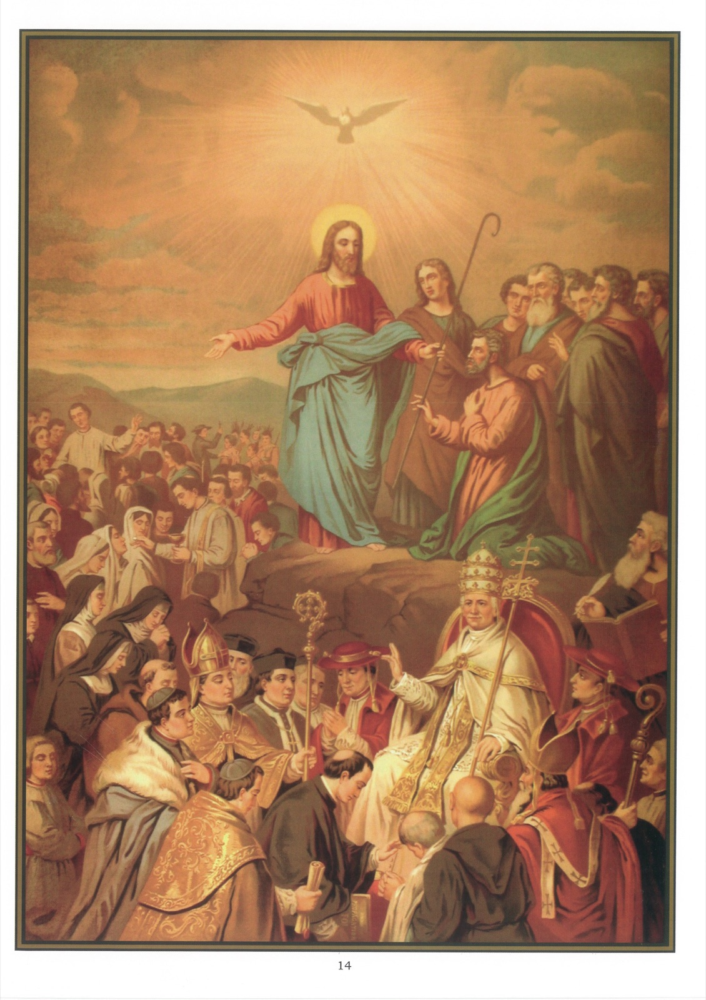

# Plate 12 — The Church

*Art. 9: I believe in the holy Catholic Church.*

## Constitution of the Church

1. The Church is the entire body of the faithful under one head, viz., Jesus Christ. By the faithful is meant all who, having been baptised, believe all the doctrines taught by Him.

2. As Our Lord is in heaven, He has His appointed Vicar here on earth, the bishop of Rome, viz. the Pope, who is thus the visible head of His Church.

3. St. Peter was the first visible head of the Church appointed by Christ himself: « Thou art Peter [petros, Greek = a stone, petra = rock, translation of Cepha (Aramaic for rock)], and upon this rock I will build my church, and the gates of hell shall not prevail against it. And I will give to thee the keys of the kingdom of heaven (i.e., of the Church on earth). And whatsoever thou shalt bind upon earth, it shall be bound also in heaven; and whatsoever thou shalt loose on earth, it shall be loosed also in heaven. » (Matt. XVI, 18-19.)

4. St. Peter having established his See in Rome, his successors therein obviously inherited his headship of the Church and his infallibility in the teaching of doctrine (the gates of hell, i.e., the powers of darkness, error, falsehood, shall not prevail against it - the Church).

5. The lawful pastors of the Church are, after the Pope, all bishops, whose office, as successors of the Apostles, is to teach and govern Christ's Church.

6. The bishops are appointed by the Pope to rule over their respective dioceses.

7. Rectors are priests who have been placed by the bishops in charge of the several parishes.

8. They are all members of the Church who have been baptised, believe what she teaches and are duly submissive to the Pope and to their bishop.

9. Those who do not form part of the Church are either infidels, heretics, schismatics, apostates or excommunicated person.

10. An infidel is one who has not been baptised and does not believe in Jesus Christ.

11. A heretic is one who, while believing in Jesus Christ, yet deliberately refuses to accept some truth revealed by God and taught by the Church as an article of faith.

12. A schismatic is one who separates himself from the Church by refusing to acknowledge and obey his lawful pastors.

13. An apostate is one who denies the faith of Jesus Christ after having once professed it.

14. An excommunicated person or excommunicate is one whom the Church has excluded from her communion owing to his crimes.

15. Sinners may be members of the Church, but are her dead members.

16. It is the greatest of all misfortunes not to belong to the Church, because those who, neglecting every opportunity, deliberately remain outside of it, cannot be saved.

## Marks of the True Church

17. There is but one true Church, because Christ founded only one Church.

18. There are four marks by which we may know her: she must be one; she must be holy, she must be catholic, and she must be apostolic.

19. The Roman Church is one, because all her members possess one Faith, have the same Sacrifice and Sacraments, and are united under one head, the Pope, successor of St. Peter.

20. She is holy because she teaches a holy doctrine, offers to all the means of holiness and has in all ages produced holy men and women.

21. She is catholic or universal because she has been continuous ever since Christ's promise, will triumph through all persecutions and endure to the end of the world.

22. She is apostolic, since she was founded, under Our Lord's authority, by the Apostles themselves, has after them been governed by the successors of the Apostles and believes and teaches the doctrine of the Apostles.

## Explanation of the Plate

23. At the top is depicted the appointment of St. Peter as head of the Church. Our Lord is represented as handing to him the shepherd's crook, thereby charging him to feed His sheep and lambs (John XXI, 16-17), i. e., to rule over His Church.

24. Immediately below we see (1) the Pope, the successor of Peter, robed in white and wearing the tiara or triple crown; (2) on either side of the Pope, a cardinal recognizable by the hat; ( 3) standing in a circle facing the Pope (a) an archbishop with mitre and crozier and the pallium over his shoulders, and (b) a bishop with only mitre and crozier supported by other prelates and by male and female religious; and (4) in the middle ground, a priest administering holy communion, another preaching to the faithful, and a third, a missionary, holding aloft a crucifix and proclaiming to the infidel the message of the Gospel.
