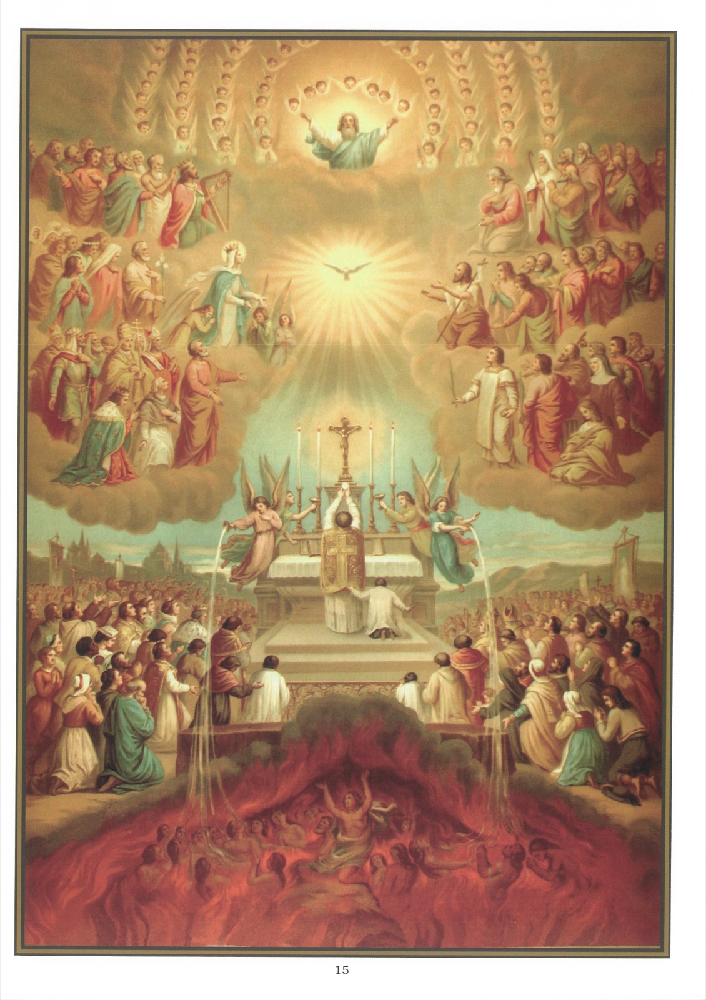

# Plate 13 — The Communion of Saints

*Art. 9 (cont.): I believe in the communion of Saints.*

1. The word communion is used here in the sense of fellowship or sharing or participation in common, community and exchange of goods. The doctrine contained in the Article is hence that the spiritual or supernatural possessions of the Church, that mystical body whereof Christ is the Head, are the common property of all its members and that a constant interchange of such goods and services is going on between them, exactly as in the case of the several members of the same household.

2. These supernatural possessions and services are the same faith, sacraments and government, the merits of Jesus Christ and of His Blessed Mother and the saints in heaven, the Sacrifice of the Mass, prayers, intercession, indulgences and good works.

3. The word saints includes not only the blessed who are now triumphant with Our Lord in heaven (the Church Triumphant), but also all those suffering souls who are completing their period of expiation in purgatory (the Church Suffering), as well as the faithful here on earth who, sanctified by baptism, and under the call to lead a holy life, have to contend against the enemies of their salvation and thus constitute the Church Militant.

4. We have already seen on p. 6, para. 5 what purgatory is. Its existence is proved by Christ's own declaration (Matt. XII, 31-32) that blasphemy against the Holy Ghost shall not be forgiven either in this world or in the world to come. These words obviously mean that some sins will be pardoned after this life is ended. Now it cannot be in heaven that these sins will be pardoned, for sin can not enter there; nor can it be in hell, out of which there is no redemption. Consequently, there must be a third place where such pardon can be obtained, and this place we call Purgatory, because it is there that the souls who cannot at once enter heaven, are purged from the guilt of their sins.

5. There is communion between us and the saints and angels in heaven, since we venerate them and pray to them, while they take they protect and intercede for us. Our Lord Himself tells us that « there is joy before the angels upon one sinner doing penance » (Luke XV, 10). And that even a soul in hell may invoke the saints and that the saints may intercede for us (the story of Dives and Lazarus in Luke XVI, 19-31).

6. We are in communion with the souls in Purgatory in that we produce relief for them by our prayers and good works, by transferring to them indulgences we gain four ourselves, and especially by having Masses offered up for them, whereby they benefit by the transcendent merits of Our Saviour. « It is a holy and wholesome thought to pray for the dead that they may be loosed from sins ». (2 Mac. XII, 46).

7. The prayers most frequently said for the souls in Purgatory are the Office of the Dead, the De Profundis and the invocation « And may the souls of the faithful departed through the mercy of God rest in peace ».

8. Within the Church militant the faithful are in communion one with another through possessing the same beliefs, sacraments and government and by a mutual exchange of examples, prayers, merits and satisfactions.

9. All do not benefit equally, but each in proportion to his merits.

10. Even sinners within the Church militant have some part in this community of spiritual benefits, since graces fall to their share, which they have only to use in order to be converted.

11. Nay, even those who do not belong to the body of the true Church share in them according to the measure of their union with Christ and with the soul of the Church.

12. Those who have no share at all are heretics (viz, those who, knowing which is the true Church, yet refuse to enter it), schismatics and apostates.

13. The words « There is no salvation outside the Church » mean that salvation is absolutely denied to all who knowingly and of bad faith remain outside it.

## Explanation of the Plate

14. The picture symbolises the « Communion of Saints » : in it are represented the angels and saints in heaven, the faithful here on earth and the souls suffering in purgatory.

15. In the upper part of the picture we see the angels and saints adoring the Three Persons of the Blessed Trinity and praying to Them for the faithful still on earth.

16. In the middle are the faithful on earth assisting at the Holy Sacrifice of the Mass, at which they are invoking the saints in heaven and praying for one another as well as for the deliverance of the souls from Purgatory.

17. At the bottom are represented the souls in Purgatory. Refreshing waters poured down upon them by the two angels are symbolical of the relief they derive from the Holy Sacrifice of the Mass.
