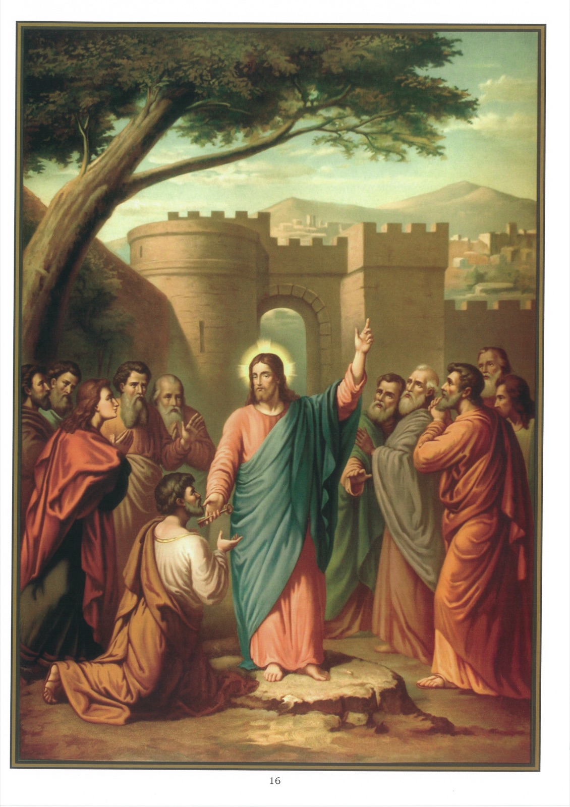

# Plate 14 — The Remission of Sins

*Art. 10: I believe in the forgiveness of sins.*

1. These words mean that Christ has given to His Church the power to forgive sins.

2. God alone possesses, of His own authority, this power to forgive sins. In the Old Testament He kept it to Himself.

3. In the New Dispensation, God having become man, Christ as man, His divinity having thereby become intimately united to His Humanity, possessed the power of forgiving sins and in His role as the Saviour exercised it whenever He chose to do so. And this He did frequently. A characteristic instance is that furnished by the healing of the paralytic as related by St. Matthew (IX, 2-8):

« And behold they brought to Him one sick of the palsy lying in a bed. And Jesus seeing their faith, said to the man sick of the palsy: « Be of good heart, son, thy sins are forgiven thee. » And behold some of the Scribes said within themselves: « He blasphemeth. » And Jesus, seeing their thoughts, said: « Why do you think evil in your hearts? Whether is it easier to say: Thy sins are forgiven thee, or to say: Arise and walk? But that you may know that the Son of Man hath power on earth to forgive sins, « Arise », said He to the man sick of the palsy, « take up thy bed and go into thy house ». And he arose and went into his house. And the multitude, seeing it, feared and glorified God that gave such power to men. »

4. In His goodness Our Lord, while still in this life, conferred this power on St. Peter, and, on the day itself of His resurrection, also on all the apostles and, through them, on their legitimate successors. the following passages from SS. Matthew and St. John:

« And Jesus came in the quarters of Caesarea Philippi, and He asked His disciples saying: « Whom do men say that the Son of Man is? » But they said: « Some John the Baptist, and other some Elias, and others Jeremias or one of the prophets. » Jesus saith to them: « But whom do you say that I am? » Simon Peter answered and said: « Thou art Christ,

the Son of the living God. » And Jesus, answering, said to him: « Blessed art thou, Simon Bar Jona, because flesh and blood hath not revealed it to thee, but my Father, who is in heaven. And I say to thee, that thou art Peter, and upon this rock I will build my church, and the gates of hell shall not prevail against it. And I will give to thee the keys of the kingdom of heaven. And whatsoever thou shalt bind upon earth, shall be bound in heaven, and whatsoever thou shall loose on earth, it shall be loosed also in heaven. » Then He commanded His disciples that they should tell no one that He was Jesus the Christ (Matt. XVI, 13-20).

« Now when it was late that same day, the first of the week, and the doors were shut where the disciples were gathered together for fear of the Jews, Jesus came and stood in the midst and said to them: « Peace be to you. » And when He had said this He showed them His hands and His side. The disciples therefore were glad when they saw the Lord. He said therefore to them again: « Peace be to you. As the Father hath sent Me, I also send you. » When He had said this, He breathed on them, and He said to them: "Receive ye the Holy Ghost. Whose sins you shall forgive, they are forgiven them, and whose sins you shall retain, they are retained. » (John XX, 19-23.)

5. By virtue of these concluding words there is no sin, however great, which cannot be remitted by the Church, just as she has also the power of retaining it by refusing absolution to penitents not in the proper disposition for it. More than this, the sins that have been remitted by the Church have no further existence of any kind: they are entirely effaced.

6. There can be no forgiveness of sins outside the true Church, for there is salvation and remission of sins only within the fold of the one and only true Church.

7. The Church remits sin principally through the sacraments of Baptism and Penance.

8. Our sins are remitted not by reason of our own merits, but through the merits of Jesus Christ who died on the Cross to gain pardon for us.

9. The apostles inserted into their Creed this article, I believe in the forgiveness of sins, to impress upon us the greatness of God's mercy and to move sinners to place in Him all their trust.

10. The Catholic doctrine of the forgiveness of sins seems to be a great stumbling block to protestants, and yet among Anglicans (1) the bishop, when ordaining a person addresses to him the very words « Whose sins

you shall forgive &c. » quoted above; (2) in their Communion Service people with troubled consciences are exhorted to go and « open their grief » to some clergyman so that they may receive « absolution »; and (3) dying persons are required to be « moved » to make a special confession of their sins.

## Explanation of the Plate

11. The picture shows Our Lord handing over to St. Peter the keys as a token of the power He was conferring on him of remitting or retaining sins (see passage cited above from St Matthew under paragraph 4).
