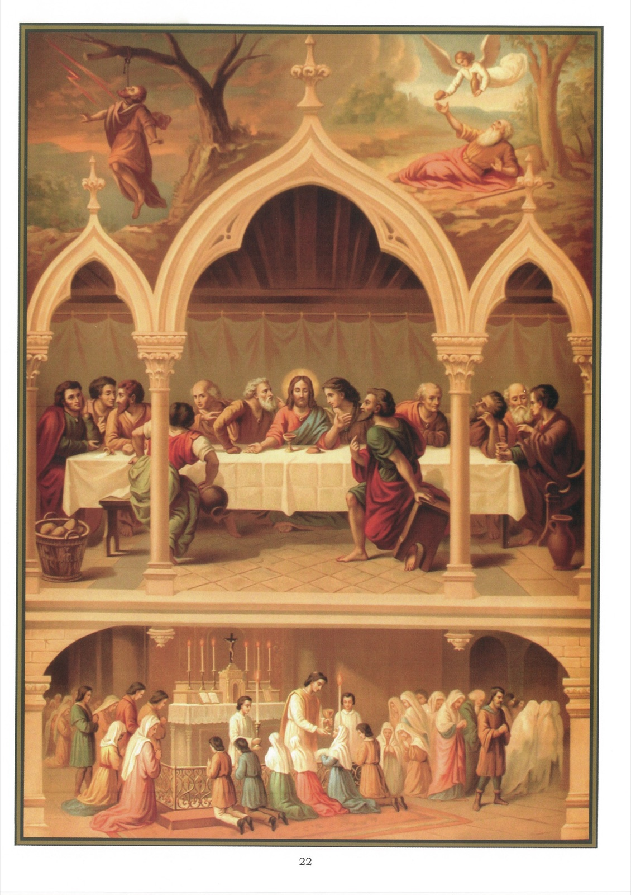

# Plate 20 — The Eucharist

## The Holy Eucharist

1. The Holy Eucharist is a Sacrament in which under the appearances of bread and wine we have really present the Body and Blood, the Soul and Divinity of Our Lord Jesus Christ.

2. Christ instituted this Sacrament, in order that He might (1) always dwell in our midst, (2) offer Himself as a constant sacrifice for us to His Father and (3) become the food of our souls.

## Holy Communion

3. In instituting this Sacrament Jesus took bread and gave it to His apostles, saying: « Take ye and eat; this is My Body. » (Matt. XXVI, 26.) He then took up the chalice with wine in it and giving it to them, said: « Take ye and drink; this is My Blood. Do this for a commemoration of Me. » (Matt. XXVI, 28, and Luke XXII, 19.)

4. With these words « This is My Body, this is My Blood » Jesus by His Almighty power changed the bread into His Body and the wine into His Blood. By His farther words « Do this for a commemoration of me » He gave to His apostles and to all priests the power to change, after His own example, bread into His Body and wine into His Blood.

5. This change takes place at Mass when the priest pronounces over the bread and wine the words of consecration.

6. To communicate or receive communion is to receive our Lord in the Sacrament of Holy Eucharist.

7. The due dispositions for communicating properly fall into two categories, the one relating to the soul, the other to the body.

8. The principal disposition relating to the soul is that the person shall be in a state of grace, i. e., be entirely free from mortal sin.

9. Those who feel themselves guilty of mortal sin should, before going to communion, confess their sins and receive absolution.

10. To receive communion while in mortal sin is a terrible sacrilege; it was the sin of Judas.

11. Immediately before receiving communion we ought to excite in ourselves a real devotion. To this end it is useful to read the Prayers before Communion in one's prayer book.

12. The bodily dispositions for communicating properly are to fasting (having eaten and drunk nothing) since midnight and to exhibit a modest and recollected demeanour.

13. Having duly received Our Lord, we must adore Him now dwelling within us, express to Him our gratitude for that signal favour, offer ourselves wholly to Him and beg for the graces we stand in need of, in a word, make our thanksgiving.

14. This should be done immediately after receiving holy communion. It would be grossly improper to set about other things before first paying our duty to Our Lord, who has taken up His dwelling within us; and indeed there could be no more favourable moment than this for holding intimate converse with Him and obtaining from Him every needful grace.

## The Mass

15. The Mass is a sacrifice in which are offered to God the Body and Blood of Our Lord Jesus Christ under the two species of bread and wine.

16. Christ instituted this sacrifice so that we might repeat and continue among ourselves the sacrifice which He offered up on the Cross on Calvary.

17. Between the sacrifice of the Mass and that on Calvary there is this difference that whereas on Calvary the sacrifice was a bloody one, in which He was both Priest and Victim, that on the altar at Mass is an

unbloody one, in which He offers Himself up through the ministry of His priests.

18. The sacrifice of the Mass can be offered up to God alone, sacrifice being an act of worship.

## Explanation of the Plate

19. The central picture is a representation of the last supper, at which Christ instituted the Holy Eucharist in the cenacle in Jerusalem on Holy Thursday, the Eve of His death. Above this on the left we see the traitor Judas, who hanged himself after his sacrilegious communion at the Last Supper.

20. The principal effect of communion is figured in the other small picture. We see in it an angel presenting to Elias a loaf of bread « baked on the hearth » and a cruse of water. As he gave these to the prophet, he said to him: « Arise, eat, for thou hast yet a great way to go. » And Elias « arose and ate and drank, and walked in the strength of that food forty days and forty nights unto the mount of God, Horeb. » (II Kings XIX, 7-8.) This bread of Elias was a figure of the future Eucharist, which was in due time to nourish and strengthen the human soul, help it worthily to perform her journey through this life and finally to lead her to the bliss of heaven.

21. The lowest picture shows a priest administering communion to the faithful during mass.
