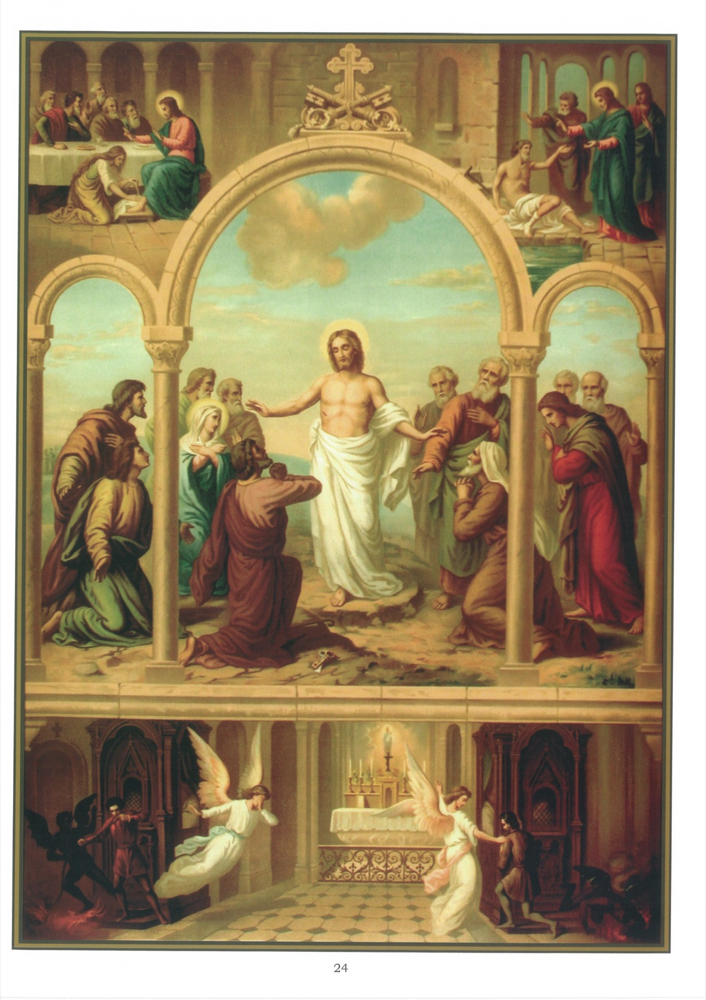

# Plate 22 — Penance

1. This sacrament remits the sins committed subsequently to baptism, and it is received when the priest pronounces Absolution.

2. Absolution is the judgment pronounced by the priest in Christ's name when he remits the sins of the penitent, who for his part must (1) feel contrition, (2) confess his sins, and (3) make satisfaction for them.

## Contrition

3. Contrition is sorrow for, and detestation of, sins committed, joined to a firm purpose not to sin again.

4. It is perfect when the sorrow is caused solely and entirely by the offence given to God, Who is infinitely good and infinitely worthy of love and to Whom sin is odious. Perfect contrition, joined to a firm desire to go to confession, suffices of itself to restore the sinner at once to grace.

5. Contrition is imperfect (attrition) when the sorrow springs from the dread of hell or the enormity of the sin committed. With such sorrow however the love of God should begin to show itself.

## Confession

6. Confession is an accusing of oneself before a priest in order to obtain absolution from one's sins. He must obviously be told what these sins are before he can judge whether he should remit or retain them. All mortal sins must be confessed, the number of times they have been committed being stated, as well as the attendant circumstances thereof, since these

may profoundly affect their gravity and even their very nature. It is not necessary to confess one's venial sins, although it is beneficial to do so.

## Satisfaction and indulgences

7. Satisfaction is the reparation due for the offence given to God by our sins and for any wrong done through them to our neighbour.

8. We owe this satisfaction to God even after receiving absolution, because, although absolution remits the eternal punishment of hell, it does not release us from the temporal punishment to be endured for our sins, whether in this life or in the next.

9. This temporal punishment may however, in whole or in part, be remitted, through the merits of Jesus Christ, by the gaining of an Indulgence, which is therefore not the forgiveness of sins committed or a permission to commit a sin, but is merely the remission of the temporal punishment due for sins already forgiven in the Sacrament of Penance.

10. The power of granting Indulgences was left by Christ to the Church and is included in His words to Peter: And whatsoever thou shalt loose upon earth shall be loosed also in heaven. (Matt. XVI, 19.)

11. In order to obtain any Indulgence the soul must be in a state of grace, i.e., free from mortal sin.

12. A Plenary Indulgence remits all, a Partial Indulgence a part only of, the temporal punishment due to sins committed since Baptism.

13. The conditions for gaining a Plenary indulgence are almost always that the applicant shall worthily receive the Sacraments of Penance and the Holy Eucharist and then perform some outward works of piety. For Partial Indulgences confession is not usually prescribed, but there must at least be perfect contrition (see para, 4 above).

14. The Indulgences we may gain be applied to the souls in Purgatory - a pious practice much recommended by the Church.

## Explanation of the Plate

15. The central picture shows Christ instituting the Sacrament of Penance. Appearing to the apostles on the day itself of His resurrection, He said to them: « Receive ye the Holy Ghost. Whose sins you shall forgive, they are forgiven them, and whose sins you shall retain they are retained. » (John XX, 22-23.)

16. Christ several times during His earthly life remitted sins. In the right-hand top corner, we see Him saying to the paralytic, whom He healed: « Be of good heart, son, thy sins are forgiven thee. » (Matt. IX, 2.)

17. Opposite on the left we have a model of perfect contrition in the person of St. Mary Magdalen. This woman, after having led an abandoned life, came one day to weep out her sins at Jesus' feet in order to obtain His pardon. Our Lord, was at table in the house of Simon the Pharisee, said: Many sins are forgiven her, because she hath loved much. And turning to her, He said: « Thy sins are forgiven thee. Go in peace. » (Luke VII, 47, 50.)

18. The bottom picture depicts the opposite results of a good and of a bad confession. The good penitent's guardian angel is encouragingly pointing upwards to heaven, while the devil is driven away confounded. On the other hand, the bad penitent is being dragged off to hell by the devil, while his guardian angel abandons him, stricken with grief.
