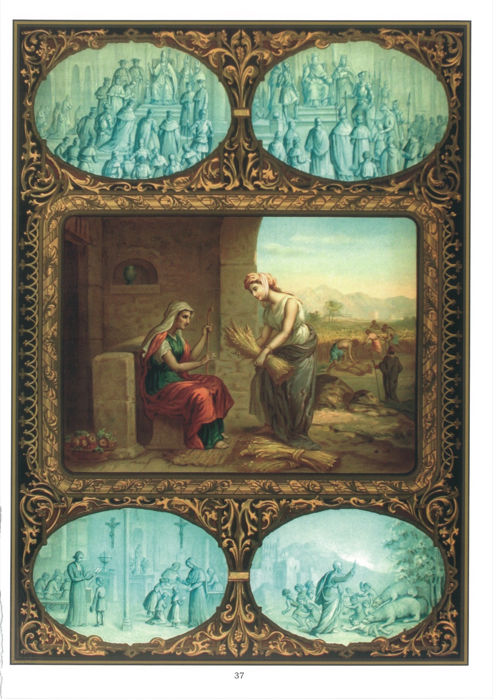

# Plate 35 — The Fourth Commandment (continued)

## The Fourth Commandment (cont.):

## Honour thy father and thy mother

## Duty towards other relations and superiors

1. The fourth Commandment requires us to honour, besides our parents, also our relatives and our spiritual and temporal superiors.

2. Our spiritual superiors are the Pope, the bishop and the parish priest. Our temporal superiors are the Chief of the State, whether crowned head or president, and those who act under his authority, our employers, and in the case of the young, their guardians and teachers.

3. We are bound to respect our spiritual and temporal superiors, to obey them in all matters in which they have a right to command us, and to pray for them.

4. As regards bishops and priests we read « Let the priests that rule well be esteemed worthy of double honour, especially those who labour in the word and doctrine. » (I Tim. V, 17.) Then again see how the Galatians must have loved and honoured St. Paul for this latter to have expressed himself thus: « For I bear you witness that if it could be done, you would have plucked out your own eyes and would have given them to me. » (Gal. IV,15.)

5. It is our duty also to support our priests. « Who », asks St. Paul, « serveth as a soldier at any time at his own charges? » (I Cor. IX, 7.) And is it not written in Ecclesiasticus? « Give honour to the priests. Give them their portion, as it commanded thee, of the first fruits and of purifications. » (VII, 33-34.) We must contribute more particularly to the needs of the Sovereign Pontiff, especially now that he has been despoiled of his States.

6. As regards obedience the apostle Paul says: « Obey your prelates and be subject to them. For they watch as being to render an account of your souls. » (Heb. XIII, 17.) Our Lord commands us to obey even bad priests, if the advice they give is good. « The Scribes and Pharisees have sitten on the chair of Moses. All things therefore whatsoever they shall say to you, observe and do. But according to their works do ye not; for they say, and do not. » (Matt. XXIII, 2-3.)

7. We must also help them with our prayers; for they sacrifice their time, their health and their lives for the good of our souls, although ingratitude is only too often their reward.

8. What precedes applies also to kings, princes, governors and all those to whom we are subject. The apostle Paul, in his epistle to the Romans, treats at length of the honour, consideration and respect due to them. Moreover he enjoins us to pray for them.

9. St. Peter says: « Be ye subject therefore to every human creature for God's sake, whether it be to the king as excelling, or to governors as sent by him. » (I Pet. II, 13-14.) For in honouring them we honour God, who has put them over us.

10. It is never permitted to rise up against authority, because, in the first place, God forbids it, and, in second place, a revolt against constituted authority invariably brings in its train many serious evils for society.

11. When called upon to nominate or elect a member of some public body, be it merely the casting of our vote, we owe it to our country as well as to our conscience to select or vote for only such a candidate as honours God, religion, the law and true Christian liberty.

12. Should however our parents or other superiors require us to do something contrary to the law of God, it would be our bounden duty, without forgetting the respect that is their due, to tell them that our conscience forbids us to do it, because we have to obey God before men.

13. For all these reasons it is sinful to belong to any secret society that plots against the Church or State (even a foreign State). Masonic lodges, even when is no reason to believe that they plot against Church or State, are included, because they are secret societies and are condemned by the Church.

## Explanation of the Plate

14. At the top on the left, the Pope, supported by cardinals, is receiving the homage of kings, rulers, soldiers and others and on the right a king receiving the homage of his subjects.

15. In the picture in the middle we see Ruth and Noemi, her mother-in-law, whom she followed from her own land of Moab to Bethlehem. Ruth offers to the world a touching example of filial piety by the way she brought to Noemi the ears of wheat she painfully gleaned for her support. (Ruth II, 18.)

16. Below on the left we see well-behaved studious children listening with attention and respect to their teachers, and on the right, the terrible punishment inflicted on forty-two wicked boys who insulted the prophet Eliseus, shouting at him: « Go up, thou baldhead! » Two bears came out and tore them to pieces. (II Kings II, 23-24.)
