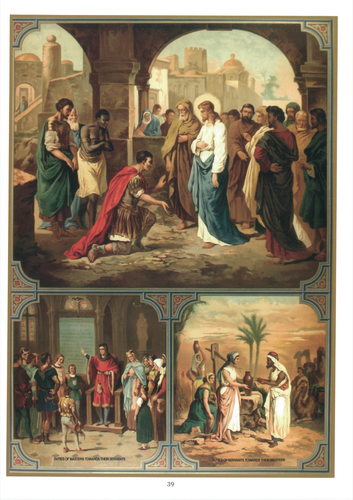

# Plate 37 — The Fourth Commandment (continued)

## The Fourth Commandment (concl.):

## Honour thy father and thy mother

## Duties of masters and mistresses towards their servants

1. It is the duty of Masters and Mistresses (1) to be kind and just towards their servants, (2) to look after them in health and in sickness, (3) to watch over their morals, and (4) to see that they serve God and are well grounded in their religion, if they are Catholics, and if they are not Catholics, to pray that God may vouchsafe to them the grace of conversion.

2. Masters and mistresses must also see that their servants do their work properly, and, if these are Catholics, give them every facility for fulfilling their religious duties - the due observance of Sunday, abstaining on the appointed days, communicating at Easter.

3. These various obligations imposed on masters and mistresses are based on the words of Holy Writ. In his Epistle to the Hebrews (XIII, 17) St. Paul says that masters have to render an account of the souls of those subject to them.

## Explanation of the Plate

4. In the large picture and in the small one on the left are given two touching examples of masters faithfully fulfilling doing their duties by their servants. The first is that of the centurion:

« And when He had entered into Capharnaum there came to Him a Centurion, beseeching Him, and saying: « Lord, my servant lieth at home

sick of the palsy and is grievously tormented. » And Jesus saith to him: « I will come and heal him. » And the centurion making answer, said: « Lord, I am not worthy that thou should enter under my roof; but only say the word and my servant shall be healed. For I also am a man subject to authority, having under me soldiers, and I say to this, Go, and he goeth, and to another, Come, and he cometh, and to my servant, Do this, and he doeth it. » And Jesus hearing this, marvelled and said to them that followed Him: « Amen, I say to you, I have not found so great faith in Israel. And I say to you that many shall come from the east and west and shall sit down with Abraham and Isaac and Jacob in the kingdom shall be cast out into exterior darkness; there shall be weeping and gnashing of teeth. » And Jesus said to the centurion: « Go, and as thou hast believed, so be it done to thee. » And his servant was healed at the same hour. » (Matt. VIII, 5-13.)

5. The centurion is on his knees at the feet of Jesus, Who has His apostles round Him. Two servants who have accompanied the centurion, are seen standing respectfully behind their master.

6. The other example, illustrated in the small picture on the left, is that of St. Elzéar, Count of Sabran in Provence. Having drawn up a Rule of Life for his servants, he posted it up in one of the finest apartments of his palace and assembled his servants there to explain it to them. We give below the principal rules it contained.

## Rule of life

1. Say your morning and night prayers

2. Attend Mass.

3. Go often to the Sacraments.

4. Have a special devotion for the Blessed Virgin and to St. Joseph.

5. Never be idle.

6. Shun evil company.

7. Avoid quarrels, etc.

St. Elzéar is represented standing on a dais facing his servants and showing them the Rule. A crucifix and a statue of Our Lady adorn the

apartment. St. Delphine, his wife, is present and, with her maids of honour, forms the small group on his left.

## Duties of servants towards their masters

7. Servants must (1) respect their masters, (2) render them faithful service, and (3) obey them in every thing that is not contrary to the law of God.

8. Servants should look upon their masters as God's representatives and should therefore in conscience obey them as they would God Himself.

9. The small picture on the right shows Eliezer, who serves as a remarkable model of fidelity to servants of all degrees. He was sent on a long journey to Mesopotamia to find a wife for Isaac, his young master. Bringing with him rich presents, he is seen standing near a well with his camels. Rebecca, grand-daughter of Nachor, Abraham's brother, having come to the well at the same time with some companions to draw water, is offering him a drink. In this sign Eliezer sees the will of God and gives her in return the rich gifts he has brought with him. (Gen. XXIV.)
