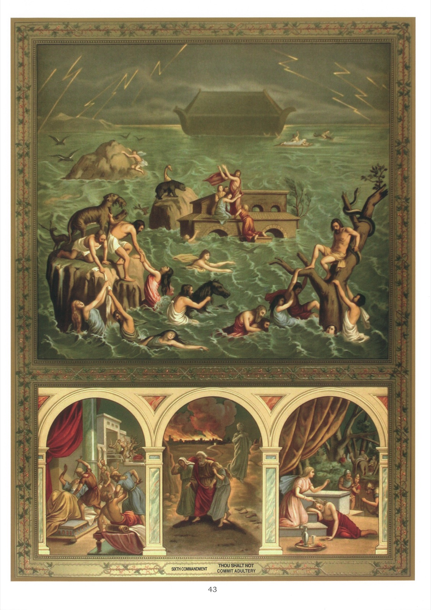

# Plate 41 — The Sixth and Ninth Commandments

## The Sixth Commandment:

## Thou shalt not commit adultery

1. By this Commandment are forbidden all immodest acts, words and looks, and generally everything that tends to impurity.

2. The sin of impurity is one strictly to be avoided, firstly, because more than any other sin it destroys in our souls the likeness of God to which we have been created, by bringing us down to the level of beasts, and secondly, because it defiles our bodies, which are members of Christ and temples of the Holy Ghost.

3. Among other effects due to impurity are impairment of the intellect, decay and loss of faith and a premature death.

4. The most effective way of avoiding falling into habits of impurity is to say regularly one's morning and night prayers, to have a special devotion for the Blessed Virgin Mary, to go frequently to confession and communion and to fly all occasions of danger.

5. In addition one must mortify oneself, for there are evil spirits that can be chased away only by prayer and fasting, as Our Lord Himself tells us:

« And one of the multitude answering, said: « Master, I have brought my son to Thee, having a dumb spirit, who, wheresoever he taketh him, dasheth him, and he foameth and gnasheth with the teeth and pineth away. And I spoke to Thy disciples to cast him out and they could not. » Who answering them, said: « O incredulous generation, how long shall I be with you? How long shall I suffer you? Bring him unto me. » And they brought him. And when he had seen him, immediately the spirit troubled him; and being thrown down upon the ground, he rolled about foaming. And He asked his father: « How long time is it since this hath happened unto him? » But he said: « From his infancy. And oftentimes hath he cast him into the fire and into waters to destroy him. But if Thou canst do anything, help us, having compassion on us. » And Jesus saith to him: «

If thou canst believe, all things are possible to him that believeth. » And immediately the father of the boy, crying out, with tears said: « I do believe, Lord; help my unbelief. » And when Jesus saw the multitude running together, he threatened the unclean spirit, saying to him: « Deaf and dumb spirit, I command thee, go out of him, and enter not any more into him. » And crying out, and greatly tearing him, he went out of him, and he became as dead, so that many said: « He is dead. » But Jesus taking him by the hand, lifted him up, and he arose. »

« And when He was come into the house, His disciples secretly asked Him: « Why could not we can cast him out? » And He said to them: « This kind can go out by nothing but prayer and fasting. » (Mark IX, 16-28.)

6. The usual causes of impurity are idleness, bad books, bad newspapers, bad pictures, bad songs, bad company, luxurious living, love of finery, the stage, dancing, and excess in eating and drinking.

## Explanation of the Plate

7. The large picture portrays the Deluge, in which all men perished except Noah and his family. God sent this terrible retribution to punish men, because they had given themselves up to all kinds of sin, especially to that of impurity. Noah, who loved and practiced virtue, was saved. While everyone else was swallowed up in the rising waters, he was sheltered in the Ark which God had commanded him to build and which safely rode the flood. (Gen. VI, VII.)

8. Of the three small pictures, the middle one shows the destruction of Sodom and Gomorrah by fire rained down from heaven. God destroyed these two cities because their inhabitants were steeped in the sin of impurity. Lot, Abraham's nephew, being a just man, was saved. Warned by angels, he left Sodom with his wife and daughters, before the rain of fire began. Lot's wife was turned into a pillar of salt for looking back, in spite of the angels' warning, at the burning cities. (Gen. XIX.)

9. In the small picture on the right we see Samson asleep at the feet of a wicked woman named Dalila, for whom he had conceived an impure passion. This passion had so blinded him, that he disclosed to her the secret that his prodigious strength lay in his hair. Dalila accordingly got

his head shaved as he lay asleep and gave him up to the Philistines, who put out his eyes and condemned him to the task of turning a mill. (Judg. XVI .)

10. The small picture on the left shows the two sons of Jacob, Simeon and Levi, putting to the sword the king of Sichen, who had ravished their sister Dina, and with him, his father Hemor, and all the male Sichemites. Thus avenged, Dina was rescued by her other brothers, who at the same time carried off the women of the Sichemites, together with their children and beasts. (Gen. XXXIV.)
