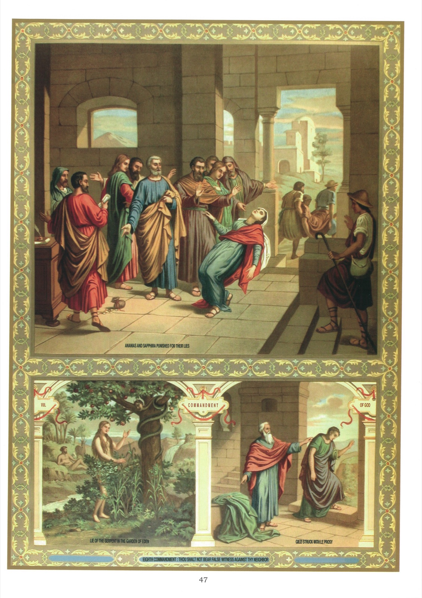

# Plate 45 — The Eighth Commandment (continued)

## The Eighth Commandment (contd.):

Thou shalt not bear false witness against thy neighbour.

## Lying

1. To tell a lie is to say, with the deliberate intention of deceiving, some thing which speaker believes to be untrue.

2. We say « believes to be untrue », and not, as one might expect, « is untrue or false », because what he believes to be false, may in reality be true. As regards the existence of a « deliberate intention of deceiving », strictly speaking such intention may even be absent, as in the exceptional case of a well-known habitual liar whom no one believes.

3. There are three classes of lies, viz., (1) the jocose lie, (2) the officious lie, (3) the injurious or hurtful lie.

4. A jocose lie is one that is told in joke for one's own amusement or that of others.

5. An officious or write lie is one that is told for some useful purpose or for the benefit of one's neighbour.

6. An injurious or hurtful lie is told with the object of injuring one's neighbour.

7. Of these three kinds of lies the injurious lie is the worst and becomes a mortal sin if the resulting injury to the property or reputation of the victim is at all serious.

8. It is never permissible to tell a lie, even to exculpate oneself or to render a service to our neighbour.

9. A lie is always a sin, since being opposed to the truth, it is an insult to God who is the truth itself.

## Explanation of the Plate

10. In the large picture we see St. Peter and before him the woman Saphira, who drops down dead at his feet.

« But a certain man named Amanias, with Saphira his wife, sold a piece of land, and by fraud kept back part of the price of the land, his wife being privy thereunto; and bringing a certain part of it, laid it at the feet of the apostles. But Peter said: « Amanias, why hath Satan tempted thy heart that thou shouldst lie to the Holy Ghost, and by fraud keep part of the price of the land? Whilst it remained, did it not remain to thee? And after it was sold, was it not in thy power? Why hast thou conceived this thing in thy heart? Thou hast not lied to men, but to God. »

« And Amanias hearing these words, fell down, and gave up the ghost. And there came great fear upon all that heard it. And the young men rising up, removed him, and carrying him out, buried him. »

« And it was about the space of three hours after, when his wife, not knowing what had happened, came in. And Peter said to her: « Tell me, woman, whether you sold the land for so much? » And she said: « Yes, for so much. » And Peter said unto her: « Why have you agreed together to tempt the Spirit of the Lord? Behold the feet of them who have buried thy husband are at the door, and they shall carry thee out. Immediately she fell down before his feet and gave up the ghost. And the young men coming in, found her dead, and carried her out and buried her by her husband. And there came great fear upon the whole Church and upon all that heard these things. » (Acts V, 1-11.)

11. In the small picture on the left we see Eve being tempted by the serpent, who said to her: (If you eat of this fruit,) you shall not die the death, for in what day so ever you eat thereof you shall be as gods, knowing good and evil. (Gen. III, 4-5.)

12. The whole of mankind was lost by this lie of Satan, whom Our Lord calls a liar and the father of lies in the following passage from the Gospel of St. John:

« Jesus therefore said to them: If God were your Father, you would indeed love Me. For from God I proceeded and came; for I came not of Myself, but He sent Me. Why do you not know My speech? Because you

cannot hear My word. You are of your father the devil, and the desires of your father you will do. He was a murderer from the beginning, and he stood not in the truth; because truth is not in him. When he speaketh a lie, he speaketh of his own, for he is a liar and the father thereof. But if I say the truth, you believe Me not. Which of you shall convince Me of sin? If I say the truth to you, why do you not believe Me? He that is of God, heareth the words of God. Therefore you hear them not, because you are not of God! » (John VIII, 42-47.)

13. The small picture on the right shows Eliseus and his servant Giezi. This latter had lied to Naaman, saying that he had been sent by the prophet to ask him for a talent of silver and two changes of garments. Having received from the Syrian General two talents of silver and two changes of garments, Giezi lied a second time, telling Eliseus that he had not left the house at all. As a punishment for this double lie, he was smitten with leprosy, « he and all his seed for ever ». (II Kings V, 20-27.)
