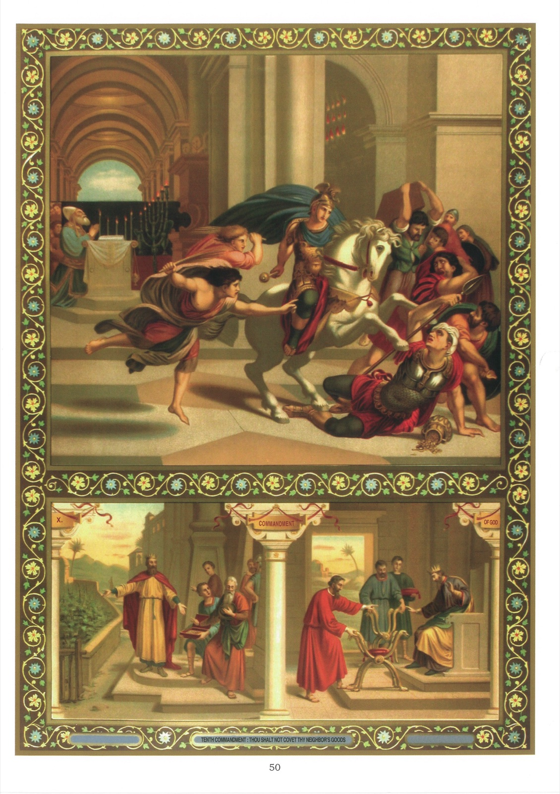

# Plate 48 — The Tenth Commandment

## The Tenth Commandment:

## Thou shalt not covet thy neighbour's goods

1. By this Commandment we are forbidden to desire unjustly the possession of things belonging to another and to bear him envy for them.

2. We are further forbidden (1) to be inordinately attached to earthly things, or (2) to be too eager in their pursuit. On this subject Our Lord spoke thus:

« There was a certain rich man who was clothed in purple and fine linen and feasted sumptuously every day. And there was a certain beggar named Lazarus, who lay at his gate full of sores, desiring to be filled with crumbs that fell from the rich man's table, and no one did give him. Moreover the dogs came and licked his sores. And it came to pass that the beggar died and was carried by the angels into Abraham's bosom. And the rich man also died and he was in torments, he saw Abraham afar off and Lazarus in his bosom; and he cried and said: « Father Abraham, have mercy on me and send Lazarus that he may dip the tip of his finger in water to cool my tongue, for I am tormented in this flame. ». And Abraham said to him: « Son, remember that thou didst receive good things in thy lifetime and likewise Lazarus evil things. But now he is comforted and thou art tormented; and besides all this, between us and you there is fixed a great chaos, so that they who would pass from hence to you cannot, nor from thence come hither. » And he said: « Then, father, I beseech thee that thou wouldst send him to my father's house, for I have five brethren, that he may testify unto them lest they also come into this place of torments ». And Abraham said to him: « They have Moses and the prophets, let them hear them ». And he said: « No, father Abraham, but if one went to them from the dead, they will do penance. » And he said to him: « If they hear not Moses and the prophets, neither will they believe if one rise again from the dead! » (Luke XVI, 19-31.)

« And He said to his disciples: « Therefore I say to you be not solicitous for your life what you shall eat, nor for your body want you shall put on.

The life is more than the meat and the body is more than the raiment. Consider the ravens, for they sow not, neither do they reap, neither have they storehouse nor barn, and God feedeth them. How much are you more valuable than they! And which of you, by taking thought, can add to his stature one cubit? If then ye be not able to do so much as the least thing, why are you solicitous for the rest? Consider the lilies how they grow; they labour not, neither do they spin, but I say to you, not even Solomon in all his glory was clothed like one of these. Now if God clothed in this manner the grass that is today in the field and tomorrow is cast into the oven, how much more you, O ye of little faith! »

« And seek not you what you shall eat or what you shall drink, and be not lifted up on high. For all these things do the nations of the world seek, but your Father knoweth that you have need of these things. But seek ye first the kingdom of God and His justice, and all these things shall be added unto you » (Luke XII, 22-31.)

3. The above words mean that we must think of our salvation before every thing else; but that does not prevent us from caring within reason for the things of the world and the affairs of this life.

## Explanation of the Plate

4. In the large picture we see Heliodorus, general of the army of Seleucus, king of Syria. This prince, coveting unjustly the treasures which the temple at Jerusalem contained, ordered Heliodorus to go and seize them.

When the general arrived there with his guards to commit this sacrilegious robbery, he saw suddenly appear « a horse with a terrible rider on him and he ran fiercely and struck Heliodorus with his forefeet. Moreover there appeared to other young men bright and glorious, who stood by him, one on either side, and scourged him without ceasing with many stripes. And Heliodorus suddenly fell to the ground, and they took him up covered with great darkness, and having put him into a litter, they carried him out. » (II Mach. III, 25-27.)

5. The small picture on the left illustrates the story of Naboth's vineyard. Being situated close to the palace, it was coveted by the King, Achab, who pressed Naboth to sell it or to exchange it for another

elsewhere. As alienation of family property was forbidden by the law of Moses, Naboth refused, saying: « The Lord be merciful to me and not let me give thee the inheritance of my fathers. » (II Kings, XXI, 3.)

6. St. Eloi (small picture on the right) was the very opposite of Achab. Having been ordered by King Clotaire II to make him a chair of pure gold set with precious stones, he was given enough material for two such chairs. So far from keeping the extra gold and gems, as he might safely have done, he made two chairs and brought them to the king.
