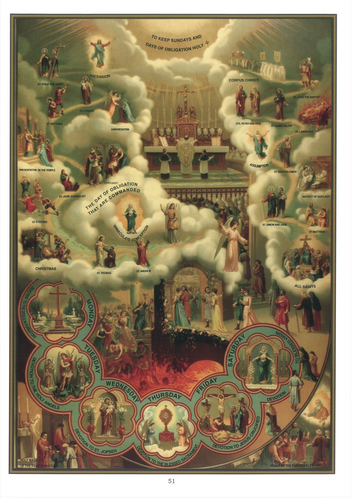

# Plate 49 — The Commandments of the Church

First Commandment: To keep the Sunday and Holy Days of Obligation holy by hearing Mass and resting from servile works.

1. The Church has authority from Our Lord himself to make laws: « He that heareth you heareth Me. » (Luke X, 16). Again « What things so ever ye shall bind on earth shall be bound in heaven. » (Matt. XVIII, 18). A group of the laws so made is known as the Commandments or Precepts of the Church. They impose the obligation of hearing Mass and fasting and abstaining on certain days, and of going to confession and communion at least once a year (the first four Commandments); of supporting one's pastors (the fifth Commandment); and of observing certain restrictions with regard to marriage (the sixth Commandment). All six Commandments apply to the area of the British Empire and to the United States, but in countries where the Church has sufficient revenues of her own, the fifth is omitted, and where the restrictions of the sixth are already embodied in the special body of the laws relating to marriage, this too becomes superfluous. Thus some countries possess only four, other five Commandments of the Church.

2. The Holy Days of Obligation observed in England are seven in number, viz., Christmas Day, the Circumcision (Jan. 1), the Epiphany (Jan. 6), the Ascension, SS. Peter and Paul (June 29), the Assumption (Aug. 15), and All Saints (Nov. 1).

3. To the above are added, in Scotland St Andrew's day (Nov. 30), and, in Ireland, St Patrick's day (March 17) and the Annunciation (March 25). In the United States there are only six such Holy Days, viz., Christmas Day, New Year's Day, Ascension, the Assumption, the Immaculate Conception and All Saints.

4. It is a mortal sin to neglect to hear Mass on Sundays and on Holy Days of Obligation. Hence parents, guardians, masters and mistresses sin grievously if without just cause they prevent their children, wards or servants and other persons subject to them from going to Mass on such days.

5. There are, however, circumstances which necessarily dispense one from going to Mass, as, for instance, illness, having to nurse a sick person, too great distance from church, necessity of some one person staying at home to mind the house or small children, inability to obtain leave of absence from work on a week-day, and so on.

6. There are also the so-called Days of Devotion, on which the faithful are specially recommended to hear Mass. These were at one time, when life was less strenuous, Holy Days of Obligation. For the British Empire, they are -

February. - The Purification or Candlemas Day (2nd.); St. Mathias, Apostle (24th.).

March. - St. Joseph, Spouse of the Blessed Virgin (19th.); Annunciation (not in Ireland, where - see above - it is a day of Obligation).

April. - St. George the Martyr (23rd. - only in England).

May. - SS. Philip and James, Apostles (1st.); Finding of the Cross (3rd.).

June. - St. Margaret, Queen, Patroness of Scotland (10th., only in Scotland); Nativity of St. John the Baptist (24th.).

July. - St. James Major, Apostle (25th.); St. Anne, Mother of the Blessed Virgin (26th.).

August. - St. Laurence, Martyr (10th.); St. Bartholomew, Apostle (24th.).

September. - Nativity of the Blessed Virgin (8th.); St. Matthew, Apostle (21st.); St. Michael, Archangel, or Michaelmas Day (29th.).

October. - SS. Simon and Jude, Apostles (28th.).

November. - St. Andrew, Apostle (30th. - not for Scotland, see para. 3 above).

December. - The Immaculate Conception of the Blessed Virgin (8th.); St. Thomas, Apostle (21th.); St. Stephen, First Martyr (26th.); St. John, Apostle and Evangelist (27th.); the Holy Innocents (28th.); St. Thomas of Canterbury, Martyr (29th. in England only).

Easter Monday and Tuesday, and Monday and Tuesday in Whitsun Week. Also Corpus Christi (Thursday next after Trinity Sunday).

## Explanation of the Plate

7. At the top we have a priest saying Mass on a Feast day before a devout congregation. Immediately below we see a ball going on, attended by worldly men and women who prefer their pleasures to the sanctification of Sunday and Holy Days and who, unless they repent, must inevitably end by falling into the abyss of hell below. In the bottom left hand corner is represented a priest saying Mass in a private house, and in the opposite corner the keeping of the Feast of Tabernacles by the Jews.

8. The six medallions represent the six weekdays and the devotion special to each. The remaining pictures require no explanation.
