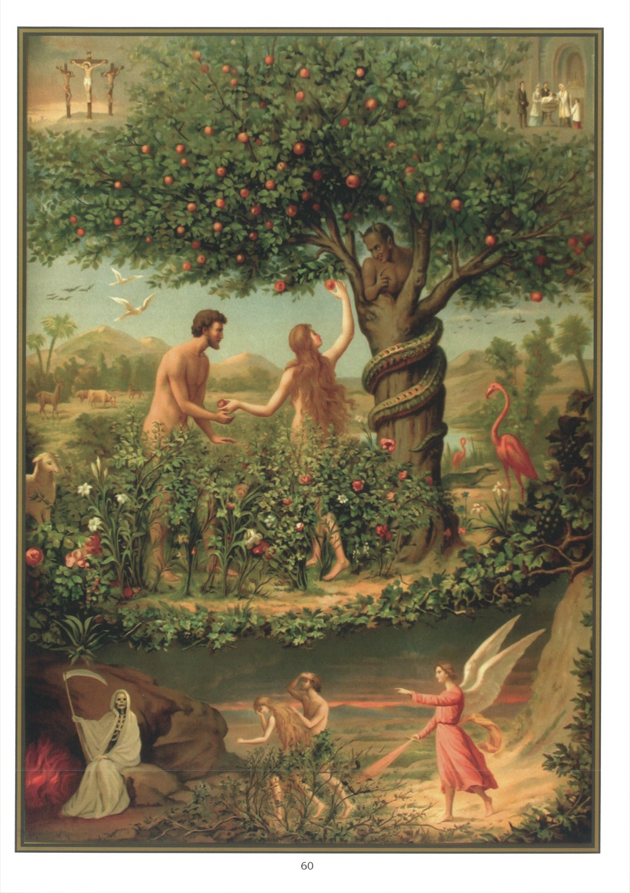

# Plate 58 — Original Sin

## SIN IN GENERAL. - ORIGINAL SIN

1. Sin is a deliberate violation of the law of God.

2. For there to be deliberate violation the person should, in the first place, be competent to judge whether what he contemplates doing is right or wrong; and, in the second place, should of his free will do what he knows to be wrong. Without these two conditions he would not be responsible for what he did and it would not be a case of sin.

3. Sin is the greatest of evils, 1stly, because it is an insult to God, whereas other evils touch creatures only; and, 2ndly., because it is the source of all the evils we suffer in this life and in the next.

4. There are two kinds of sin - original sin and actual or personal sin.

5. Original sin is what we attaches to us from our birth and of which we have inherited the guilt through the disobedience of our first parent Adam. Although we are not personally guilty of this sin with our own personal will, yet it was committed by our human nature with the will of Adam, in whom all our human nature was included and with whom our human nature was united as a branch to the root. St. Paul calls us all « children of wrath ». (Ephes. II, 3)

6. We have been made partakers of the sin and punishment of Adam just as we would all be sharers in his innocence and happiness had he remained obedient to God. (Rom. V, 12.)

7. Adam's sin has thus under the divine justice become the sin of all men.

8. Of this divine justice we observe a faint glimmer even in human justice. For instance, when a person convicted of high treason loses by confiscation all his possessions, the loss is not his alone, but also that of all his descendants.

9. That we are born with the stain of original sin is certain, since Holy Writ and the Church both say so, and, were it otherwise, we could be saved without baptism, which is absurd.

10. This matter of original sin is a mystery transcending the human understanding. All we can say of it is that, while the sin was for our first parents an actual sin, it is for us an habitual sin, a difference however which does not prevent its being for us also a cause of spiritual death, and as a consequence both a stain on our soul and a punishment.

11. Our Blessed Lady was entirely exempt from original sin as a personal privilege and because of Our Lord and Saviour Jesus Christ, whose Mother she was to be. This is what we understand by the Immaculate Conception.

12. The permanent effects of original sin, which remain even after that sin has been entirely washed away in the Sacrament of baptism are (1) ignorance, (2) weakness of free will, (3) concupiscence or proneness to sin, (4) the miseries of the present life, and (5) death.

13. The resulting ignorance refers to the decrease in us of the knowledge of God and of our soul, of our duties, and of the end for which we have been created.

14. The enfeeblement of our free will due to original sin is such that there are many circumstances in which, without the help of God's grace, we should be unable to do good or avoid evil.

15. Concupiscence induces an inordinate love of self, riches and pleasure.

16. God has allowed these fatal effects to remain, although the original sin itself has been washed away by baptism, in order that we may practice virtue and add to our merits.

17. Our ignorance forces us to apply ourselves to study; our proneness to sin obliges us to be always on our guard; the miseries we have to endure in this life help to school us to be patient; and the certainty of death incites us to detach ourselves from the world and the present life.

## Explanation of the Plate

18. We illustrate here the disobedience of Adam and Eve. God had forbidden them, under pain of death, to eat of the fruit of the tree of the knowledge of good and evil; but Eve, deceived by Satan under the guise of a serpent, ate of the forbidden fruit and gave some to her husband, who also ate of it.

19. Having forfeited the grace of God by their sin, Adam and Eve became subject to ignorance, to the uncontrolled empire of their passions and to pain and death, and they were driven out of the terrestrial paradise. And so in the lower picture we show the Angel of the Lord, armed with a « flaming sword », driving before him Adam and Eve out of the garden, and death waiting to receive them after they had experienced all the miseries of this life.

20. At top in the top corner we depict the Crucifixion to remind us that by His death Our Lord delivered us from original sin. God had promised this deliverance to our first parents themselves: « I will put enmities between thee (the serpent) and the woman, and thy seed and her seed; she shall crush thy head. » (Gen. III, 15.) In the opposite corner we see a priest baptizing a child and thus cleansing it from the stain of original sin.
