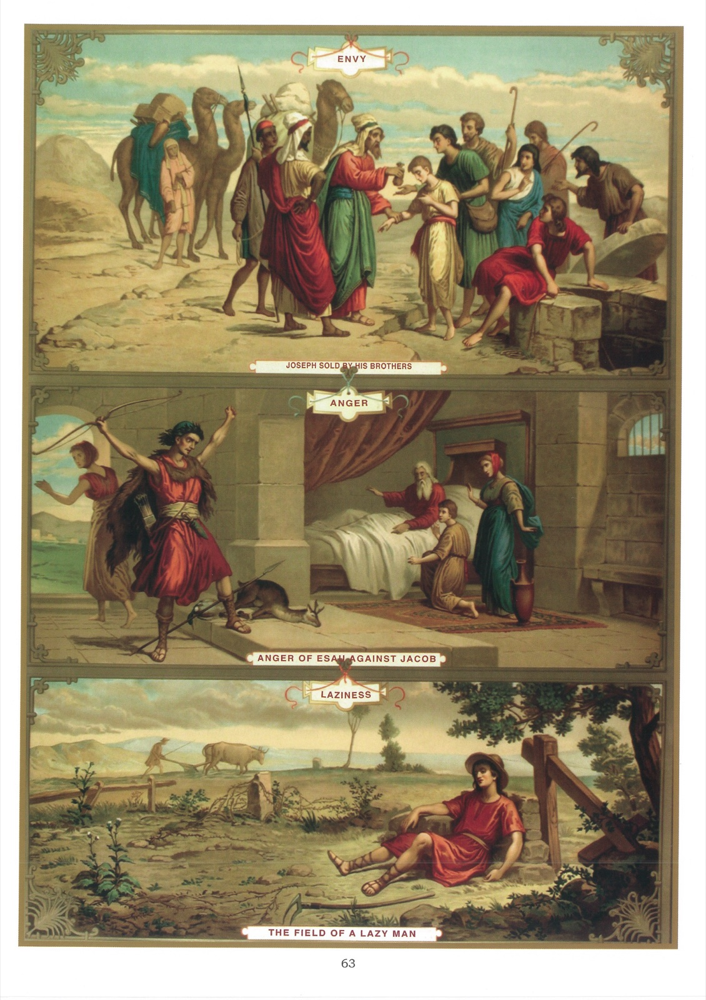

# Plate 61 — The Capital Sins (continued)

## ENVY. - ANGER. - SLOTH

## Envy

1. Envy is a certain sorrow or vexation caused by the happiness, prosperity or success of another or a malicious joy felt at his misfortune or failure.

2. Envy is a grievous sin, firstly, because it is directly opposed to the love of our neighbour, and secondly, because through it we become like Satan himself, whose envy brought sin into the world and who through envy is always seeking to injure us.

3. The spirit of envy is a perpetual torture to the unfortunate person who falls under its sway. It gnaws at, and eats out, his heart.

4. Envy gives rise to a great many other sins - unfounded suspicious, calumnies, backbiting, discord, hatred and even injury to property and life as well as national suffering and disaster.

5. The contrary virtue is brotherly charity, which disposes us to share the joys and sorrows of others as if they were our own.

6. To guard against envy we must (1) ever bear in mind that we are all brothers in Jesus Christ; (2) pray for, and do good to, those whom we are disposed to envy; and (3) practice humility in all things.

## Anger

7. Anger is a wrong feeling of displeasure against another.

8. Anger is not a sin when its object is to oppose evil and it is kept under due control. It is then really praiseworthy and justifiable.

9. The first movement to anger, before there is any time for reflection, is not a sin, but it becomes sinful if, as soon as we become aware of it, we do not suppress it or keep it under due control.

10. Anger usually arises out of pride and from an obstinate love of one's own opinion.

11. Anger, if unchecked, leads us to blaspheme the Holy Name of God, to revenge ourselves on our neighbour, to abuse him, to injure him in his person or property, and even to cause his death.

12. The contrary virtue to anger is meekness, which disposes us to support with patience opposition and annoyances from others.

13. The best ways to guard against anger is (1) constantly to picture to ourselves the meekness and patience displayed by Our Saviour during His life on earth, and during His Passion and sufferings on the Cross; and (2) to school ourselves into saying and doing nothing while we are still under strong emotion.

14. There is one kind of anger which is justifiable and holy; it is the same which moved Our Lord to strong measures against the profaners of the temple, and which parents feel with unruly children.

## Sloth

15. Sloth is an inordinate love of one's own ease, so that one would rather leave one's duty undone than undergo the slightest amount of trouble or inconvenience in doing it.

16. There are two kinds of sloth, viz, (1) spiritual sloth, being that which leads us to neglect our religious duties, and (2) temporal sloth, which leads us to neglect the duties of our station.

17. Sloth enervates and exposes its victim to all kinds of evils through the neglect of even his most urgent duties. It is the parent of all the vices. The slothful man becomes a dawdler, frittering away his time and remaining an ignoramus, incapable of doing anything. He can never be depended upon, and the life he leads is an utterly useless one.

18. The contrary virtue to sloth is diligence, which enables us to perform all our duties courageously and punctiliously.

19. To overcome sloth we must (1) ever remember that labour and toil is a law imposed by God on all men; (2) draw up a rule of life for ourselves and follow it strictly; (3) never pass too much time in bed; (4) never waste even the smallest portion of our waking hours.

## Explanation of the Plate

20. At the top is depicted the sale of Joseph by his brothers. There, envying him, threw him into a disused well, there to die. But relenting, they took him out and sold him to some Madianite merchants who carried him away to Egypt. (Gen. XXXVII.)

21. In the middle, we see Esau. Returning one day from the chase with venison, which preparing it in the way Isaac his father liked it, he took it in to him to ask him for the blessing of the first-born. But Jacob had already obtained it by a stratagem. When Esau found this out, he fell into a terrible rage and threatened to kill Jacob. (Gen. XXVII.)

22. Below is a picture of the sluggard reclining lazily in his neglected field, covered all over with stones and overgrown with thorns and thistles.
