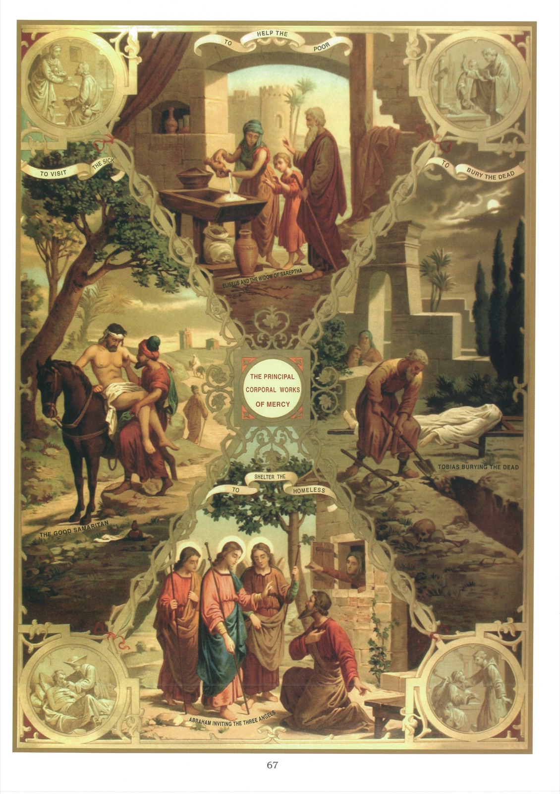

# Plate 65 — The Corporal Works of Mercy

## Explanation of the Plate

1. Mercy is a virtue which incites us to sympathize in the sufferings of others and to alleviate them when we can.

2. There are two classes of works of mercy, viz., corporal works and spiritual works.

3. The corporal works of mercy are those that which relieve the temporal wants of the body.

4. There are seven corporal works of mercy, viz., (1) to feed the hungry, (2) to give drink to the thirsty, (3) to clothe the naked, (4) to harbour the harbourless, (5) to visit the sick, (6) to visit the imprisoned and, (7) to bury the dead. We illustrate here (1), (4), (5) and (7).

## Feeding the Hungry

5. The first corporal work of mercy is to feed the hungry.

6. The central picture at the top illustrates the story of the miracle wrought by the prophet Elias on the diminutive store of meal and oil of the widow of Sarephta, so that although drawn upon daily, it suffered no decrease. Here is the story: - During the long famine that afflicted the kingdom of Israel, Elias was ordered by God to go to Sarephta in the country of the Sidonians. As he neared the gate of the town, he saw a widow-woman gathering sticks. « He called to her and said: « Give me a little water in a vessel that I may drink. » And when she was going to fetch it, he called after her, saying: « Bring me also, I beseech thee, a morsel of bread in thy hand. » And she answered: « As the Lord thy God liveth, I have no bread, but only a handful of meal in a pot and a little oil

in a cruse. Behold I am gathering two sticks that I may go in and dress it for me and my son, that we may eat it and dress it for me and my son, that we may eat it and die. » And Elias said to her: « Fear not, but go and do as thou hast said. But first make for me of the same meal a little hearth cake and bring it to me, and after make for thyself and thy son, for thus saith the Lord, the God of Israel, the pot of meal shall not waste, nor the cruse of oil be diminished until the day wherein the Lord will give rain upon the face of the earth. » (I Kings VII, 10-14.)

7. The above story shows us how God loves to reward, even with temporal favours, those who practice charity towards the poor.

8. The medallion on the left of the above picture shows a lady giving alms to a poor man.

## Harbouring the harbourless

9. The fourth corporal work of mercy is to harbour the harbourless.

10. In the large picture at the bottom, we see Abraham offering hospitality to the three angels who came to destroy the cities of Sodom and Gomorrah. (Gen. XVIII.)

11. The medallion to the right of the above shows a religious giving hospitality to a pilgrim.

## Visiting the sick

12. The fifth work of corporal mercy is to visit the sick.

13. The large picture on the left illustrates this virtue by the Gospel story of the Good Samaritan:

« A certain man went down from Jerusalem to Jericho and fell among robbers, who also stripped him and, having wounded him, went away leaving him half dead. And it chanced that a certain priest went down the same way, and seeing him passed by. In like manner also a Levite, when he was near the place and saw him, passed by. But a certain Samaritan, being on his journey, came near him, and seeing him, was moved with

compassion. And going up to him, bound up his wounds, pouring in oil and wine; and setting him upon his own beast, brought him to an inn and took care of him. And the next day he took out two pence, and gave to the host, and said: Take care of him and whatsoever thou shalt spend over and above, I at my return will repay thee! » (Luke X, 30-35.)

14. The medallion immediately below shows a Sister of Charity tending a sick person.

## Burying the dead

15. The seventh corporal work of mercy is to bury the dead.

16. This work of mercy is shown in the large picture on the right. In it we see the holy man Tobias burying one of his fellow captives. He « daily went among all his kindred and comforted them, and was careful to bury the dead and they that were slain. » (Tob. I, 19-20.)

17. In the medallion above this picture a priest is depicted sprinkling holy water on the grave of a dead person whom he has just buried.
