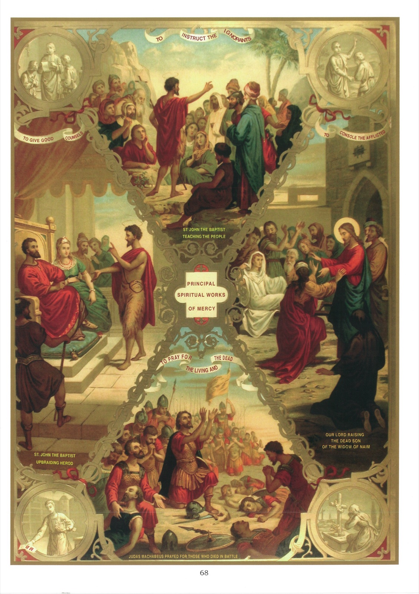

# Plate 66 — The Spiritual Works of Mercy

1. Spiritual works of mercy have for their object the good of the soul of one's neighbour.

2. They also are seven in number, viz., (1) to convert the sinner, (2) to instruct the ignorant, (3) to counsel the doubtful, (4) to comfort the sorrowful, (5) to bear wrongs patiently, (6) to forgive injuries, and (7) to pray for the living and the dead.

3. The Gospel tells us that it is by the spiritual and corporal works of mercy done by us that we shall be judged on the last day: -

« And when the Son of Man shall come in His majesty, and all the angels with Him, then shall He sit upon the seat of His Majesty. And all nations shall be gathered together before Him and He shall separate them one from another, as the shepherd separateth the sheep from the goats. And He shall set the sheep on His right hand, but the goats on his left. Then shall the King say to them that shall be on His right hand: « Come, ye blessed of My Father, possess you the kingdom prepared for you from the foundation of the world. For I was hungry, and you gave me to eat; I was thirsty, and you gave Me to drink; I was a stranger, and you took Me in; naked, and you covered Me; sick, and you visited Me. I was in prison, and you came to Me. » Then shall the just answer Him, saying: « Lord, when did we see Thee hungry, and fed Thee; thirsty, and gave Thee drink? And when did we see Thee a stranger, and took Thee in? Or naked, and covered Thee? Or when did we see Thee sick and in prison, and came to Thee? »

« And the King answering, shall say to them: « Amen, I say to you, as long as you did it to one of these My least brethren, you did it to Me! » (Matt. XXV, 31-40).

## Explanation of the Plate

4. We illustrate here only the second, third, fourth and seventh of the spiritual works of mercy.

## Instructing the ignorant

5. This is the second of the spiritual works of mercy and a striking instance of it is given in the top picture. We see St. John the Baptist teaching the people and instructing the great multitude of those who came to him for knowledge and guidance.

6. In a second illustration (the medallion on the left) one of the Brothers of the Christian Schools is represented taking his class.

## Counselling the doubtful

7. This is the third of the spiritual works of mercy and here again St. John the Baptist supplies us with a characteristic example. In the picture on the left we see him upbraiding Herod for his evil life. « It is not lawful » says he to the king, « for thee to have thy brother's wife. » (Mark VI, 18.)

8. A second example, taken from the streets of any considerable town of France, is that of the newsboy (see bottom medallion on left) selling the daily paper La Croix, the object of which is to combat the depraving influence of the irreligious and libertine press and to bring the people to love and understand better their holy religion.

## Consoling the sorrowful

9. This, the fourth spiritual work of mercy, is well illustrated by a striking event in the life of Our Lord viz., the raising of the dead son of the widow of Naim (see picture on right). One day as Jesus, accompanied by His disciples, was nearing the gate of that town, the only son of the widow was being carried out to be buried. Moved with pity for the bereaved widow, Jesus said to her « Weep not », and going up to the bier,

touched it. « And they that carried it stood still. And He said: « Young man, I say to thee, Arise! » And he that was dead, sat up and began to speak. And He gave him to his mother. » (Luke VII, 12-15.)

10. We give also another example (see top medallion on right). It is that of a young man leaving home to make his fortune in a distant land. As he speaks words of comfort to his weeping brother, he points upwards to heaven where they will one day meet never to part again.

## Praying for the living and the dead

11. A notable instance of this, the seventh of the spiritual works of mercy, is furnished by Judas Machabæus, who after a victorious battle fell upon his knees and with the survivors of his army prayed for those who had fallen in the fight. The prayer being ended, he made a collection and sent the proceeds to Jerusalem « for sacrifice to be offered for the sins of the dead ». (Mach. XII, 43.)

12. In the lower medallion on the right, we see a woman praying over the grave of her deceased parents for the repose of their souls.
