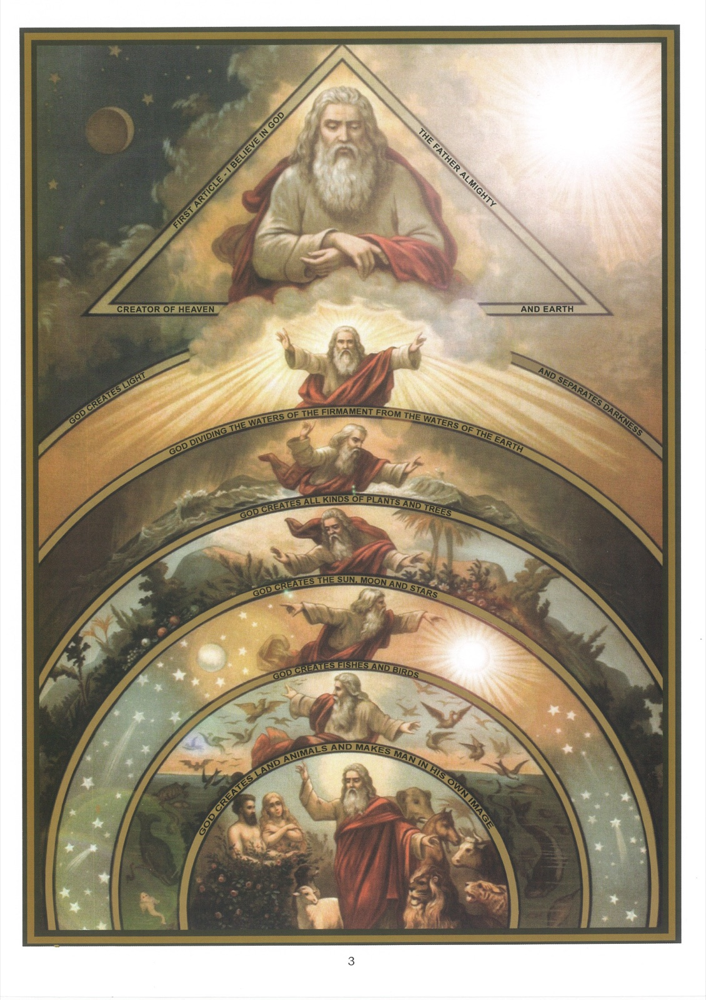

# Tableau 3 — La Création

*Premier article (suite) : … Créateur du ciel et de la terre*

## La Création

1. Ces paroles du Symbole : Dieu est le Créateur du ciel et de la terre, signifient que Dieu a fait de rien le ciel et la terre avec tout ce qu’ils contiennent.

2. Les hommes ne peuvent pas créer, parce que pour faire quelque chose de rien, il faut être tout-puissant.

3. Dieu n’était pas obligé de créer le monde ; il l’a créé parce qu’il l’a voulu.

4. Dieu a créé le monde par sa parole, c’est-à-dire par un seul acte de sa volonté.

5. Les plus parfaites créatures de Dieu sont les anges et les hommes.

## Des anges

6. Les anges ont de purs esprits que Dieu a créés pour l’adorer et exécuter ses ordres.

7. Dieu les a créés dans un état de grâce et de sainteté, mais tous n’ont pas persévéré dans cet état ; une partie d’entre eux se sont révoltés contre Dieu et perdus par leur orgueil.

8. Dieu récompensa la fidélité des bons anges en les confirmant en grâce et en les mettant en possession du bonheur du ciel.

9. Les fonctions des bons anges sont de louer Dieu et d’exécuter ses ordres.

10. Les bons anges, et en particulier les anges gardiens, veillent sur nous et nous protègent.

11. Nous devons respecter la présence de notre ange gardien, et l’invoquer dans nos tentations et dans nos dangers.

12. Dieu a puni les mauvais anges en les chassant du ciel, et en les condamnant au supplice de l’enfer.

13. Les mauvais anges cherchent à nous porter au mal, parce qu’ils sont ennemis de Dieu et jaloux du bonheur éternel qui nous est promis.

## De l’œuvre des six jours

14. Dieu a créé le ciel et la terre en six jours.

## Explication du tableau

15. Ce tableau représente l’œuvre divine par six zones circulaires, dont chacune reproduit l’un des six jours de la création et l’attitude de Dieu en opérant son œuvre.

16. La première zone représente l’œuvre du premier jour, c’est-à-dire Dieu créant la lumière.

17. La deuxième représente l’œuvre du troisième jour, c’est-à-dire Dieu créant le firmament et le séparant de la terre et des eaux.

18. La troisième représente l’œuvre du troisième jour, c’est-à-dire Dieu séparant la terre des eaux, en commandant à la terre de produire toutes sortes de plantes.

19. La quatrième représente l’œuvre du quatrième jour, c’est-à-dire Dieu créant le soleil, la lune et les étoiles.

20. La cinquième représente l’œuvre du cinquième jour, c’est-à-dire Dieu créant les oiseaux dans l’air et les poissons dans les eaux.

21. La sixième représente l’œuvre du sixième jour, c’est-à-dire Dieu créant les animaux terrestres et faisant l’homme à son image et à sa ressemblance.

22. En haut du tableau, Dieu se repose le septième jour et le consacre à son service. Ce repos est symbolisé par le soleil voilé et les astres qui président à la nuit : la lune et les étoiles. Le triangle formé par un nuage dans lequel Dieu se repose, signifie que les trois personnes divines ont toutes coopéré à l’œuvre de la création. C’est ce que nous révèlent ces paroles : « Faisons l’homme à notre image et à notre ressemblance. »

## De l’homme

23. L’homme est une créature raisonnable, composée d’une âme et d’un corps.

24. L’âme est un esprit créé à l’image de Dieu pour être uni à un corps, et qui ne mourra jamais.

25. Notre âme est créée à l’image de Dieu en ce qu’elle est capable de connaître, d’aimer et d’agir librement.

26. Il est certain que notre âme est immortelle, parce que c’est après cette vie que Dieu doit, dans sa justice, récompenser la vertu et punir le péché.

27. Dieu a créé le premier homme en formant son corps avec de la terre, et en unissant à ce corps une âme qu’il a faite de rien.

28. Pour créer la première femme, Dieu envoya au premier homme un sommeil mystérieux ; pendant qu’il dormait, il lui tira une côte dont il forma la première femme et il unit une âme à ce corps.

29. Le premier homme s’appelle Adam et la première femme s’appelle Ève. C’est d’eux que nous descendons tous, et nous les appelons pour cela nos premiers parents.

30. Dieu plaça Adam et Ève dans un lieu de délices appelé le paradis terrestre.
