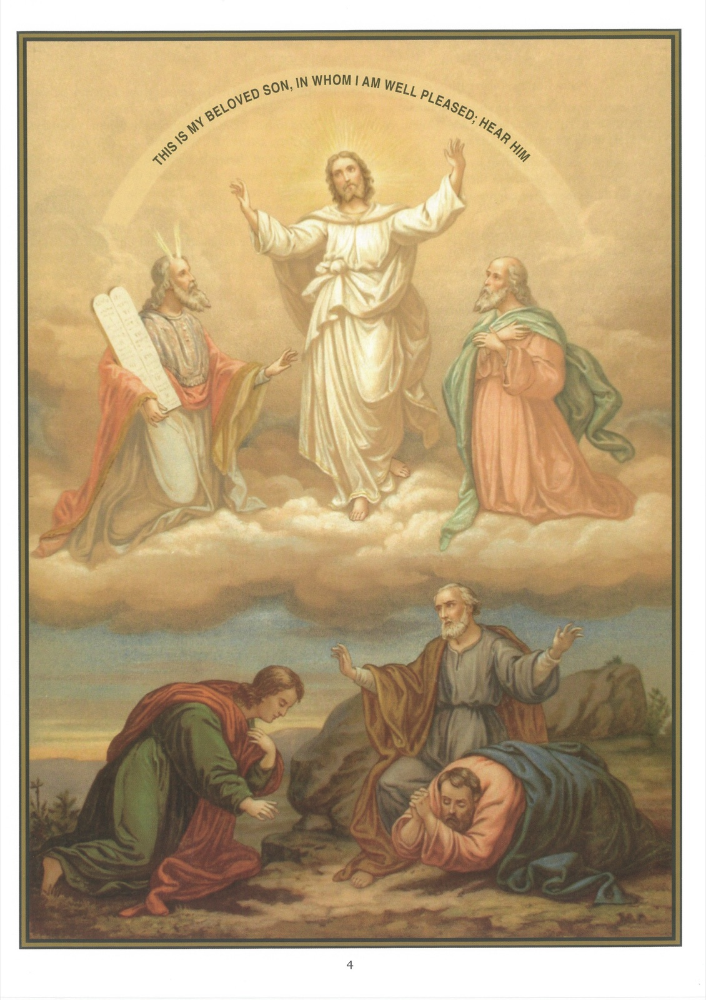

# Tableau 4 (i) — L'Incarnation — La Transfiguration

*Deuxième article : Et en Jésus-Christ son Fils unique, Notre-Seigneur*

## Promesse d’un Rédempteur

1. Dieu a créé Adam et Ève comme les anges, dans un état d’innocence et de justice, où ils n’étaient sujets ni aux souffrances ni à la mort.

2. Le démon, caché sous la figure d’un serpent, porta nos premiers parents à désobéir à Dieu en mangeant du fruit défendu.

3. En punition de leur désobéissance, ils furent chassés du paradis terrestre et condamnés à manger leur pain à la sueur de leur front ; ils devinrent sujets à l’ignorance, à la concupiscence, à la douleur, à la mort et furent exclus du bonheur du ciel.

4. Le péché d’Adam s’est communiqué à tous ses descendants, en sorte qu’ils naissent coupables du péché de leur premier père et sujets aux mêmes misères que lui.

5. Le péché, dont tous les hommes naissent coupables, s’appelle le péché originel, c’est-à-dire qui vient de notre origine (57e tableau).

6. La Très Sainte Vierge, par un privilège spécial, a été exempte du péché originel, parce qu’elle devait être la Mère du Fils de Dieu (54e tableau).

7. Dieu n’abandonna pas l’homme après son péché, mais il en eut pitié et lui promit un Sauveur, qu’on appela le Messie.

8. Dieu renouvela aux patriarches Abraham et Jacob la promesse d’un Sauveur qu’il avait faite à Adam.

9. Dieu fit annoncer d’avance par les prophètes la venue du Sauveur.

10. Les prophètes ont prédit l’époque de la venue du Messie, sa naissance d’une Vierge à Bethléem, ses miracles, sa passion, sa mort, sa résurrection et, enfin, l’établissement de sa religion par toute la terre.

11. Le Messie ou le Sauveur promis au monde est Notre-Seigneur Jésus-Christ.

## Le Verbe éternel

12. Saint Jean, au début de son Évangile, décrit ainsi la génération éternelle du Rédempteur :

13. 1 Au commencement était le Verbe, et le Verbe était en Dieu, et le Verbe était Dieu. 2 C’est lui qui était au commencement en Dieu. 3 Toutes choses ont été faites par lui, et rien de ce qui a été fait n’a été fait sans lui. 4 En lui était la vie, et la vie était la lumière des hommes. 5 Et la lumière luit dans les ténèbres, et les ténèbres ne l’ont point comprise.

14. 6 Il y eut un homme envoyé de Dieu dont le nom était Jean. 7 Il vint en témoignage, pour rendre témoignage à la lumière, afin que tous crussent par lui. 8 Il n’était pas lui-même la lumière, mais il venait rendre témoignage à la lumière.

## Le Verbe incarné

15. 9 Celui-là était la vraie lumière, qui illumine tout homme venant en ce monde. 10 Il était dans le monde, et le monde a été fait par lui, et le monde ne l’a point connu. 11 Il est venu chez lui, et les siens ne l’ont point reçu. 12 Mais à tous ceux qui l’ont reçu, il leur a donné la puissance de devenir les enfants de Dieu, à ceux qui croient en son nom, 13 qui ne sont point nés du sang, ni de la volonté de la chair, ni de la volonté de l’homme, mais de Dieu. 14 Et le verbe s’est fait chair, et il a habité parmi nous ; et nous avons vu sa gloire, gloire de l’Unique engendré par le Père, plein de grâce et de vérité.

## Témoignage du Précurseur

16. 15 Jean rend témoignage de lui, et il crie, disant : C’était de celui-ci que j’ai dit : Celui qui doit venir après moi a été établi au-dessus de moi, parce qu’il était avant moi. 16 Et de sa plénitude nous avons tous reçu, et grâce après grâce. 17 Car la loi a été donné par Moïse ; la grâce et la vérité sont venues par Jésus-Christ. 18 Personne n’a jamais vu Dieu ; le Fils unique qui est dans le sein du Père, lui, l’a manifesté.

## Explication du tableau

17. Ce tableau représente le miracle de la transfiguration, dans lequel Dieu le Père a proclamé Jésus-Christ son Fils.

18. Jésus-Christ ayant conduit avec lui sur le mont Thabor trois de ses disciples, Pierre, Jacques et Jean, fut tout à coup transfiguré devant eux. Son visage devint brillant comme le soleil et son vêtement blanc comme la neige comme la neige. Nous voyons ici Moïse et Élie qui s’entretiennent avec lui à la vue de ses disciples. Du milieu de la nuée lumineuse qui les couvre, une voix fait entendre ces paroles : Celui-ci est mon Fils bien-aimé en qui j’ai mis toutes mes complaisances ; écoutez-le. À cette voix, les apôtres qui avaient accompagné Notre-Seigneur sont saisis de frayeur et tombent la face contre la terre. Au milieu d’eux, saint Pierre dit : « Seigneur, nous sommes bien ici ; si vous le voulez, faisons-y trois tentes : une pour vous, une pour Moïse et une pour Élie. »
