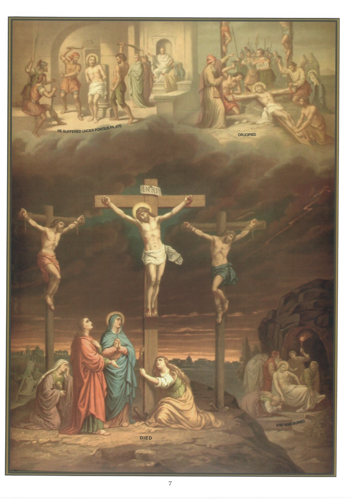

# Tableau 5 — La Rédemption

*Quatrième article : A souffert sous Ponce-Pilate, a été crucifié, est mort, a été enseveli*

## Mystère de la Rédemption

1. Le mystère de la Rédemption est le mystère du Fils de Dieu mort sur la Croix pour racheter tous les hommes.

2. Ces paroles : Qui a souffert sous Ponce-Pilate, signifient que, lorsque Ponce-Pilate était gouverneur de la Judée pour les Romains, Jésus-Christ a enduré toutes sortes de souffrances dans son âme et dans son corps.

3. Dans son âme, Jésus-Christ a souffert le dégoût, la frayeur, une tristesse mortelle : Mon âme, disait-il, est triste jusqu’à la mort.

4. Dans son corps, Jésus-Christ a tant souffert que le prophète Isaïe l’appelait un homme de douleurs, un homme frappé de Dieu et brisé pour nos crimes.

5. Tant de souffrances n’étaient pas nécessaires pour notre rédemption, car une seule goutte de sang aurait suffi à Jésus-Christ pour nous racheter, puisqu’elle avait un mérite infini.

6. Notre-Seigneur a voulu tant souffrir pour nous témoigner davantage son amour, et pour nous inspirer une plus vive horreur du péché, qui a été cause de sa mort.

7. Jésus-Christ a souffert : 1° au jardin des Oliviers ; 2° chez Caïphe ; 3° chez Hérode ; 4° chez Pilate ; 5° sur le Calvaire.

8. Au jardin des Oliviers, Jésus-Christ souffrit les douleurs de l’agonie, qui furent si grandes, qu’elles lui firent répandre une sueur de sang. C’est dans ce jardin que Judas, l’un de ses apôtres, le livra à ses ennemis par un baiser (18e tableau).

9. Chez Caïphe, grand-prêtre des Juifs, Jésus-Christ fut renié trois fois par saint Pierre (29e tableau), souffleté, couvert de crachats et déclaré digne de mort parce qu’il s’était dit Fils de Dieu.

10. Chez Hérode, tétrarque de Galilée, qui était venu à Jérusalem pour célébrer la Pâque, Jésus-Christ fut revêtu d’une robe blanche, par dérision, et traité comme un insensé.

11. Chez Pilate, Jésus-Christ fut battu de verges, couronné d’épines et condamné à être crucifié, bien que le juge eût reconnu son innocence.

12. Sur le Calvaire, Jésus-Christ fut abreuvé de fiel et de vinaigre, et crucifié entre deux voleurs. Élevé en Croix, il demanda pardon à son Père pour ses bourreaux ; il promit le paradis au bon larron ; il recommanda sa Mère ; enfin, après avoir dit que tout était consommé, il remit son âme entre les mains de son Père.

13. Ces paroles du Symbole : Est mort, signifient que l’âme de Jésus-Christ a été séparée de son corps ; mais la divinité est restée unie à son âme et à son corps même après sa mort.

14. Jésus-Christ est mort le jour du Vendredi-Saint vers 3 heures de l’après-midi.

15. À la mort de Jésus-Christ, le soleil s’éclipsa, la terre trembla, les rochers se fendirent, le voile du Temple se déchira de haut en bas, et plusieurs morts ressuscitèrent, comme on le voit en bas de ce tableau, à gauche.

16. Après la mort de Jésus-Christ, un soldat lui ouvrit le côté d’un coup de lance, et il en sortit du sang et de l’eau.

17. Notre-Seigneur permit qu’on lui fît cette blessure pour montrer : 1° qu’il nous avait aimés à l’excès en versant pour nous jusqu’à la dernière goutte de son sang ; 2° que son cœur serait toujours ouvert pour répandre sur nous l’abondance de ses grâces.

18. Ces paroles du Symbole : A été enseveli, signifient qu’après la mort de Jésus-Christ son corps fut détaché de la Croix et mis dans le tombeau.

19. Après la sépulture de Jésus-Christ, on roula une grosse pierre à l’entrée du sépulcre, ensuite Pilate la fit sceller, et des soldats juifs furent chargés de garder le tombeau.

20. Les Juifs prirent ces précautions pour empêcher qu’on enlevât le corps de Jésus-Christ ; mais Dieu les permit afin de rendre sa résurrection plus manifeste.

## Le Chemin de la croix

21. L’Église demande à ses fidèles de faire souvent l’exercice dit du Chemin de la Croix, qui rappelle aux fidèles, en quatorze stations, la Passion douloureuse de notre Sauveur, depuis sa condamnation à mort jusqu’à sa mise au tombeau. Elle a attaché de nombreuses indulgences à ce pieux exercice et les fidèles qui y ont une grande dévotion en retirent de précieuses grâces.

## Explication du tableau

22. Nous voyons en haut de ce tableau Pilate assis sur son tribunal ; à gauche, Jésus-Christ est battu de verges ; à droite, il est attaché à la croix. En bas, à droite, il est crucifié entre les deux larrons. Sa sépulture est représentée au bas de ce tableau, dans l’angle de droite.
