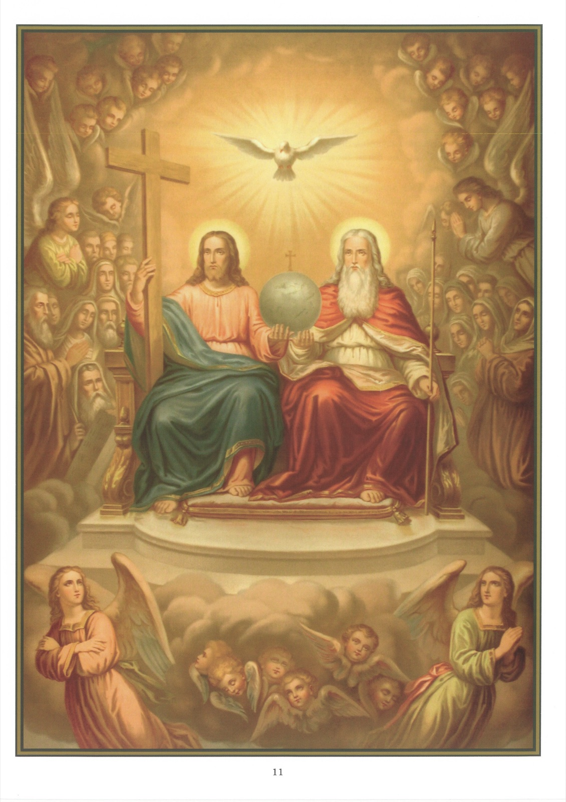

# Tableau 9 — Jésus à la droite de son Père

*Sixième article (suite) : … Est assis à la droite de Dieu le Père tout-puissant*

1. Le Symbole nous dit que Jésus-Christ est assis, pour nous faire entendre qu’il se repose et jouit dans le ciel, d’un bonheur qui n’aura point de fin.

2. Jésus est assis dans le Ciel comme un roi sur son trône et comme un juge en son tribunal. En cette double qualité, il exerce le pouvoir législatif et judiciaire dont il parlait lorsqu’il disait, avant de quitter ce monde : Tout pouvoir m’a été donné au ciel et sur la terre.

3. Jésus-Christ, ajoute le Symbole, est assis à la droite de Dieu le Père. Ce n’est pas à dire que Dieu ait une main droite et une main gauche ; mais comme la droite est la place d’honneur, ces paroles signifient que Jésus-Christ, qui est égal à son Père comme Dieu, est élevé comme homme au-dessus de toutes les créatures.

4. Quoique nous soyons redevables de notre salut et de notre rédemption à la Passion de Jésus-Christ, dont les mérites ont ouvert la porte du ciel aux justes, cependant l’Ascension n’est point seulement un modèle placé sous nos yeux pour nous apprendre à élever nos pensées et à monter au ciel en esprit, elle nous communique encore une force divine pour atteindre ce but. Elle met le comble au mérite de notre foi, elle affermit notre espérance et elle fixe vers le ciel l’amour de notre cœur.

5. L’Ascension met le comble au mérite de notre foi, car la foi a pour objet les choses qui ne se voient point, et qui ne sont point à la portée de la raison et de l’intelligence de l’homme. Si donc Notre-Seigneur ne nous eût point quitté, notre foi aurait perdu de son mérite, puisque les heureux que proclame Jésus-Christ lui-même sont ceux qui ont cru sans avoir vu.

6. Ensuite, elle est très propre à affermir l’espérance dans nos cœurs. En croyant que Jésus-Christ comme homme est monté au ciel et qu’il a placé la nature humaine à la droite de Dieu de Père, nous avons un puissant motif d’espérer que nous, qui sommes ses membres, nous y monterons un jour pour nous réunir à notre chef, surtout après que le Seigneur nous a garanti lui-même cette réunion en ces termes : Mon Père, ceux que vous m’avez donnés, je veux que là où je suis, ils y soient avec moi.

7. Un des plus grands avantages qu’elle nous procure encore, c’est d’avoir fixé vers le ciel l’amour de notre cœur et de l’avoir enflammé des ardeurs de l’Esprit divin. On a dit avec beaucoup de vérité que là où était notre trésor, là aussi était notre cœur. Certainement alors, si Jésus-Christ eût continué à demeurer avec nous, nous aurions borné toutes nos pensées à le connaître de vue et à jouir de son commerce ; nous n’aurions considéré en lui que l’homme qui nous aurait comblé de ses bienfaits, et nous n’aurions eu pour lui qu’une sorte d’affection toute naturelle.

8. En montant au ciel, il a spiritualisé notre amour, et comme nous ne pouvions plus l’atteindre que par la pensée à cause de son absence, nous avons été par là même facilement disposés à l’adorer et à l’aimer comme un Dieu. C’est ce que nous apprend, d’une part, l’exemple des apôtres : tant que le sauveur fut avec eux, ils semblaient n’avoir pour lui que des sentiments tout humains. Et de l’autre, c’est ce que nous confirme le témoignage de Notre-Seigneur lui-même, quand il dit : Il est bon pour vous que je m’en aille. En effet, cet amour imparfait dont ils l’aimaient pendant qu’il vivait avec eux avait besoin d’être perfectionné par l’amour divin, c’est-à-dire par la descente du Saint-Esprit ; aussi ajoute-t-il aussitôt : Si je ne m’en vais pas, le Paraclet ne viendra point à vous.

9. L’Ascension fut le commencement d’un nouveau développement ici-bas pour l’Église, cette véritable maison de Jésus-Christ dont le gouvernement et la direction allaient être confiés à la vertu de l’Esprit-Saint. Jusque-là, pour le représenter auprès des hommes, il avait placé à la tête de cette Église comme premier pasteur et comme souverain prêtre, Pierre, le prince des apôtres ; mais depuis ce moment, outre les douze, « c’est Lui qui a fait les uns apôtres, les autres prophètes, ceux-ci évangélistes, ceux-là pasteurs et docteurs » (Épître aux Éphésiens, 4, 11-12), continuant, de la droite de son Père où il est assis, à distribuer à tous les dons qui leur conviennent. Car l’Apôtre nous affirme que la grâce est donnée à chacun de nous selon la mesure du don de Jésus-Christ.

## Explication du tableau

10. Ce tableau représente Jésus-Christ assis dans le ciel à la droite de son Père sur un trône de gloire ; les anges et les saints l’environnent, et son trône est porté par une multitude d’esprits célestes. Le Père tient un sceptre ; le Fils sa Croix, et tous deux soutiennent le monde, créé par le Père, racheté par le Fils et sanctifié par le Saint-Esprit.
