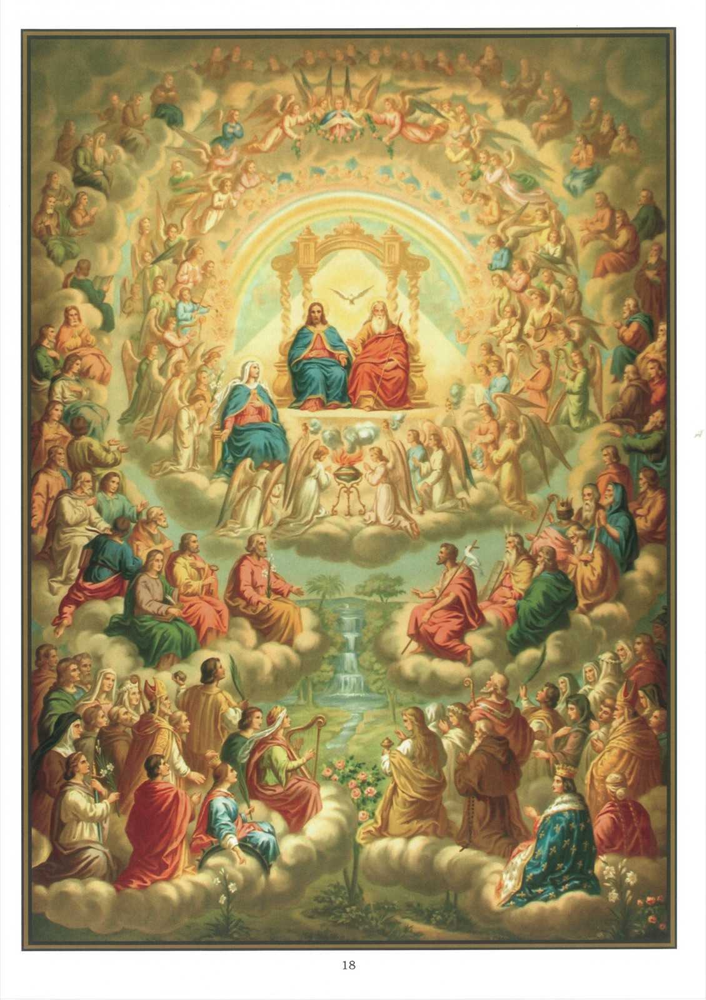

# Tableau 16 — Le Paradis

*Douzième article : Je crois la vie éternelle*

## Le ciel

1. Ces derniers mots du Symbole : La vie éternelle, nous apprennent qu’après cette vie il y aura une autre vie éternellement heureuse dans le ciel, ou éternellement malheureuse dans l’enfer.

2. Nous sommes assurés qu’il y aura une autre vie après celle-ci, parce que Dieu l’a révélé, et qu’une autre vie est nécessaire pour la récompense des bons et la punition des méchants.

3. Le ciel ou le paradis est un lieu de délices où les anges et les saints voient Dieu face à face et sont pleinement heureux avec lui pour toujours.

4. Ceux qui vont au ciel sont ceux qui meurent en état de grâce et qui ont entièrement satisfait à la justice de Dieu.

5. Nous savons que les saints voient Dieu dans le ciel, par ces paroles de Notre-Seigneur : Bienheureux ceux qui ont le cœur pur, parce qu’ils verront Dieu.

6. Le bonheur des saints dans le ciel est tellement grand, que nous ne pouvons pas le comprendre ici-bas : L’œil de l’homme n’a jamais vu, dit saint Paul, son oreille n’a jamais entendu et son cœur n’a jamais conçu ce que Dieu prépare à ceux qui l’aiment.

7. Selon les Saints Pères, la félicité de la vie éternelle, c’est à la fois la délivrance de tous les maux et la possession de tous les biens.

8. En ce qui concerne les maux, nos saints Livres sont clairs et formels. Ainsi il est écrit dans l’Apocalypse : Les bienheureux n’auront plus ni faim ni soif ; le soleil ni aucune chaleur ne les incommodera plus. Et ailleurs : Dieu essuiera toutes les larmes de leurs yeux ; il n’y aura plus ni mort, ni deuil, ni cris, ni douleurs, parce que le premier état sera passé.

9. En ce qui concerne les biens, leur gloire sera immense, et en même temps ils posséderont tous les genres de joies et délice. Mais aujourd’hui, il est impossible que nous comprenions la grandeur de ces biens ; ils ne peuvent se manifester à notre esprit.

10. Pour les goûter, il faut que nous soyons entrés dans la joie du Seigneur. Alors nous en serons comme inondés et enveloppés de toutes part, et tous nos désirs seront satisfaits. 11 Bien que tous les saints voient Dieu dans le ciel, leur bonheur est plus ou moins grand, selon leurs mérites.

12. Actuellement, les âmes des saints sont seules dans le ciel, leurs corps n’y entreront qu’après la résurrection.

13. Les bienheureux contempleront éternellement Dieu présent devant eux ; et ce don, le plus excellent et le plus admirable de tous, les rendra participants de la nature divine, et les mettra en possession de la vraie et définitive béatitude. Béatitude à laquelle nous devons avoir une foi si grande, que le Symbole des Pères de Nicée nous ordonne de l’attendre de la bonté de Dieu, avec la plus ferme espérance : J’attends la résurrection des morts et la vie du siècle à venir.

## Explication du tableau

14. Ce tableau représente le ciel. Au centre, nous voyons les trois Personnes divines assises dans un triangle sur un trône de gloire, environné des anges. Plusieurs d’entre eux jouent de divers instruments, et d’autres agitent des encensoirs devant les trois personnes divines. La Sainte Vierge, leur reine, est à leur tête, à la droite de Jésus-Christ son Fils et sur un trône inférieur au trône de Dieu, mais supérieur à tout ce qui n’est pas de Dieu.

15. Au second rang figurent : à droite, saint Jean-Baptiste, Moïse, David, Abraham et d’autres saints de l’Ancien Testament ; à gauche, saint Joseph, saint Pierre avec les apôtres, un évangéliste tenant un livre et plusieurs saints du Nouveau Testament.

16. Au troisième rang, on voit les autres saints, parmi lesquels il y a des martyrs, comme saint Étienne, de saints pontifes, un saint roi, de saintes vierges martyres, comme sainte Cécile et sainte Catherine, et de saintes femmes, comme sainte Marie-Madeleine.

17. Saint Étienne porte une pierre dans la main, parce qu’il fut martyrisé à coups de pierres.

18. Sainte Cécile tient une harpe, parce qu’elle chantait les louanges de Dieu au son des instruments de musique.

19. Aux pieds de sainte Catherine, on voit une roue brisée, parce qu’on voulut la mettre à mort au moyen d’une roue armée d’instruments tranchants ; mais cette roue se brisa lorsqu’on la mit en mouvement.

20. Sainte Marie-Madeleine tient un vase dans la main, parce qu’elle répandit un jour sur la tête de Notre-Seigneur un vase rempli de parfum précieux.
