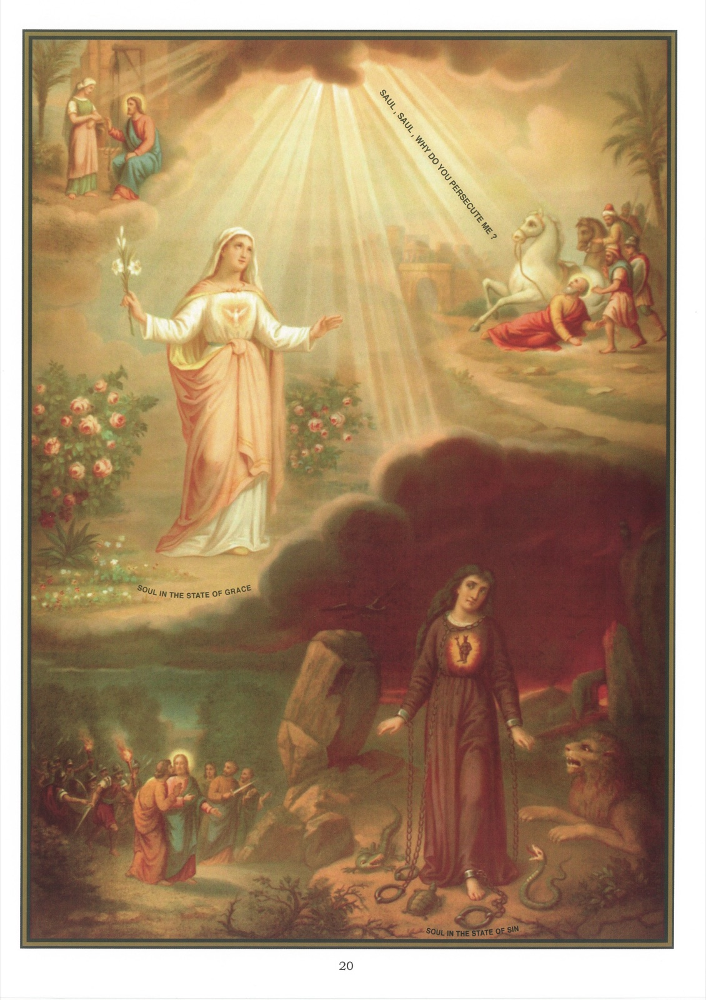

# Tableau 18 — La Grâce

1. La grâce est un don surnaturel que Dieu nous fait gratuitement, en vue des mérites de Jésus-Christ, pour opérer notre salut.

2. Je dis que la grâce est un don, parce que Dieu nous l’accorde par pure bonté, sans y être obligé ; c’est aussi ce que veut dire le mot gratuitement ; – un don surnaturel, parce que la grâce surpasse les forces de notre nature et que nous ne pouvons l’acquérir par nous-mêmes ; – que Dieu nous fait, par les mérites de Jésus-Christ, parce que c’est Jésus-Christ qui nous a mérité la grâce en mourant pour nous sur la croix ; – pour opérer notre salut, parce que Dieu nous donne la grâce, non pour nous rendre heureux sur la terre, mais pour nous aider à mériter le bonheur du ciel.

3. Outre la grâce, Dieu nous a accordé des dons qu’on appelle naturels, comme la santé, la fortune, les qualités de l’esprit et du cœur.

4. Ces dons naturels contribuent indirectement à opérer notre salut, mais ils ne sauraient nous sauver par eux-mêmes ; la grâce seule peut nous rendre dignes de la vie éternelle.

5. Il résulte de là que la grâce est le plus précieux de tous les biens, puis qu’elle a coûté le sang d’un Dieu et qu’elle nous mérite le ciel.

6. Il y a deux sortes de grâces : la grâce habituelle ou sanctifiante, et la grâce actuelle.

7. La grâce habituelle est une grâce qui demeure en notre âme, qui la rend sainte, agréable aux yeux de Dieu et digne de la vie éternelle.

8. Cette grâce est appelée habituelle, parce qu’elle se conserve en nous, lors même que notre volonté n’agit pas, par exemple dans le sommeil ; elle élève l’âme qui la possède à un état surnaturel qu’on appelle état de grâce.

9. Dans cet heureux état, on aime Dieu et on en est aimé, selon ces paroles de Notre-Seigneur Jésus-Christ : Si quelqu’un m’aime, mon Père l’aimera, et nous viendrons à lui, et nous ferons en lui notre demeure.

10. De plus, la grâce sanctifiante rend toutes nos actions, même les plus petites, méritoires pour le ciel, lorsqu’elles sont faites en vue de plaire à Dieu.

11. La grâce sanctifiante s’accroît surtout par la réception des sacrements ; elle s’affaiblit par notre tiédeur et par le péché véniel ; elle se perd tout à fait par le péché mortel.

12. La grâce actuelle est un secours que Dieu nous donne, au moment où nous en avons besoin, pour faire le bien et éviter le mal.

13. Ce secours consiste : 1° dans les bonnes pensées que Dieu met dans notre esprit ; 2° dans les bons mouvements par lesquels il excite et aide notre volonté.

14. Outre ce secours, purement intérieur, Dieu se sert encore, pour nous porter à faire le bien, de moyens extérieurs de salut, comme la prédication, les bons exemples, les miracles, etc.

15. Sans la grâce, nous ne pouvons rien faire qui soit utile pour le ciel, comme nous l’apprennent ces paroles de Notre-Seigneur : Sans moi, vous ne pouvez rien faire.

16. Dieu donne à tous des grâces actuelles, même aux pécheurs et aux infidèles, parce qu’il veut le salut de tous les hommes.

17. Dieu nous donne toujours au moins la grâce de la prière, avec laquelle nous pouvons obtenir toutes les grâces dont nous avons besoin.

18. Quand Dieu nous donne une grâce actuelle, notre devoir est d’y coopérer, c’est-à-dire de suivre ses inspirations sans jamais y résister.

## Explication du tableau

19. Ce tableau nous offre en haut, à droite, un modèle admirable de la fidélité à la grâce dans la personne de saint Paul. Un jour qu’il se rendait à Damas pour mettre en prison tous les chrétiens qu’il trouverait dans cette ville, il entendit une voix qui lui dit : Saul ! Saul ! pourquoi me persécutes-tu ? Il répondit : Qui êtes-vous, Seigneur ? La voix lui dit : Je suis Jésus, que tu persécutes. Saul lui dit alors : Seigneur, que voulez-vous que je fasse ?

20. Nous voyons en haut, à gauche, Notre-Seigneur assis sur le bord du puits de Jacob et disant à la Samaritaine : Ah ! si vous connaissiez le don de Dieu ! Ce « don de Dieu », qui l’emporte sur tous les biens de ce monde, n’est autre que la grâce.

21. L’âme en état de grâce est représentée au milieu de ce tableau par une vierge revêtue de la robe d’innocence et tenant un lis à la main ; elle regarde le ciel et porte le Saint-Esprit dans son cœur, selon cette parole de saint Paul : Ne savez-vous pas que vous êtes le temple de Dieu, et que l’esprit de Dieu habite en vous ?

22. L’âme en état de péché mortel est représentée en bas, à droite, par une vierge plongée dans les ténèbres, revêtue d’habits de deuil et enchaînés par le démon qui règne en maître dans son cœur.
