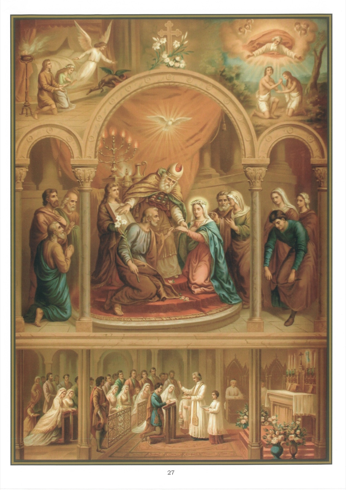

# Tableau 25 — Le Mariage

1. Le mariage est un sacrement qui unit légitimement l’homme et la femme, et leur donne la grâce de vivre ensemble chrétiennement.

2. C’est Dieu qui a institué le mariage dès le commencement du monde, et Jésus-Christ l’a élevé à la dignité de sacrement.

3. Le plus saint mariage qui ait jamais existé est celui de saint Joseph avec la Sainte Vierge.

4. Pour qu’un Mariage soit valide, il faut : 1° qu’il n’y ait aucun des empêchements qui le rendrait nul ; 2° qu’il soit célébré devant le curé de l’un des époux et en présence de plusieurs témoins.

5. Il y a deux sortes d’empêchements du Mariage : les uns le rendent nul ; les autres, sans le rendre nul, font qu’on pécherait en le contractant.

6. Les empêchements les plus ordinaires qui rendent le mariage nul sont la parenté et l’alliance jusqu’au quatrième degré, et la parenté spirituelle, qui résulte, par exemple, du baptême, entre un parrain et sa filleule, entre une marraine et son filleul.

7. L’Église ordonne de publier des bans avant le mariage, pour découvrir les empêchements qui pourraient y mettre obstacle.

8. On peut quelquefois obtenir du Pape et des Évêques la dispense d’un empêchement de Mariage, quand on a pour cela des raisons suffisantes.

9. Pour bien recevoir le sacrement de Mariage, il faut avoir des intentions et des vues chrétiennes, s’y préparer par la prière, par une bonne confession, et, autant que possible, par la sainte Communion.

10. Se marier en état de péché mortel, c’est un sacrilège qui attire souvent la malédiction de Dieu sur les familles.

11. Les personnes qui ne sont unies que devant l’officier civil ne sont pas mariées devant Dieu : elles vivent dans l’habitude du péché mortel, et sont indignes de recevoir les sacrements et la sépulture ecclésiastique.

12. Les personnes mariées doivent se garder une fidélité inviolable, s’assister dans leurs besoins, supporter mutuellement leurs défauts et donner à leurs enfants une éducation chrétienne.

13. Le mariage est indissoluble : il ne peut être rompu que par la mort de l’un des deux époux. « Ce que Dieu a uni, dit le saint Évangile, l’homme ne saurait le séparer. »

14. Le premier bien du mariage, c’est la famille, c’est-à-dire les enfants nés d’une épouse légitime et véritable. L’apôtre saint Paul l’élève si haut, qu’il va jusqu’à dire : La femme sera sauvée par les enfants qu’elle mettra au monde. Paroles qui doivent s’entendre, non pas seulement de la génération des enfants, mais encore de leur éducation et du soin de les former à la piété, car il ajoute aussitôt : S’ils persévèrent dans la foi.

15. Il y a un état plus parfait que le Mariage : c’est celui de la virginité chrétienne, qui fait marcher ceux qui l’embrassent dans la voie suivie par Jésus-Christ lui-même.

16. Les parents qui empêchent leurs enfants d’embrasser la vie religieuse, quand ils y sont appelés de Dieu, se rendent grandement coupables et s’exposent à faire le malheur de leurs enfants.

## Explication du tableau

17. Nous voyons au milieu de ce tableau saint Joseph épousant la Sainte Vierge en présence du grand-prêtres, dans le temple de Jérusalem. Le lis en fleurs que saint Joseph tient à la main rappelle la manière dont il fut choisi pour devenir l’époux de la sainte Vierge. Lorsque Marie fut parvenue à l’âge d’être mariée, le grand prêtre rassembla les jeunes gens de la famille de David qui désiraient l’épouser, et remit à chacun d’eux un rameau bénit, en leur ordonnant d’y inscrire leurs noms ; puis il déposa tous les rameaux sur l’autel, et pria le Seigneur de manifester lui-même son choix. Quand il les reprit, celui de Joseph seul était couvert de feuillage et d’une fleur blanche semblable au lis. À gauche, on voit un jeune homme désolé de n’avoir pas été choisi, brise le rameau qu’il avait reçu du grand prêtre.

18. Ce tableau représente, en haut, à gauche, le jeune Tobie et Sara se préparant au mariage par de ferventes prières. On voit l’ange Raphaël chasser un démon qui avait tué les sept maris de Sara, à cause des mauvaises dispositions avec lesquelles ils voulaient s’engager dans le mariage. Ce qui obtient à Tobie et à Sara la protection de l’ange, ce fut la résolution qu’ils avaient prise de servir Dieu dans l’état du mariage.

19. Au bas du tableau, nous voyons deux catholiques qui se marient en présence d’un prêtre.

20. Ce tableau représente en haut, à droite, Adam, et, près de lui, Ève, que Dieu forma d’une de ses côtes. Dieu les bénit et leur dit : Croissez et multipliez-vous.
