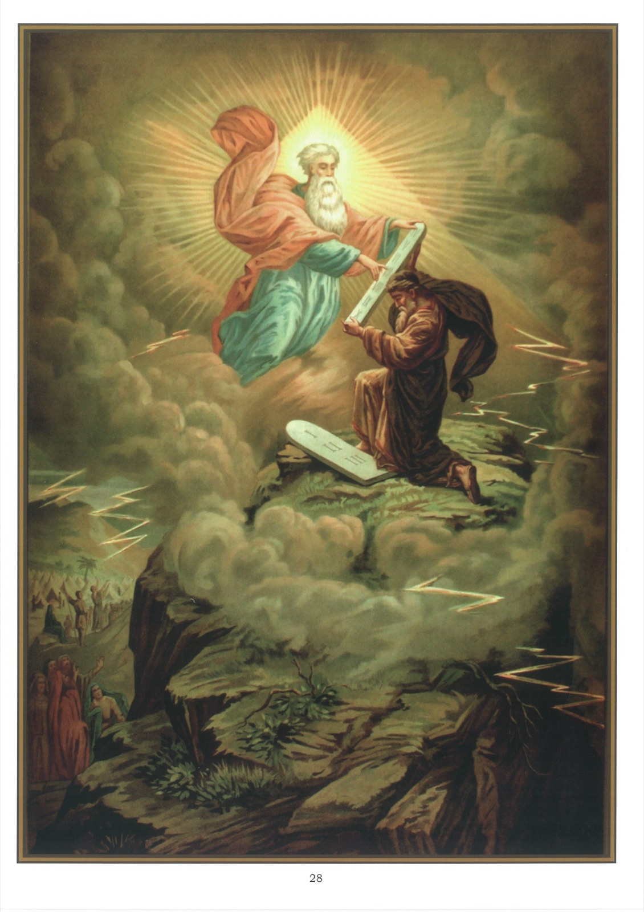

# Tableau 26 — Commandements de Dieu — Le Décalogue

1. Pour être sauvé, il ne suffit pas de croire les vérités que Dieu a révélées, mais il faut encore observer ses commandements et ceux de l’Église.

2. Il y a dix commandements de Dieu : c’est ce qu’on appelle le Décalogue.

3. Dieu a donné aux hommes les dix commandements sur le mont Sinaï, par le ministère de Moïse, cinquante jours après que les Israélites étaient sortis de l’Égypte.

4. Voici les dix commandements, tels que Dieu les a donnés à son peuple : I. Je suis le Seigneur votre Dieu, qui vous ai tirés de la terre d’Égypte, de la maison de servitude. Vous n’aurez point d’autre dieu que moi. II. Vous ne prendrez point le nom du Seigneur votre Dieu en vain.

## III. Souvenez-vous de sanctifier le jour du sabbat

IV. Honorez votre père et votre mère, afin que vous viviez longtemps sur la terre.

## V. Vous ne tuerez point

## VI. Vous ne commettrez point de fornication

## VII. Vous ne déroberez point

VIII. Vous ne porterez point de faux témoignage contre votre prochain. IX. Vous ne désirerez point la femme de votre prochain. X. Vous ne désirerez point sa maison, ni son serviteur, ni sa servante, ni son bœuf, ni son âne, ni rien qui soit à lui.

5. Dieu grava le Décalogue sur deux tables de pierre. Sur la première étaient les trois premiers commandements, qui se rapportent à Dieu ; la seconde contenait les sept derniers commandements, qui se rapportent au prochain.

6. Les trois premiers commandements se rapportent à Dieu. En effet, le premier nous ordonne d’adorer Dieu ; le deuxième, de respecter son nom, et le troisième d’observer le jour consacré à son honneur.

7. Les sept derniers commandements se rapportent au prochain. En effet, le quatrième nous ordonne d’honorer nos père et mère, et les six derniers nous défendent de nuire au prochain dans sa personne, dans ses biens et aussi dans son honneur.

8. Le Décalogue avait été gravé dès l’origine dans le cœur de l’homme. Dieu l’a publié de nouveau sur le mont Sinaï, parce que l’ignorance et les passions, suites du péché originel, l’avaient presque entièrement effacé de la conscience humaine.

9. Le Décalogue oblige les chrétiens aussi bien que les Israélites. Jésus-Christ l’a déclaré en ces termes : Si vous voulez parvenir à la vie éternelle, observez les commandements.

10. Il le déclare aussi dans la parabole suivante : 25 Et voici qu’un docteur de la Loi, se levant pour le tenter, dit : Maître, que ferai-je pour posséder la vie éternelle ? 26 Mais Jésus lui dit : Dans la Loi, qu’y a-t-il d’écrit ? Qu’y lisez-vous ? 27 Il répondit : Tu aimeras le Seigneur ton Dieu de tout ton cœur, de toute ton âme, et de toutes tes forces, et de tout ton esprit, et ton prochain comme toi-même. 28 Jésus lui dit : Vous avez bien répondu ; faites cela et vous vivrez. 29 Mais lui, voulant se justifier, dit à Jésus : Et qui est mon prochain ? 30 Jésus reprenant, dit : Un homme descendait de Jérusalem vers Jéricho, et il tomba entre les mains des voleurs, qui le dépouillèrent ; et, après l’avoir couvert de plaies, ils s’en allèrent, le laissant à demi-mort. 31 Or, il arriva qu’un prêtre descendait par le même chemin ; et, l’ayant vu, il passa outre. 32 Pareillement, un lévite s’étant trouvé près de là, le vit et passa outre. 33 Mais un Samaritain qui était en voyage vint près de lui, et, le voyant, fut touché de compassion. 34 Et, s’approchant, il banda ses plaies, y versa de l’huile et du vin ; et, le mettant sur sa monture, il le conduisit en une hôtellerie et pris soin de lui. 35 Et le lendemain, tirant deux deniers, il les donna à l’hôtelier et dit : Prenez soin de lui, et tout ce que vous dépenserez de plus, moi-même à mon retour, je vous le rendrai. 36 De ces trois, lequel vous paraît avoir été le prochain de celui qui était tombé entre les mains des voleurs ? 37 Le docteur répondit : Celui qui a été compatissant pour lui. Et Jésus lui dit : Allez et faites de même. (Luc 10 ; 25-37)

11. Nous sommes obligés d’observer les commandements de Dieu, parce que Dieu est notre souverain Maître, qu’il a droit à notre obéissance et que, avec sa grâce, ils sont faciles à observer.

## Explication du Tableau

12. Ce tableau représente Moïse recevant de Dieu les deux tables de la Loi. Pendant que Dieu donnait ses commandements à Moïse, une nuée épaisse couvrait le Sinaï ; le peuple vit briller des éclairs et entendit le fracas de la foudre et le bruit retentissant des trompettes. Par ce terrible appareil, Dieu voulut inspirer à son peuple une crainte salutaire qui le portât à observer sa Loi.
