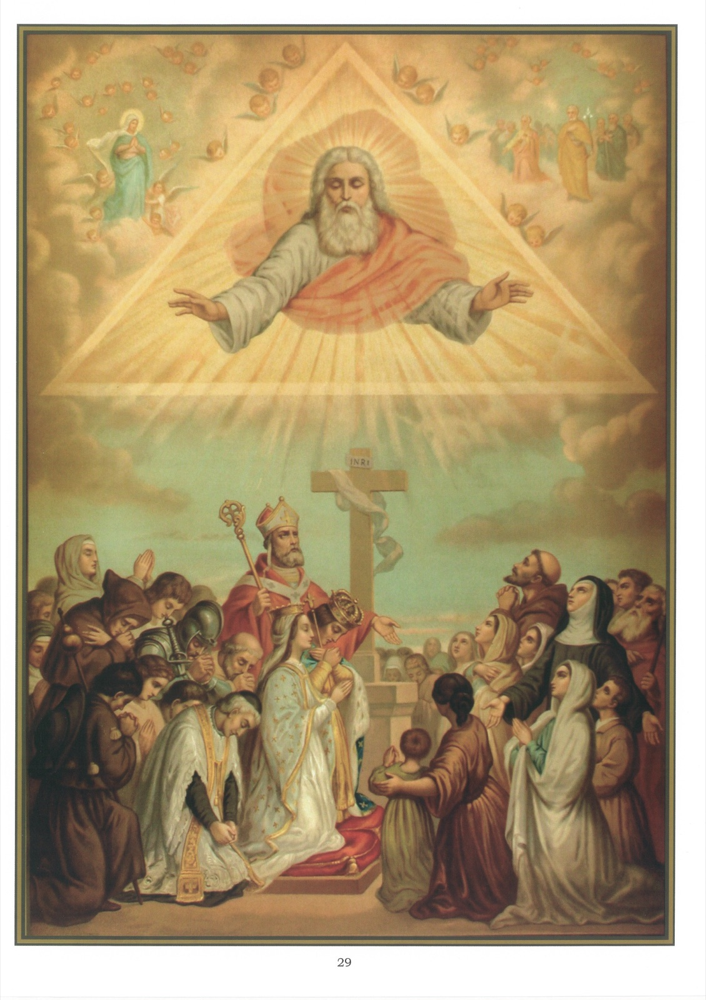

# Tableau 27 — 1er Commandement

## Premier Commandement de Dieu :

Un seul Dieu tu adoreras, Et aimeras parfaitement.

1. Le premier commandement nous ordonne : 1° de croire en Dieu ; 2° d’espérer en lui ; 3° de l’aimer de tout notre cœur ; 4° de n’adorer que lui seul.

2. Nous accomplissons les trois premiers de ces devoirs par la pratique des trois vertus théologales, la foi, l’espérance et la charité.

## De l’adoration due à Dieu seul

3. Adorer Dieu, c’est reconnaître qu’il est notre Créateur et notre souverain Seigneur, et nous humilier profondément devant lui.

4. Le précepte de l’Adoration nous oblige à rendre à Dieu : 1° un culte intérieur ; 2° un culte extérieur et public.

5. Nous rendons à Dieu un culte intérieur quand nous l’honorons dans notre cœur par des actes d’adoration, de foi, d’espérance, de charité, qui ne paraissent pas au-dehors.

6. Notre culte est extérieur quand nous manifestons au-dehors, par des paroles ou par des actions, les sentiments de religion dont nous sommes animés envers Dieu.

7. Nous devons rendre à Dieu un culte extérieur : 1° parce que notre corps lui appartient aussi bien que notre âme ; 2° parce que le culte extérieur manifeste et entretient le culte intérieur.

8. Le culte public consiste surtout à adorer Dieu dans les assemblées chrétiennes.

9. Nous devons rendre à Dieu un culte public, parce que nous avons l’obligation d’édifier notre prochain en lui montrant que nous sommes de véritables adorateurs de Dieu.

10. Nous rendons à Dieu un culte extérieur et public, par les signes de Croix, les génuflexions, les prières vocales, les chants religieux, l’assistance à la sainte messe et aux autres offices de la sainte Église.

11. Il faut principalement adorer Dieu le matin et le soir, en entrant dans l’église, pendant les divins offices, et quand on reçoit les sacrements.

12. Ce ne sont pas seulement les hommes pris en particulier qui doivent adorer Dieu : la société civile doit aussi l’adorer, parce qu’il est le souverain Maître des sociétés aussi bien que des individus.

13. Il n’est pas permis d’adorer autre chose que Dieu, parce que lui seul est le souverain Maître de tout ce qui existe.

14. Nous adorons Notre-Seigneur Jésus-Christ parce qu’il est Dieu, avec le Père et le Saint-Esprit.

## Du culte des Saints

15. Nous n’adorons pas les saints, mais nous les honorons comme des amis de Dieu et nos intercesseurs auprès de lui.

16. Le culte que l’on rend aux saints consiste : 1° à les honorer à cause de la gloire dont ils jouissent dans le ciel ; 2° à les invoquer ; 3° à imiter leurs exemples.

17. Il y a cette différence entre les prières que nous faisons à Dieu et celles que nous adressons aux saints, que nous prions Dieu de nous accorder ses grâces, au lieu que nous prions les saints de les demander à Dieu pour nous.

18. Le culte que l’on rend aux saints s’appelle culte de dulie ou d’honneur, pour le distinguer du culte de latrie ou d’adoration, qui n’est dû qu’à Dieu.

19. Nous devons à la Très Sainte Vierge un culte particulier, supérieur à celui que nous rendons aux autres saints ; ce culte a reçu le nom d’hyperdulie.

20. Nous devons honorer particulièrement la Sainte Vierge : 1° parce qu’elle est la Mère de Dieu ; 2° parce que Jésus-Christ, du haut de la Croix, nous l’a donné pour Mère ; 3° parce qu’elle est la Reine du ciel et la plus parfaite des créatures.

21. La dévotion à la sainte Vierge consiste principalement à l’aimer d’un amour filial, à la prier avec une grande confiance et à imiter ses vertus, surtout son humilité et sa pureté.

22. Il est utile d’avoir un Crucifix et des images pieuses ; c’est un moyen de témoigner son respect et son amour pour la religion.

## Explication du Tableau

23. Ce tableau représente des personnes de tout âge, de tout sexe et de toute condition qui adorent Dieu dans une humble posture, ou qui le contemplent avec une attitude pleine d’amour. Le Seigneur leur ouvre les bras et les regarde avec complaisance, montrant par là avec quelle tendresse il accueille nos hommages et accepte nos humbles supplications.

24. Nous voyons, dans le haut de ce tableau, à gauche, la Sainte Vierge entourée d’anges, et, à droite, saint Joseph et plusieurs autres saints.
