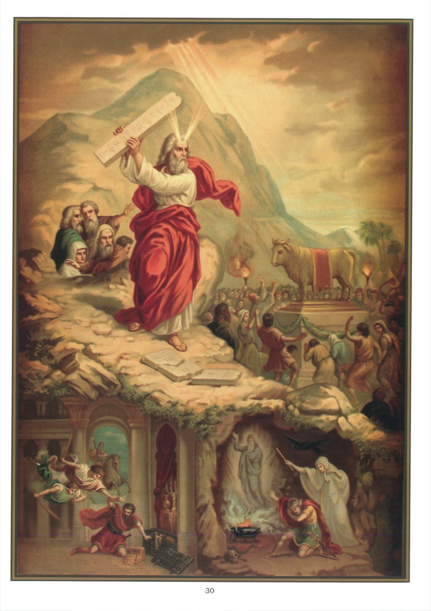

# Tableau 28 — 1er Commandement (suite)

## Premier Commandement de Dieu (suite) :

Un seul Dieu tu adoreras, Et aimeras parfaitement.

1. On pèche contre le premier commandement de Dieu : 1° par idolâtrie ; 2° par irréligion ; 3° par superstition.

2. On pèche par idolâtrie en adorant les créatures.

3. On pèche par irréligion : 1° quand on profane les choses saintes ; 2° quand on tourne en dérision la religion et ses ministres ; 3° quand on néglige ordinairement ses devoirs religieux.

4. Profaner les choses saintes, c’est un grand péché qu’on nomme sacrilège. Il y a trois sortes de sacrilèges : 1° le sacrilège de personne ; 2° le sacrilège de lieu ; 3° le sacrilège de chose.

5. On commet un sacrilège de personne, quand on profane par le crime une personne consacrée à Dieu, par exemple en frappant grièvement un ecclésiastique avec une mauvaise intention.

6. On commet un sacrilège de lieu, quand on profane un lieu consacré à Dieu, comme une église ou un cimetière.

7. On commet un sacrilège de chose, quand on profane une chose consacrée à Dieu, comme les sacrements, les vases sacrés, la Sainte Écriture, les reliques et les saintes images.

8. On pèche par superstition, quand on attribue à certaines paroles et à certaines actions des effets que Dieu n’y a point attachés, comme guérir les malades et de faire connaître l’avenir.

9. Les principales superstitions sont : la magie, le maléfice et l’observation des signes.

10. La magie est l’art de faire des choses extraordinaires et merveilleuses par le pouvoir du démon.

11. Le maléfice est l’art de nuire aux hommes ou aux animaux par le pouvoir du démon.

12. L’observation des signes est une superstition lorsqu’on voit dans des choses indifférentes le présage d’un bien ou d’un mal qui doit arriver. Par exemple, c’est une superstition de croire qu’il y a des jours heureux ou malheureux, que le nombre treize à table est un signe de mort pour l’un des convives dans le cours de l’année.

13. On pèche encore par superstition : 1° quand on se fait tirer les cartes ; 2° quand on se fait dire la bonne aventure ; 3° quand on consulte les devins.

14. La dévotion de l’eau bénite et des autres objets bénits par l’Église n’est pas une superstition, parce que ceux qui font usage de ces objets n’en attendent de salutaires effets que par la puissance de Dieu et en vertu des prières de l’Église.

15. Dans le passage suivant de l’Évangile, nous voyons Jésus chasser les vendeurs du Temple, parce qu’ils commettaient un sacrilège de lieu : 13 La Pâque des Juifs étant proche, Jésus monta à Jérusalem. 14 Il trouva dans le Temple des vendeurs de bœufs et de brebis, et de colombes, et des changeurs assis. 15 Et, faisant une sorte de fouet avec des cordes, il les chassa tous du Temple, avec les brebis et les bœufs, et il jeta par terre l’argent des changeurs et renversa leurs tables. 16 Et à ceux qui vendaient des colombes, il dit : Ôtez cela d’ici, et ne faites pas de la maison de mon Père une maison de trafic. 17 Et ses disciples se ressouvinrent qu’il est écrit : Le zèle de votre maison me dévore. (Jean 2 ; 13-17)

## Explication du Tableau

16. Ce tableau représente les Israélites adorant le veau d’or dans le désert. Pendant que Moïse s’entretenait avec Dieu sur le mont Sinaï, les Israélites, s’ennuyant de ce qu’ils ne revenaient pas, prièrent le grand-prêtre Aaron de leur faire un veau d’or pour l’adorer. Aaron de leur désir ; ils se prosternèrent alors devant cette idole et l’honorèrent par des prières et des danses. Pendant ce temps, Moïse descendait de la montagne en portant les tables de la Loi. Saisi d’indignation à la vue du culte idolâtrique auquel le peuple se livrait, il les jeta à terre et les brisa.

17. Nous voyons, au bas du tableau, à gauche, Héliodore, général des troupes de Séleucus, roi de Syrie, cherchant à s’emparer des trésors que renfermait le temple de Jérusalem. Lorsqu’il se présenta pour exécuter ce vol sacrilège, il vit apparaître un cheval sur lequel était monté un cavalier terrible qui, fondant sur lui, le frappa plusieurs fois des pieds devant. En même temps, deux jeunes hommes, richement vêtus, vinrent se placer devant lui et se mirent à le fouetter sans relâche. Héliodore tomba tout d’un coup, enveloppé de ténèbres ; on le mit dans une litière et on le porta hors du camp.

18. C’est le péché de superstition que commit Saül lorsqu’il alla consulter la magicienne d’Endor. Nous voyons ce roi, au bas du tableau, à droite ; derrière lui est la magicienne, à qui il demanda de lui faire apparaître le prophète Samuel, mort quelque temps auparavant. Devant Saül, on voit Samuel qui, par une permission de Dieu, apparut à ce roi et lui annonça qu’il serait tué le lendemain en combattant les Philistins.
