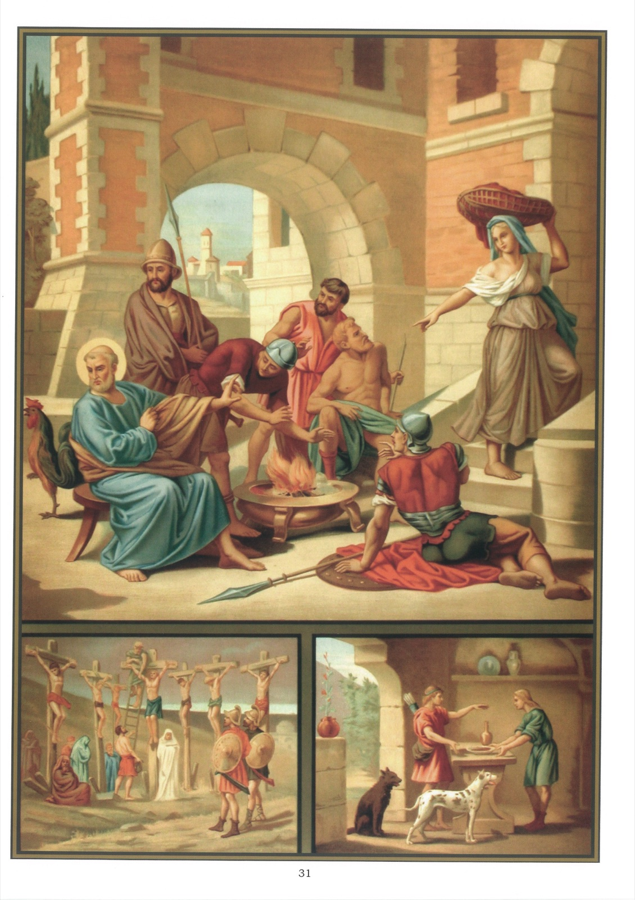

# Tableau 29 — 2e Commandement

## Deuxième Commandement de Dieu :

Dieu en vain tu ne jureras, Ni autre chose pareillement.

1. Par ce commandement, Dieu nous ordonne de respecter son saint nom et d’accomplir les vœux que l’on a faits.

2. Par le second commandement, Dieu nous défend : 1° de jurer en vain ; 2° de blasphémer ; 3° de faire des imprécations ; 4° de manquer aux vœux que l’on a faits.

3. Jurer ou faire serment, c’est prendre Dieu à témoin des choses que l’on assure ou que l’on promet.

4. Le serment peut être exprimé de trois manières : 1° par paroles, en disant, par exemple : Je fais serment, je jure ; 2° par signe, par exemple, en levant la main ; 3° par écrit, en déclarant que l’on fait serment.

5. On ne fait pas toujours un vrai serment lorsqu’on prononce des paroles de jurement, mais seulement lorsqu’on a l’intention de prendre Dieu à témoin de ce qu’on affirme ou de ce qu’on promet.

6. Quand on jure par les créatures, on prend Dieu lui-même à témoin, parce qu’alors on jure indirectement par Celui qui les a faites. Ainsi, c’est prendre Dieu à témoin que de jurer par le ciel, par le tonnerre, etc.

7. On fait serment en vain de trois manières : 1° en faisant serment contre la vérité ; 2° en faisant serment sans nécessité ; 3° en faisant serment de faire une chose mauvaise.

8. Ceux qui font serment contre la vérité sont ceux qui font serment pour assurer une chose qu’ils savent être fausse ou pour faire une promesse qu’ils ne veulent pas tenir.

9. Toutes les fois qu’on fait serment contre la vérité, quand même la chose serait peu importante, c’est un grand péché, qu’on appelle parjure. On commet donc toujours un péché mortel lorsqu’on fait un faux serment sérieusement et avec réflexion.

10. Ce qui fait que le faux serment est un si grand péché, c’est qu’on fait à Dieu une très grave injure en le prenant pour témoin d’un mensonge.

11. Quand on doute si une chose est vraie, il n’est point permis de jurer. Si l’on ne peut s’assurer de la vérité, il ne faut pas jurer, de peur de commettre un parjure.

12. Pour ne pas s’exposer à tomber dans ce péché, il ne faut point jurer du tout, ni par sa foi, ni par sa conscience, ni par la vérité, ni autrement.

13. Faire serment sans nécessité, c’est faire serment sans y être obligé, ou pour des choses de peu d’importance.

14. On pèche en faisant serment sans nécessité, parce qu’on manque de respect que l’on doit à Dieu en le prenant à témoin d’une chose qui n’en vaut pas la peine.

15. Il est permis de faire serment dans des circonstances graves, par exemple quand on est appelé en justice.

16. On doit alors faire serment avec beaucoup de respect en se proposant d’honorer Dieu comme étant la vérité même.

17. Quand on a promis quelque chose avec serment, on est doublement obligé de l’accomplir. On y est doublement obligé, parce que c’est un devoir de justice d’accomplir ce qu’on a promis, et un devoir de religion d’accomplir ce qu’on a promis avec serment.

## Explication du Tableau

18. Le sujet principal de ce tableau représente le parjure de saint Pierre. Cet apôtre, étant entré chez le grand-prêtre Caïphe à la suite de son divin Maître, s’assit dans la cour où il se chauffa. Une servante l’aperçut et dit à ceux qui étaient présents : « Celui-ci était aussi avec Jésus de Nazareth. » Pierre déclara alors avec serment qu’il ne connaissait point cet « homme-là ».

19. Nous voyons, au bas de ce tableau, à droite, Jacob et Esaü. Ce dernier, revenant un jour tout fatigué de la chasse, pria son frère de lui donner un plat de lentilles qu’il s’était préparé ; Jacob présente ce plat à Esaü en lui demandant de jurer qu’il lui cédera son droit d’aînesse. Esaü, levant la main, fait, sans nécessité, le serment que Jacob lui avait demandé et perd son droit d’aînesse.

20. Nous voyons, au bas du tableau, à gauche, à gauche, sept hommes mis en Croix sous le règne de David à cause d’un serment violé par Saül. Josué, en prenant possession de la terre de Chanaan, avait juré aux habitants de Gabaon qu’il ne leur serait fait aucun mal. Mais Saül ayant tué des Gabaonites, Dieu punit ce parjure en affligeant tout le peuple d’une famine qui dura trois ans.

## David demanda aux Gabaonites comment il pourrait réparer l’outrage qui leur avait

été fait. Ils exigèrent qu’on leur livrât sept des enfants Saül. David les leur livra et ils les crucifièrent sur une montagne pour satisfaire à la justice divine.
