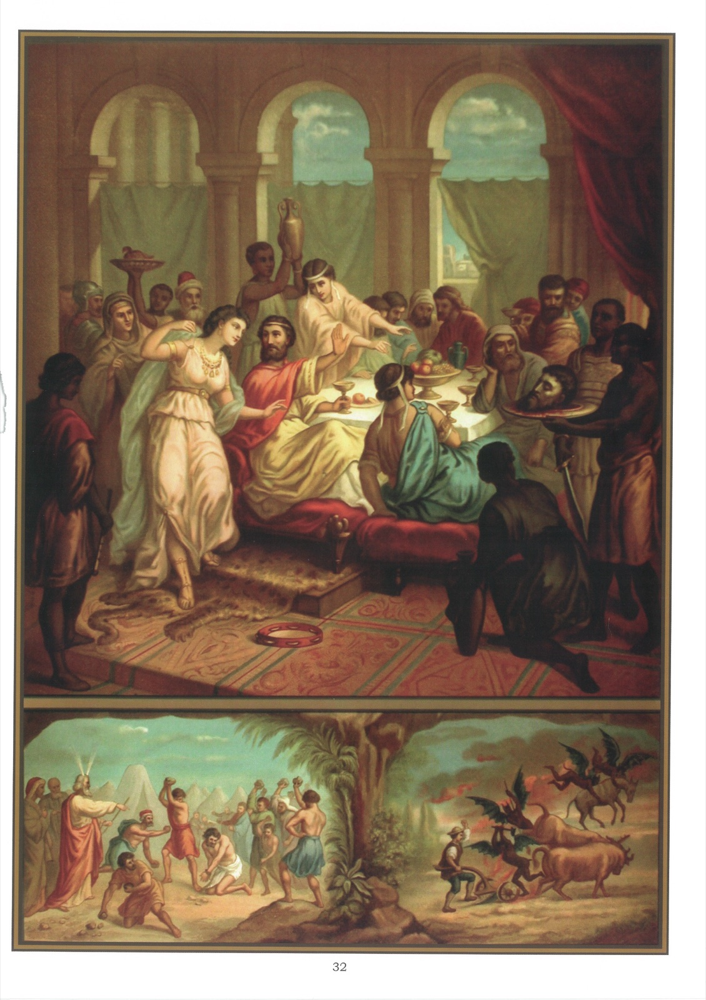

# Tableau 30 — 2e Commandement (suite)

## Deuxième Commandement de Dieu (Suite) :

Dieu en vain tu ne jureras, Ni autre chose pareillement.

1. Celui qui a juré de faire une chose défendue n’est pas obligé d’accomplir son serment, car il a commis une faute en faisant ce serment, et il en commettrait une nouvelle en l’accomplissant.

2. C’est le péché que commit Hérode en faisant décapiter saint Jean-Baptiste. Voici le récit, d’après saint Marc : 14 Or, le roi Hérode entendit parler de Jésus (car son nom était devenu célèbre), et il disait : Jean-Baptiste est ressuscité d’entre les morts, c’est pourquoi des forces miraculeuses agissent en lui. 15 Mais d’autres disaient : C’est Élie. Et d’autres : C’est un prophète semblable aux anciens prophètes. 16 Ce qu’ayant entendu, le roi Hérode dit : C’est ce même Jean à qui j’ai fait trancher la tête, qui est ressuscité des morts. 17 Car ce même Hérode avait envoyé saisir Jean et l’avait fait mettre en prison, chargé de liens, à cause d’Hérodiade, femme de Philippe, son frère, qu’il avait épousée. 18 Car Jean disait à Hérode : Il ne vous est pas permis d’avoir la femme de votre frère. 19 Or, Hérodiade lui tendait des pièges et voulait le faire périr, mais elle ne le pouvait pas. 20 Car Hérode craignait Jean, sachant que c’était un homme juste et saint ; il le gardait, faisait beaucoup de choses d’après ses conseils, et l’écoutait volontiers. 21 Mais il arriva un jour opportun ; en l’anniversaire de sa naissance, Hérode donna un festin aux grands, aux officiers et aux principaux de Galilée. 22 La fille de cette même Hérodiade étant entrée et ayant dansé, et ayant plu à Hérode et à ses convives, le roi dit à la jeune fille : Demande-moi ce que tu voudras et je te le donnerai. 23 Et il lui fit ce serment : Tout ce que tu me demanderas, je te le donnerai, fût-ce la moitié de mon royaume. 24 Elle, étant sortie, dit à sa mère : Que demanderais-je ? Sa mère lui dit : La tête de Jean-Baptiste. 25 Étant aussitôt rentrée en hâte près du roi, elle fit sa demande, disant : Je veux que vous me donniez à l’instant, sur un plat, la tête de Jean-Baptiste. 26 Le roi fut contristé ; néanmoins, à cause de son serment et à cause de ses convives, il ne voulut pas l’affliger par un refus. 27 Mais il envoya un de ses gardes, il lui commanda d’apporter la tête de Jean sur un plat. Et ce garde trancha la tête de Jean dans la prison. 28 Et il l’apporta sur un plat et la donna à la jeune fille, et la jeune fille la donna à sa mère. 29 L’ayant appris, les disciples de Jean vinrent et prirent son corps et le déposèrent dans un tombeau. (Marc, 6 ; 14-29)

3. Blasphémer, c’est dire des paroles injurieuses à Dieu ou aux saints ; c’est en particulier profaner le saint nom de Dieu.

4. Il y a deux sortes de blasphèmes : le blasphème simple et le blasphème hérétique.

5. Le blasphème simple est une parole injurieuse à Dieu, mais qui ne renferme rien contre la foi, comme de maudire ou de prononcer avec mépris le saint nom de Dieu.

6. Le mot sacré joint au nom de Dieu, quand on le prononce par colère ou par mépris, est gravement injurieux à Dieu ; c’est comme si l’on disait : « Maudit soit le nom de Dieu ! » ce qui est un horrible blasphème.

7. Le blasphème hérétique est une injure qui, outre le mépris de Dieu, contient une erreur contre la foi, comme de dire, par exemple, que Dieu n’est pas juste ou qu’il ne s’occupe pas de nous.

8. Le blasphème hérétique, quand on le prononce avec réflexion, est toujours un péché mortel.

9. Quand on entend un blasphème, on doit le réparer aussitôt en disant, par exemple : « Loué soit Jésus-Christ ! »

10. Faire des imprécations, c’est prononcer des malédictions contre soi-même, contre le prochain ou contre quelque créature.

11. On jure avec imprécation lorsqu’en jurant on se souhaite du mal à soi-même et aux autres, par exemple, en disant : « Je veux mourir si cela n’est pas vrai ! »

## Explication du Tableau

12. Le tableau que nous avons sous les yeux représente le roi Hérode faisant un festin pour célébrer l’anniversaire de sa naissance. Il a à ses côtés la fille d’Hérodiade qui lui a demandé la tête de Jean-Baptiste. On voit à gauche, la tête de Jean, que les bourreaux apportent dans un plat.

13. Dans l’ancienne loi, les blasphémateurs étaient lapidés. Nous voyons au bas de ce tableau, à gauche, un homme qui avait blasphémé et que Moïse, après avoir consulté Dieu, fit lapider par le peuple.

14. Nous voyons au bas du tableau, à droite, un laboureur proférant des imprécations contre les animaux qu’il conduit en disant, entre autres choses : « Que le diable vous emporte ! » Sa funeste prière est exaucée : les démons viennent jeter le trouble dans son travail et lui emportent une de ses bêtes.
