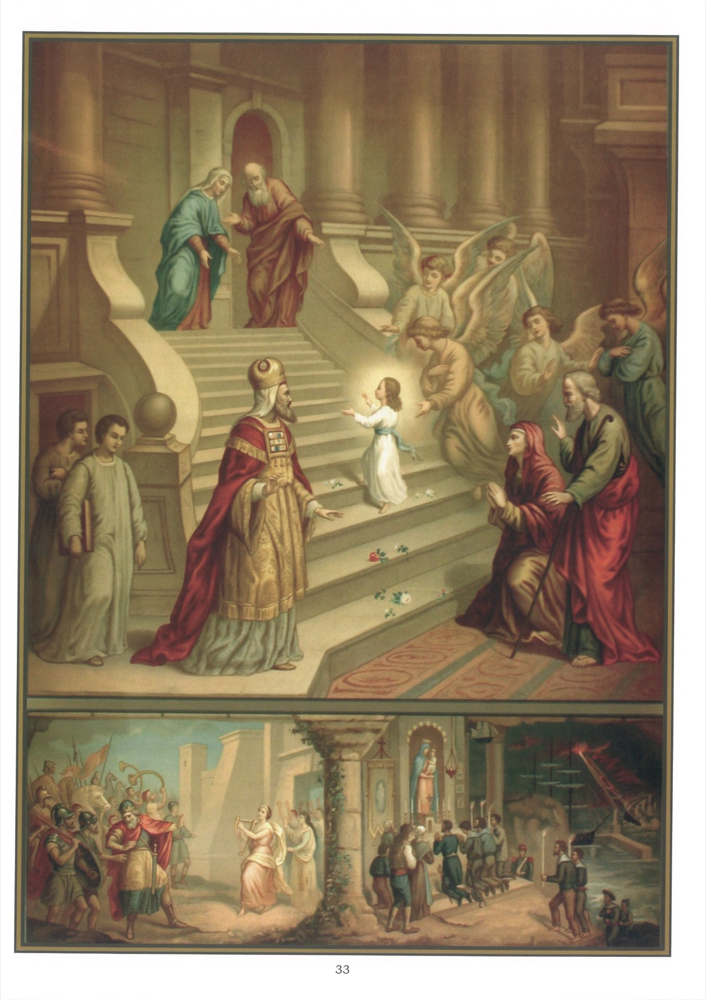

# Tableau 31 — 3e Commandement

## Deuxième Commandement de Dieu (Suite) :

Dieu en vain tu ne jureras, Ni autre chose pareillement.

1. Un vœu est une promesse que l’on fait à Dieu avec l’intention de s’obliger rigoureusement.

2. Le vœu est un acte de latrie. Si donc on fait un vœu aux saints, cela signifie qu’on promet quelque chose à Dieu en leur honneur.

3. Le vœu est personnel, s’il n’oblige que celui qui le fait, parce que la manière du vœu s’appelle réel. Tel est, par exemple, celui de donner 100 francs aux pauvres.

4. Le vœu est perpétuel, s’il oblige toute la vie ; autrement, il est temporaire.

5. De la part de celui qui le fait, il est requis : 1° qu’il soit capable de vouer, c’est-à-dire qu’il ait l’usage de la raison ; 2° qu’il ait l’intention de faire le vœu et de s’obliger, de la même manière que pour faire un serment ; 3° qu’il le fasse avec une délibération suffisante, c’est-à-dire telle qu’il la faut pour pécher mortellement.

6. Personne, en effet, ne s’impose une obligation sans la vouloir.

7. La crainte grave et injuste, venant d’une cause extrinsèque, en vue d’imposer le vœu, le rend invalide. Ce qui est ainsi extorqué ne peut être agréable à Dieu.

8. De la part de la chose promise, il faut, tout d’abord, qu’elle soit possible. À l’impossible, nul n’est tenu. Par conséquent, le vœu de ne pas pécher, même très légèrement, n’est pas valide ; mais le vœu de ne pas pécher gravement ou de ne pas pécher d’une manière à la fois vénielle et délibérée est valide.

9. Si la matière du vœu est divisible, on est tenu d’accomplir ce qui demeure possible que dépendamment de ce qui est devenu impossible.

10. Il faut que la matière du vœu soit bonne, et même meilleure que l’acte qui ne peut pas être fait en même temps qu’elle. Par conséquent, en règle générale, le vœu de se marier est nul, bien que le mariage soit bon et honnête, parce qu’il n’est pas compatible avec la virginité, qui est meilleure.

11. Mais le vœu de faire une chose commandée d’ailleurs est valide, parce qu’il augmente la fidélité et la dévotion à remplir un devoir.

12. Si on fait vœu de faire une chose bonne, avec une fin mauvaise, le vœu n’est pas valide ; car la fin mauvaise rend mauvaise aussi la matière du vœu.

13. Il en serait autrement si, la fin principale étant bonne, il s’y glissait une fin mauvaise, mais secondaire.

14. Quand un vœu a été fait, même témérairement, il entraîne l’obligation d’accomplir ce que l’on a promis de la même manière que le serment.

15. Le vœu qu’on fait pour se punir d’un péché, par exemple : « Je fais vœu de faire une aumône si je blasphème », est obligatoire.

16. Quand on a fait un vœu, on est obligé de l’accomplir. Il vaut beaucoup mieux, dit l’Esprit-Saint, ne pas faire de vœux, que d’en faire et de ne pas les accomplir.

17. Avant de s’engager par un vœu, on doit : 1° Examiner si on pourra l’accomplir ; 2° demander conseil à son confesseur.

18. On peut, pour de bonnes raisons, obtenir de l’Église la dispense ou la commutation d’un vœu.

19. Les vœux les plus parfaits sont les vœux de pauvreté, de chasteté et d’obéissance, que font les religieux et les religieuses.

## Explication du Tableau

20. Nous voyons au bas de ce tableau, à gauche, Jephté, qui vient de remporter une victoire. Il avait fait le vœu imprudent, s’il était vainqueur, d’immoler la première personne qu’il rencontrait. À son retour, il vit d’abord sa fille qui venait l’acclamer en jouant des airs joyeux. On pense que la fille de Jephté ne fut pas immolée, mais vouée à la virginité.

21. Nous voyons, au milieu du tableau, Marie se rendant au Temple de Jérusalem, à l’âge de trois ans, pour s’y consacrer à Dieu par le vœu de virginité. Ses parents, saint Joachim et sainte Anne, l’accompagnent. Le grand prêtre la reçoit au bas de l’escalier, et, du haut du péristyle, le saint vieillard Siméon et Anne la prophétesse la contemplent avec admiration en lui tendant les bras. Les anges, dont elle est la Reine, lui font escorte. Les roses qu’on voit sur les quinze marches du Temple symbolisent les mystères du Rosaire.

22. Nous voyons, au bas de ce tableau, à droite, des marins à genoux devant un autel de la Sainte Vierge. Ils ont fait vœu, pendant une tempête, de visiter un sanctuaire de Marie s’ils échappaient à la mort. Ayant été exaucés, ils viennent accomplir leur vœu.
