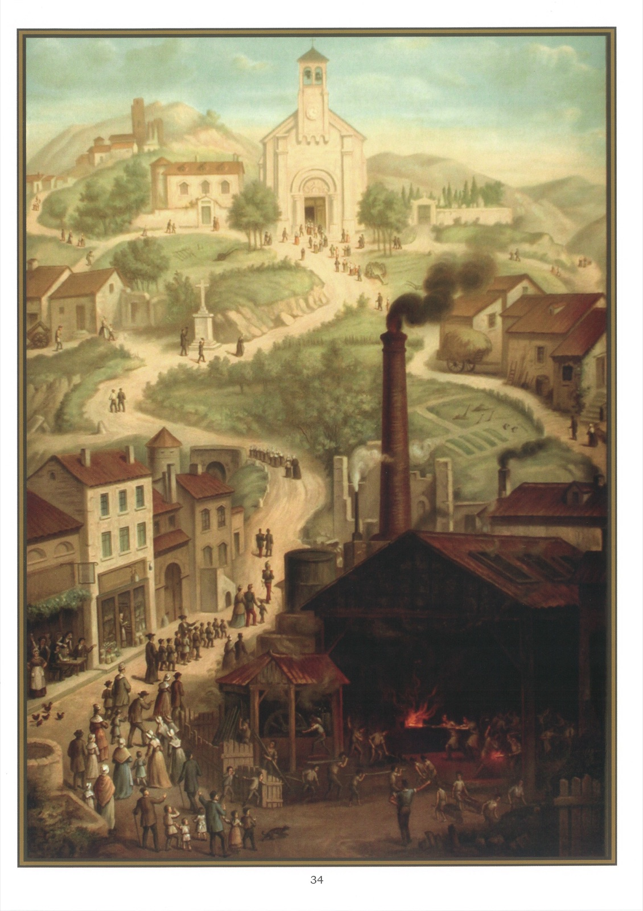

# Tableau 32 — 3e Commandement (suite)

## Troisième Commandement de Dieu :

Les dimanches tu garderas, En servant Dieu dévotement.

1. Le troisième commandement de Dieu nous ordonne de sanctifier le dimanche.

2. Le dimanche est le jour du Seigneur, c’est-à-dire le jour spécialement consacré au service de Dieu dans la loi nouvelle.

3. Avant la venue de Jésus-Christ, le jour consacré au service de Dieu était le samedi, que l’on appelait le sabbat ou jour de repos ; il avait été choisi pour honorer le repos de Dieu après les six jours de la création.

4. L’observation du sabbat a été transférée au dimanche par l’Église, pour honorer deux grands mystères qui se sont accomplis le dimanche : la Résurrection de Jésus-Christ et la descente du Saint-Esprit sur les apôtres.

5. Pour sanctifier le dimanche, il faut s’abstenir d’œuvres serviles et assister au

## Saint Sacrifice de la Messe

6. Par œuvres serviles, on entend les travaux manuels, et, en général, les actes où le corps a plus de part que l’esprit. On les appelle serviles parce qu’elles tiennent à l’état de serviteur, et aussi parce qu’elles sont faites surtout par des personnes qui s’y livrent pour gagner leur vie. Bâtir, labourer, travailler la pierre, le fer, la laine, coudre, tisser, travailler à l’aiguille ou au crochet sont des œuvres serviles.

7. Dieu défend les travaux corporels : 1° pour obliger l’homme à reconnaître sa souveraine autorité ; 2° parce que les travaux corporels détournent des œuvres de religion auxquelles on doit s’appliquer en ce saint jour.

8. Cette défense est utile à notre corps aussi bien qu’à notre âme, car en nous obligeant à un repos régulier, elle répare nos forces, conserve et prolonge notre vie.

9. Il faut compter parmi les œuvres serviles, celles qui n’exigent qu’un travail peu pénible, comme faire des images ou des chapelets ; ce n’est pas le degré de fatigue qui change la nature d’un travail ; et une œuvre ne change pas de nature, qu’on la fasse gratuitement ou non.

10. Les travaux des tribunaux, qui se font avec tout l’appareil judiciaire, comme d’entendre les avocats et les témoins, de porter une sentence, sont défendus le dimanche, à moins qu’une cause criminelle, déjà entreprise, ne puisse être interrompue sans inconvénient grave.

11. Les foires sont aussi défendues, à moins qu’elles ne tombent à un jour fixe, ainsi que les marchés dans les magasins publics.

12. Les œuvres libérales, qui tendent plutôt à la culture de l’esprit, sont permises le dimanche ; il en est de même des œuvres communes, qui tiennent un certain milieu entre les œuvres serviles et les œuvres libérales, comme de balayer, de chasser, de pêcher, de voyager, sont permises le dimanche.

13. Il n’est pas défendu d’étudier, d’enseigner, de faire de la musique, même en se faisant payer ; de dessiner, de voyager, ni probablement de peindre, pourvu qu’on n’ait pas un grand travail à faire en préparant les couleurs. Il en est de même de la photographie, etc.

14. Il n’est cependant pas permis de sculpter, à moins qu’on ne fasse que donner la dernière perfection à une œuvre d’art.

15. Les raisons qui excusent les œuvres défendues le dimanche sont : 1° la dispense de l’Évêque ou du curé ; 2° la coutume : c’est ainsi que, là où elle existe, on peut arroser les légumes, raser, etc. ; 3° la piété permet d’orner, de balayer les églises, de faire des hosties.

16. Ceux qui font travailler le dimanche sont aussi coupables que s’ils travaillaient eux-mêmes.

17. Les parents et les maîtres qui empêchent leurs enfants ou leurs serviteurs de sanctifier le dimanche offenseraient Dieu mortellement, et ils attireraient la malédiction de Dieu sur eux-mêmes et sur leurs familles.

18. Il n’est jamais permis de pécher, main une faute commise le dimanche n’a pas pour ça une malice spéciale.

## Explication du Tableau

19. Nous voyons sur ce tableau un contraste frappant entre ceux qui sanctifient le dimanche et ceux qui le profanent. Dans le haut, se trouvent l’église, le presbytère, le cimetière, quelques fermes et un antique château. Les ateliers, les magasins sont fermés ; les voitures, les instruments aratoires abandonnés près des maisons et dans les champs ; les enfants des écoles, conduits par leurs maîtres et maîtresses ; les fidèles de toutes conditions s’acheminent vers la maison du Seigneur pour y entendre la sainte Messe, évitant les cabarets où sont attablés les impies et les libertins, et saluant religieusement la Croix qui se dresse sur leur passage. Au bas du tableau se trouve une usine où l’on profane le dimanche par un travail défendu.
