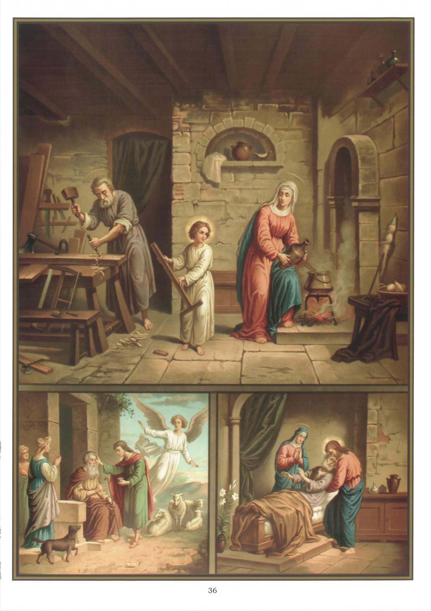

# Tableau 34 — 4e Commandement

## Quatrième Commandement de Dieu :

Tes père et mère honoreras, Afin de vivre longtemps.

1. Par le quatrième commandement, Dieu nous ordonne : 1° d’aimer nos père et mère ; 2° de les respecter ; 3° de leur obéir ; 4°de les assister dans leurs besoins.

2. Aimer ses père et mère, c’est leur être attaché du fond du cœur, et leur en donner des preuves lorsque l’occasion s’en présente.

3. Nous devons aimer nos père et mère, parce qu’après Dieu nous leur devons la vie et qu’ils s’imposent toutes sortes de peines pour nous.

4. Respecter ses père et mère, c’est les traiter avec beaucoup d’égards et supporter avec patience leurs infirmités et même leurs défauts.

5. Nous devons respecter nos père et mère et leur obéir, parce qu’ils tiennent auprès de nous la place de Dieu.

6. Nous les honorons lorsque nous demandons humblement à Dieu que tout leur réussisse, qu’ils soient environnés de la faveur et de la considération publiques, surtout aimés de Dieu et agréables aux saints qui sont dans le ciel.

7. Nous les honorons aussi lorsque nous réglons nos dispositions sur leur jugement et sur leur volonté.

8. Saint Paul a des recommandations du même genre : « Enfants, dit-il, obéissez à vos parents dans le Seigneur, car cela est juste. » Et encore : « Enfants, obéissez en tout à vos parents, car cela est agréable à Dieu. »

9. Nous honorons encore nos parents lorsque nous imitons leurs bonnes actions et leur conduite vertueuse. En effet, la plus grande marque d’estime que l’on puisse donner à quelqu’un, c’est de vouloir lui ressembler dans le bien.

10. C’est encore les honorer que de demander leur avis, et surtout de le suivre.

11. Nous les honorons enfin si nous avons soin de subvenir à leurs besoins, en leur procurant ce que réclament la nourriture et l’entretien.

12. C’est ce que Notre-Seigneur Jésus-Christ lui-même nous enseigne, quand il reproche aux pharisiens leur impiété. « Pourquoi vous-mêmes, leur dit-il, violez-vous le commandement de Dieu pour suivre votre tradition ? Car Dieu a dit : Honorez votre père et votre mère ; celui qui maudira son père et sa mère sera puni de mort. Mais vous, vous dites : quiconque dira à son père ou à sa mère : toute offrande que je présenterai vous servira, celui-là n’honorera pas son père et sa mère ; et vous avez rendu vain le commandement de Dieu à cause votre tradition. »

13. Accomplir nos devoirs envers nos père et mère est pour nous une obligation de tous les instants, mais surtout dans leurs maladies graves et dangereuses.

14. C’est alors que nous devons faire le nécessaire pour qu’ils ne soient point privés, pendant qu’ils ont leur connaissance, de la visite du prêtre, de la confession et des sacrements d’Eucharistie et d’Extrême-Onction, que les chrétiens sont tenus de recevoir aux approches de la mort.

15. Ainsi fortifiés et comme environnés de ce magnifique cortège des vertus de foi, d’espérance, de charité et de religion, non seulement ils ne craindront pas la mort, puisqu’elle est inévitable, mais même ils la désireront, puisqu’elle ouvre directement l’éternité.

16. En dernier lieu, nous honorons encore nos parents après leur mort, en faisant des funérailles dignes d’eux, en leur donnant une sépulture convenable, en faisant célébrer pour eux des sacrifices anniversaires et en exécutant avec fidélité leurs dernières volontés.

17. Après la mort de ses père et mère, on doit exécuter fidèlement leurs dernières volontés et prier pour le repos de leur âme.

18. Ces paroles : Afin de vivre longuement, signifient que Dieu Bénit et récompense, souvent même en ce monde, l’enfant qui honore son père et sa mère.

19. L’enfant qui outrage ses père et mère, ou qui les abandonne dans leurs besoins, est maudit de Dieu, et les hommes l’ont en horreur.

20. Le parfait modèle d’obéissance que les enfants doivent imiter, c’est l’Enfant Jésus, qui fut soumis à Marie et à Joseph pendant tout le temps qu’il vécut avec eux à Nazareth.

## Explication du Tableau

21. Nous voyons, en haut de ce tableau, l’Enfant Jésus aidant Marie dans les soins du ménage et Joseph dans les travaux de son état.

22. Nous voyons, au bas du tableau, à gauche, le jeune Tobie rendant la vue à son père en présence de l’ange Raphaël, en lui frottant les yeux avec du fiel de poisson qu’il avait rapporté de son voyage.

23. À droite, on voit Notre-Seigneur assistant saint Joseph, son père nourricier, à ses derniers moments, et le pressant affectueusement contre son Cœur sacré.
