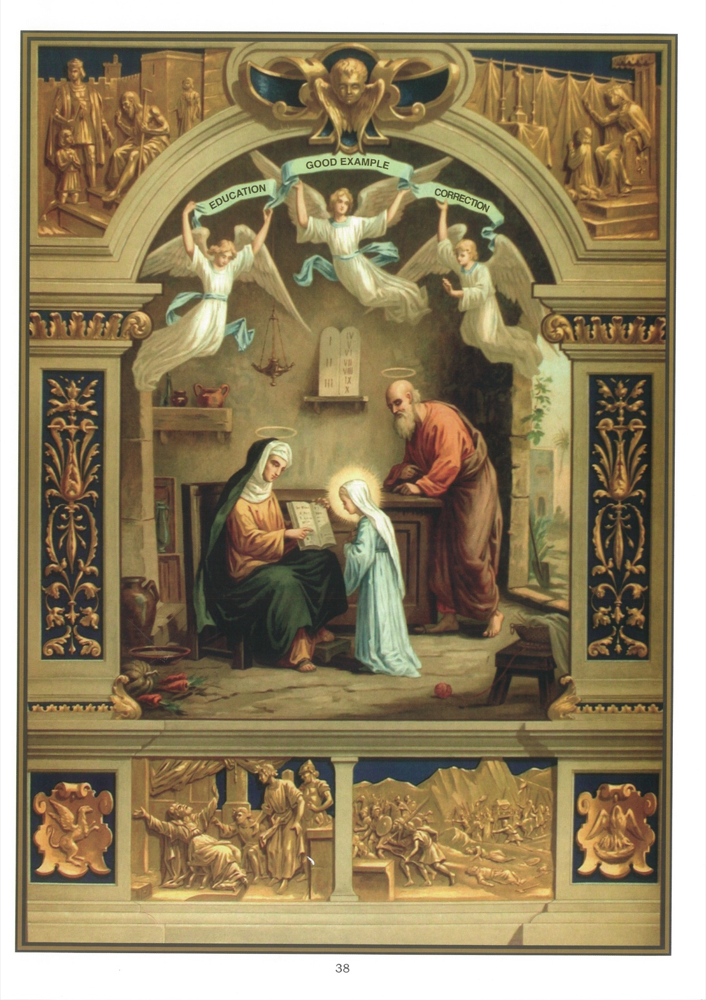

# Tableau 36 — 4e Commandement (suite)

## Quatrième Commandement de Dieu (suite) :

Tes père et mère honoreras, Afin de vivre longtemps.

## Devoirs des parents envers leurs enfants

1. Les père et mère sont obligés : 1° de pourvoir aux besoins de leurs enfants ; 2° de les élever chrétiennement ; 3° de les corriger ; 4° de leur donner le bon exemple.

2. Le premier devoir des père et mère envers leurs enfants est de les aimer tous également, avec une tendresse chrétienne, et sans faiblesse pour leurs défauts.

3. Les père et mère doivent regarder leurs enfants comme de précieux trésors que Dieu leur a confiés, et dont il leur demandera un compte rigoureux.

4. En disant que les parents doivent pourvoir aux besoins de leurs enfants, j’entends qu’ils doivent nourrir leurs enfants, les vêtir, les élever selon leur position et leur procurer un état convenable.

5. En disant que les père et mère doivent élever chrétiennement leurs enfants, j’entends qu’ils doivent : 1° leur apprendre les principaux mystères de la foi et leurs prières ; 2° les envoyer au catéchisme, et, autant que possible, à une école où ils reçoivent une instruction religieuse ; 3° les porter à aimer Dieu et à fuir le péché ; 4° les envoyer à confesser dès qu’ils ont atteint l’âge de raison.

6. Avant d’engager leurs enfants dans un état, les père et mère doivent prier pour connaître la volonté de Dieu, donner à leurs enfants de bons conseils et leur faire une sage liberté pour suivre l’appel de Dieu, soit pour le sacerdoce, soit pour la vie religieuse.

7. Les parents ne doivent désirer pour leurs enfants que la volonté de Dieu, comme nous l’enseigne la réponse de Jésus à la mère des apôtres Jacques et Jean : 20 Alors la mère des fils de Zébédée s’approcha de lui avec ses fils, et se prosterna pour lui faire une demande. 21 Il lui dit : Que voulez-vous ? Elle répondit : Ordonnez que mes deux fils que voici soient assis, l’un à votre droite, l’un à votre gauche, dans votre royaume. 22 Jésus leur répondit : Vous ne savez pas ce que vous demandez. Pouvez-vous boire le calice que je dois boire moi-même ? Ils lui dirent : Nous le pouvons. 23 Il leur dit : Vous boirez, en effet, mon calice, mais d’être assis à ma droite ou à ma gauche, il ne m’appartient pas de vous le donner à vous, mais à ceux à qui mon père l’a préparé. 24 Entendant cela, les dix autres furent indignés contre les deux frères. 25 Mais Jésus, les appelant à lui, leur dit : Vous savez que les princes des nations les dominent, et que les grands exercent la puissance sur elles. 26 Il n’en sera pas ainsi parmi vous ; et celui qui voudra être le plus grand parmi vous, qu’il soit votre serviteur ; 27 et celui qui voudra être le premier parmi vous, qu’il soit votre esclave. 28 C’est ainsi que le fils de l’homme n’est point venu pour être servi, mais pour servir et donner sa vie pour la rédemption d’un grand nombre. (Matth. 20 ; 20-28)

8. Par le devoir de la correction, j’entends que les père et mère doivent veiller sur la conduite de leurs enfants, les reprendre et les châtier quand ils font mal, mais sans emportement, et dans le seul but de les rendre meilleurs.

9. Par le devoir du bon exemple, j’entends que les père et mère doivent remplir leurs devoirs religieux : la prière, l’assistance à la messe et la pratique des sacrements, et éviter tout ce qui pourrait porter leurs enfants au péché, comme les blasphèmes, les médisances, les paroles déshonnêtes et les railleries contre la religion.

## Explication du Tableau

10. Nous voyons, au milieu de ce tableau, sainte Anne apprenant à lire à la Sainte Vierge encore toute jeune enfant. Derrière Marie, se trouve saint Joachim, son père, qui la contemple avec un tendre intérêt.

11. Le haut du tableau représente, à droite, Blanche de Castille enseignant à saint Louis à prier, et lui disant : « Mon fils, j’aimerais mieux vous voir mort que de vous voir commettre un péché mortel. »

12. Dans le haut du tableau, à gauche, un seigneur oblige son fils à demander pardon à un pauvre qu’il n’a pas honoré.

13. Le bas du tableau nous montre, dans la personne du grand-prêtre Héli, un exemple des terribles châtiments auxquels s’exposent les parents qui négligent de corriger leurs enfants. Héli avait deux fils, Ophni et Phinées, qui détournaient le peuple du culte du Seigneur. Trop indulgent pour ses enfants, il éprouva comme eux les effets de la colère divine. Il apprit un jour que l’arche avait été prise par les Philistins, et que ses deux fils avaient été tués avec trente mille Israélites. À cette nouvelle, il tomba à la renverse et se brisa la tête.
