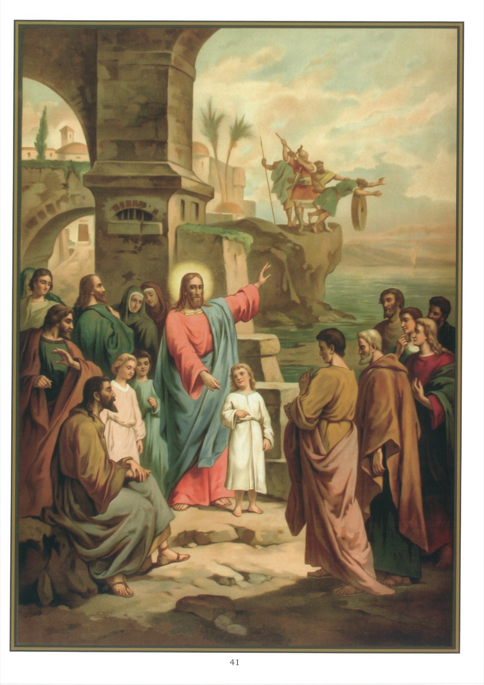

# Tableau 39 — 5e Commandement (suite)

## Cinquième Commandement de Dieu (suite) :

Homicide point ne seras, De fait ni volontairement. Ce qu’il défend : Le scandale

1. Le cinquième commandement nous défend encore de scandaliser le prochain.

2. Il faut entendre par le scandale toute parole, toute action, toute omission qui porte le prochain au mal, soit parce qu’elle est mauvaise, soit parce qu’elle paraît l’être.

3. Ce qui scandalise surtout le prochain, ce sont : 1° les paroles contraires à la religion, à la charité et à la pureté ; 2° les conseils qui tendent à porter les autres au mal ou à les détourner du bien.

4. On scandalise encore le prochain en lui procurant des écrits irréligieux et immoraux, et surtout en composant ces écrits.

5. C’est un grand péché de scandaliser le prochain, parce que l’on cause ainsi trop souvent la perte des âmes que Jésus-Christ a rachetées par son sang, et que souvent le scandale est irréparable.

6. Certaines personnes se scandalisent et prennent occasion de mal faire d’un acte qui n’est pas mauvais en soi. C’est ainsi que les pharisiens se scandalisaient des actes les meilleurs de Notre-Seigneur ou de ses disciples. Dans le passage suivant de l’Évangile, saint Marc nous en cite deux exemples : 37 Jean, prenant la parole, lui dit : Maître, nous avons vu quelqu’un, qui ne va pas avec nous, chasser les démons en votre nom, et nous l’en avons empêché. 38 Mais Jésus dit : Ne l’en empêchez point, car personne ne peut faire de miracle en mon nom et aussitôt après parler mal de moi. 39 Car celui qui n’est pas contre vous est pour vous. 40 Et quiconque vous donnera un verre d’eau en mon nom, parce que vous êtes du Christ, en vérité, je vous le dis, il ne perdra point sa récompense. 41 Et quiconque scandalisera un de ces petits qui croient en moi, il vaudrait mieux pour lui que l’on mît autour de son cou une de ces meules tournées par les ânes, et qu’on le jetât dans la mer. 42 Si donc votre main vous scandalise, coupez-la. Il vaut mieux pour vous entrer mutilé dans la vie que d’aller, ayant deux mains, dans la géhenne, dans le feu inextinguible, 43 là où leur ver ne meurent point et où le feu ne s’éteint jamais. 44 Et si votre pied vous scandalise, coupez-le. Il vaut mieux pour vous entrer boiteux dans la vie éternelle, que d’être jeté, ayant deux pieds, dans la géhenne du feu inextinguible, 45 là où leur ver ne meurt point et où le feu ne s’éteint jamais. 46 Si votre œil vous scandalise, arrachez-le. Il vaut mieux pour vous entrer borgne dans le royaume de Dieu, que d’être jeté, ayant deux yeux, dans la géhenne du feu, 47 là où leur ver ne meurt point et où le feu ne s’éteint jamais. 48 Car tous seront salés par le feu comme toute victime est salée par le sel. 49 Le sel est bon. Que si le sel s’affadit, avec quoi lui donnerez-vous de la saveur ? Gardez bien le sel en vous, et soyez en paix les uns avec les autres. (Marc, 9.) 1 Des pharisiens et quelques-uns des scribes, venus de Jérusalem, s’assemblèrent auprès de Jésus. 2 Et ayant vu quelques-uns de ses disciples manger du pain avec des mains impures, c’est-à-dire non lavées, ils les en blâmèrent. 3 Car les pharisiens et tous les juifs ne mangeaient point sans s’être souvent lavé les mains, suivant en cela la tradition des anciens. 4 Et lorsqu’ils reviennent du marché, ils ne mangent point non plus sans s’être purifiés, et il y a beaucoup d’autres traditions qu’ils observent : la purification des coupes, des vases de terre ou d’airain et des lits. 5 Les pharisiens donc et les scribes l’interrogeaient : Pourquoi vos disciples ne suivent-ils pas la tradition des anciens, et mangent-ils leur pain avec des mains impures ? 6 Il leur répondit : Isaïe a bien prophétisé de vous, hypocrites, comme il est écrit : Ce peuple m’honore des lèvres, mais leur cœur est loin de moi, 7 et vain est le culte qu’ils me rendent, enseignant des doctrines qui sont des préceptes d’hommes. 8 Car, laissant de côté la loi de Dieu, vous vous attachez à la tradition des hommes, purifiant les vases et les coupes, et faisant encore beaucoup d’autres choses semblables. (Marc, 7.)

## Explication du Tableau

7. Quand on a donné le scandale, on doit le réparer, autant que possible : 1° en détournant du mal ceux qu’on a scandalisé ; 2° en les portant au bien par ses exemples ; 3° en priant pour eux.

8. Ceux qui manquent à leurs devoirs sous prétexte de faire comme les autres sont coupables et insensés, car si les autres veulent perdre leur âme, ce n’est pas une raison pour que nous perdions aussi la nôtre.

9. Ce tableau représente Jésus-Christ avec ses disciples. Il leur montre d’une main l’enfant qu’il a fait venir et de l’autre un homme qui a une meule de moulin attachée au cou et qu’on jette à la mer.
