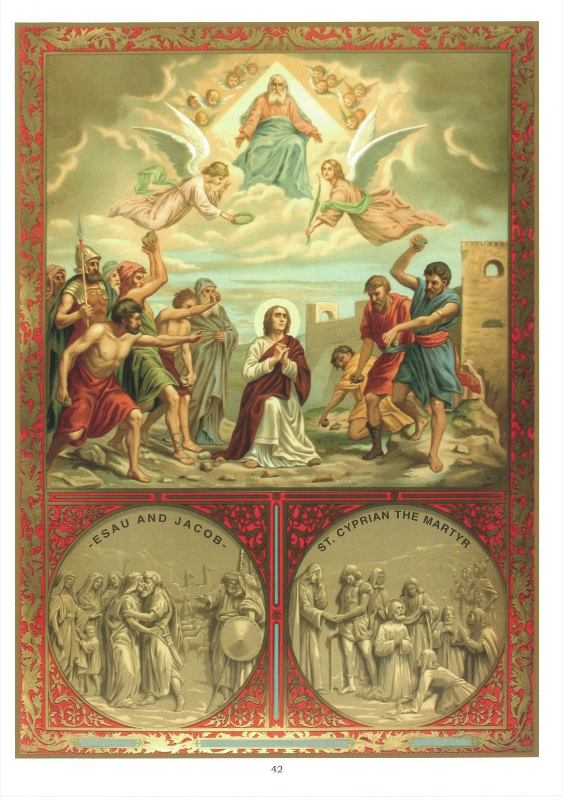

# Tableau 40 — 5e Commandement (suite)

## Cinquième Commandement de Dieu (suite) :

Homicide point ne seras, De fait ni volontairement.

## Ce qu’il ordonne

1. Le cinquième commandement de Dieu nous ordonne : 1° de pardonner à nos ennemis ; 2° de nous réconcilier avec eux ; 3° de leur faire du bien quand nous le pouvons ; 4° de faire du bien à ceux qui sont dans le besoin.

2. Notre premier devoir envers nos ennemis est de leur pardonner.

3. Ce devoir est si rigoureux que Jésus-Christ a déclaré dans l’Évangile que Dieu ne pardonnera pas à eux qui ne veulent pas pardonner. 17 Ne pensez pas que je sois venu abolir la loi ou les prophètes : je ne suis pas venu les abolir, mais les accomplir. 18 Car je vous le dis en vérité : Jusqu’à ce que passe le ciel et la terre, un seul iota ou un seul point de loi ne passera pas que tout ne soit accompli. 19 Celui donc qui violera un de ces moindres commandements et enseignera ainsi aux hommes sera regardé comme le moindre dans le royaume des cieux ; et celui qui les gardera et enseignera ainsi aux hommes, celui-là sera appelé grand dans le royaume des cieux. 20 Je vous le dis donc : Si votre justice ne surpasse pas celle des scribes et des pharisiens, vous n’entrerez point dans le royaume des cieux. 21 Vous avez entendu qu’il a été dit aux anciens : Vous ne tuerez point ; celui qui tuera sera passible de jugement. 22 Et moi je vous dis : Quiconque se met en colère contre son frère sera passible de jugement ; quiconque dira à son frère : Raca sera passible du conseil, et celui qui l’appellera fou sera passible de la géhenne du feu. 23 Si donc, offrant votre présent à l’autel, vous vous souvenez que votre frère a quelque chose contre vous, 24 laissez votre présent devant l’autel et allez-vous réconcilier avec votre frère ; et après, vous viendrez présenter votre offrande. 25 Accordez-vous promptement avec votre adversaire pendant que vous cheminez avec lui, de peur que votre adversaire ne vous livre au juge, que le juge ne vous livre à l’exécuteur, et que vous ne soyez jeté en prison. 26 Je vous le dis en vérité, vous n’en sortirez point que vous n’ayez rendu jusqu’à la dernière obole. (Matth., 5.)

4. Voici un autre passage de l’Évangile aussi explicite, et qui nous indique que le précepte du pardon des injures ne souffre point d’exception. 21 Pierre alors, s’approchant, lui dit : Seigneur, si mon frère pèche contre moi, combien de fois lui pardonnerai-je ? Jusqu’à sept fois ? 22 Jésus lui dit : Je ne vous dis pas jusqu’à sept fois, mais jusqu’à septante fois sept fois. 23 C’est pourquoi l’on a comparé le royaume des cieux à un roi qui voulut faire rendre leurs comptes à ses serviteurs. 24 Et, lorsqu’il eut commencé à le faire, on lui en présenta un qui lui devait dix mille talents. 25 Celui-ci n’ayant pas de quoi payer, son maître ordonna qu’on le vendît, lui, sa femme, ses enfants et tout ce qu’il avait, pour acquitter sa dette. 26 Mais se jetant à ses pieds, le serviteur le priait, disant : Soyez patient envers moi, et je vous rendrai tout. 27 Le maître de ce serviteur, ayant pitié de lui, le renvoya et lui remit sa dette. 28 Mais le serviteur, en sortant, rencontra un de ses compagnons qui lui devait cent deniers ; et, l’ayant saisi, il le tenait à la gorge jusqu’à l’étrangler, disant : Rends-moi ce que tu me dois. 29 Et, se jetant à ses pieds, son compagnon le priait, disant : Soyez patient envers moi, et je vous rendrai tout. 30 Mais lui ne voulut pas, et il s’en alla et le fit mettre en prison jusqu’à ce qu’il payât sa dette. 31 Les autres serviteurs, voyant ce qui arrivait, furent tout contristés, et ils vinrent, et ils racontèrent à leur maître tout ce qui s’était passé. 32 Alors son maître l’appela et lui dit : Méchant serviteur, je t’avais remis toute ta dette, parce que tu m’as prié. 33 Ne devais-tu pas avoir pitié de ton compagnon, comme j’ai eu pitié de toi ? 34 Et son maître irrité le livra aux exécuteurs jusqu’à ce qu’il payât toute sa dette. 35 Ainsi vous fera mon Père céleste, si chacun de vous ne pardonne à son frère du fond du cœur. (Matth., 18.)

5. Notre troisième devoir envers nos ennemis est de leur faire du bien quand nous le pouvons.

## Explication du Tableau

6. Nous voyons, en bas du tableau, à droite, saint Cyprien, martyr, faisant donner par ses proches une somme d’argent au bourreau qui allait le décapiter.

7. La partie supérieure de ce tableau représente saint Étienne, diacre et premier martyr, nous donnant un exemple admirable du pardon des ennemis. À genoux, les yeux levés au ciel, il adresse à Dieu cette touchante prière pour les juifs qui le lapident : Seigneur, ne leur imputez pas ce péché. Soudain, le ciel s’ouvre devant lui. Dieu le regarde avec complaisance en lui tendant les bras. Un ange lui offre la palme du martyre, et un autre lui montre la couronne qui l’attend.
