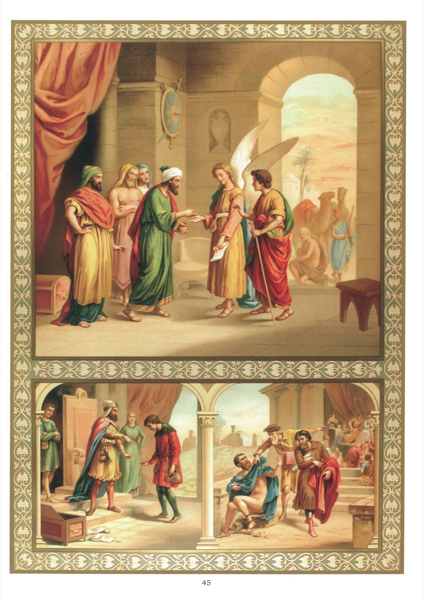

# Tableau 43 — 7e Commandement (suite)

## Septième Commandement de Dieu (suite) :

Le bien d’autrui tu ne prendras, Ni retiendras à ton escient.

1. Les serviteurs et les employés pèchent ordinairement contre le septième commandement en trompant leurs maîtres et en administrant mal les biens de leurs maîtres.

2. Même dans les moindres choses, les serviteurs ne doivent pas tromper leurs maîtres : 9 Et moi, je vous dis : Faites-vous des amis avec les richesses d’iniquité, afin que, lorsque vous manquerez de tout, ils vous reçoivent dans leurs tabernacles éternels. 10 Qui est fidèle dans les moindres choses est fidèle aussi dans les plus grandes ; et qui est injuste dans les petites choses est aussi injuste dans les grandes. 11 Si donc vous n’avez pas été fidèle dans les richesses d’iniquité, qui donc vous confira les biens véritables ? 12 Et si vous n’avez pas été fidèle pour un bien étranger, ce qui est à vous, qui vous le donnera ? 13 Nul serviteur ne peut servir deux maîtres ; car, ou il haïra l’un et aimera l’autre, ou il s’attachera à l’un et méprisera l’autre. Vous ne pouvez servir Dieu et Mammon. (Luc, 16 ; 9-13)

3. On fait un procès injuste lorsqu’on traduit quelqu’un en justice pour l’obliger à payer ce qu’il ne doit pas.

4. Ceux qui ne payent pas leurs dettes offensent Dieu, parce qu’ils retiennent injustement le bien d’autrui.

5. Celui qui a fait tort au prochain est obligé de restituer au plus tôt le bien mal acquis et de réparer tout le dommage qu’il a causé par lui-même ou par d’autres.

6. La restitution, quand elle est possible, est tellement nécessaire, que sans elle le vol ne saurait être pardonné. C’est ce que promit Zachée lorsque Notre-Seigneur vint loger dans sa maison : 1 Jésus, étant entré dans Jéricho, allait par la ville ; 2 et voilà qu’un homme, nommé Zachée, chef des publicains et fort riche lui-même, 3 cherchait à voir qui était Jésus, et il ne le pouvait à cause de la foule, parce qu’il était très petit de taille. 4 Courant en avant, il monta sur un sycomore pour le voir, parce qu’il devait passer par là. 5 Arrivé en cet endroit, Jésus leva les yeux et, l’ayant vu, lui dit : Zachée, hâtez-vous de descendre ; car aujourd’hui, c’est dans votre maison qu’il faut que je m’arrête. 6 Et il se hâta de descendre, et il le reçut avec joie. 7 Ce que voyant, ils murmuraient tous, disant : Il est allé loger chez un homme pécheur. 8 Mais Zachée, debout devant le Seigneur, lui dit : Seigneur, voici que je donne aux pauvres la moitié de mes biens, et si j’ai fait tort de quelque chose à quelqu’un, je lui rends le quadruple. 9 Jésus lui dit : Aujourd’hui le salut est entré dans cette maison, parce que celui-ci est aussi enfant d’Abraham. 10 Car le fils de l’homme est venu chercher et sauver ce qui avait péri. (Luc, 19.)

7. L’auteur d’un vol ou d’un dommage n’est pas seul obligé de restituer ; cette obligation s’étend à tous ceux qui ont participé en quelque manière au vol ou au dommage causé au prochain.

8. On participe au vol ou au dommage causé au prochain : 1° lorsqu’on le commande ; 2° qu’on le conseille ; 3° qu’on le recèle ; 4° enfin, lorsque, étant obligé de l’empêcher, on ne l’empêche pas.

9. La restitution doit se faire dans l’ordre suivant : C’est le détenteur de la chose volée qui doit la restituer avant tous les autres. À son défaut, la restitution doit être faite par celui qui a commandé ou conseillé le vol, et ensuite par celui qui l’a exécuté.

10. Il faut restituer à celui à qui on a fait du tort, ou, s’il est mort, à ses héritiers.

11. Si l’on avait soi-même hérité des biens mal acquis, il faudrait les restituer, parce qu’il n’est pas permis de retenir injustement le bien d’autrui.

12. Si l’on ne sait à qui appartient le bien qu’on est obligé de restituer, il faut consulter ses supérieurs et exécuter ce qu’ils diront.

13. On doit restituer la chose même que l’on a prise si elle existe encore en nature ; si elle n’existe plus, on doit en restituer la juste valeur.

14. Si l’on n’a pas de quoi restituer, on doit avoir l’intention de le faire et prendre les moyens de restituer le plus tôt possible.

15. Le meilleur moyen d’éviter toute injustice, c’est de respecter le bien d’autrui comme nous voulons qu’on respecte le nôtre.

## Explication du Tableau

16. Le haut du tableau représente l’ange Raphaël réclamant à Gabélus une somme d’argent que le vieux Tobie lui avait autrefois prêtée. Gabélus, loin de renier cette dette, s’empresse de la payer à l’ange.

17. Nous voyons, à droite, un homme puissant qui veut dépouiller de son bien un plus faible que lui, le menaçant de lui susciter des procès injustes et ruineux s’il ne cède à ses exigences.

18. On voit, en bas, à gauche, un serviteur infidèle qui a dissipé le bien de son maître.
