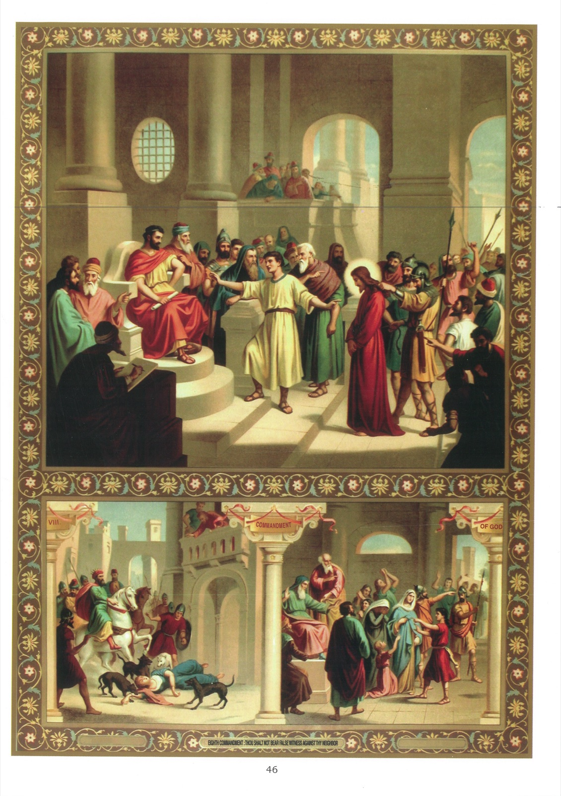

# Tableau 44 — 8e Commandement

## Huitième Commandement de Dieu :

Faux témoignage ne diras, Ni mentiras aucunement.

1. Ce commandement nous défend : 1° le faux témoignage ; 2° le mensonge ; 3° la calomnie ; 4° la médisance ; 5° le jugement téméraire.

## Le faux témoignage

2. On fait un faux témoignage lorsqu’on est appelé en justice comme témoin et qu’on ne dit pas la vérité.

3. Le faux témoignage est toujours un péché mortel, car celui qui le rend commet un parjure, puisqu’il viole le serment qu’il a fait de dire la vérité ; souvent aussi il commet une injustice en faisant condamner un innocent.

4. Celui qui a rendu un faux témoignage est obligé de réparer tout le dommage dont il est cause.

5. On pèche encore d’une manière analogue au faux témoignage, par exemple, en produisant de faux témoins ou de faux titres, faisant condamner ou en condamnant celui qu’on sait innocent.

## Explication du Tableau

6. Le haut de ce tableau représente Notre-Seigneur Jésus-Christ amené par les juifs devant Pilate, qui est assis sur son tribunal. L’un des assistants lève la main et, montrant Jésus, déclare qu’il l’a entendu défendre de payer le tribut à César. C’était là un faux témoignage, car Jésus avait dit, au contraire, qu’il fallait rendre à César ce qui appartenait à César.

7. Saint Marc rapporte un autre faux témoignage contre Notre-Seigneur : 55 Or, les princes des prêtres et tout le conseil cherchaient un témoignage contre Jésus, pour le faire mourir, et ils n’en trouvaient point. 56 Car plusieurs déposaient faussement contre lui, mais leurs dépositions ne s’accordaient pas. 57 Quelques-uns, se levant, portaient contre lui ce faux témoignage, disant : 58 Nous l’avons entendu dire : Je détruirai ce Temple fait de main d’homme, et en trois jours j’en rebâtirai un autre qui ne sera point fait de main d’homme. 59 Mais leurs témoignages ne s’accordaient point. 60 Alors, le grand-prêtre, se levant au milieu de l’assemblée, interrogea Jésus, disant : Vous ne répondez rien à ce que ces hommes déposent contre vous ? 61 Mais Jésus se taisait, et il ne répondit rien. Le grand-prêtre, l’interrogeant de nouveau, lui dit : Êtes-vous le Christ, Fils du Dieu béni ? 62 Jésus lui dit : Je le suis ; et vous verrez le fils de l’homme, assis à la droite de la puissance de Dieu, et venant sur les nuées du ciel. (Marc, 14.)

8. En bas du tableau, à gauche, on voit Jézabel, épouse d’Achab, roi d’Israël, dévorée par des chiens. Cette femme impie, voulant se défaire de Naboth, qui refusait de céder à Achab l’héritage de ses pères, fit suborner de faux témoins qui l’accusèrent d’avoir blasphémé contre Dieu et contre le roi. Naboth fut condamné à mort et lapidé. Mais le crime de Jézabel ne resta pas impuni. Le successeur d’Achab, Jéhu, qui est ici monté sur un cheval, la fit précipiter du haut de son palais, et son corps fut dévoré par des chiens.

9. Un autre exemple de faux témoignage est aussi celui proféré par les Juifs contre saint Étienne. On lit dans les Actes des Apôtres : 7 Cependant la parole de Dieu se répandait de plus en plus, et le nombre des disciples augmentait fort dans Jérusalem. Il y en avait aussi beaucoup d’entre les prêtres qui obéissaient à la foi. 8 Or, Étienne, qui était plein de grâce et de force, faisait de grands prodiges et de grands miracles parmi le peuple. 9 Et quelques-uns de la synagogue appelée la synagogue des Affranchis, et de celles des Cyrénéens et des Alexandrins, et de ceux de Cilicie et d’Asie, s’élevèrent contre Étienne et disputaient avec lui. 10 Mais ils ne pouvaient résister à la sagesse et à l’Esprit qui parlait. 11 Alors ils subornèrent des gens qui dirent : Nous l’avons entendu proférer des paroles de blasphème contre Moïse et contre Dieu. 12 Et ainsi ils émurent le peuple, les sénateurs et les docteurs de la loi, et se jetant sur Étienne, ils l’enlevèrent et l’entraînèrent au Conseil. 13 Et ils produisirent contre lui de faux témoins qui disaient : Cet homme-là ne cesse point de proférer des blasphèmes contre le lieu saint et contre la loi, 14 car nous lui avons entendu dire que ce Jésus de Nazareth détruira ce lieu-ci et changera les ordonnances que Moïse nous a laissées. (Act. 6.)

10. À droite, nous voyons Daniel, âgé de douze ans ; en face de lui est Suzanne, entourée de ses parents et de ses amis. Les deux vieillards qu’on voit derrière Suzanne avaient rendu contre elle un faux témoignage en déclarant qu’ils l’avaient surprise à commettre une action infâme. Suzanne fut condamnée à mort, et elle allait être lapidée, lorsque le jeune Daniel s’écria qu’elle était innocente. Il convainquit les deux vieillards de faux témoignage, et ils furent mis à mort.
