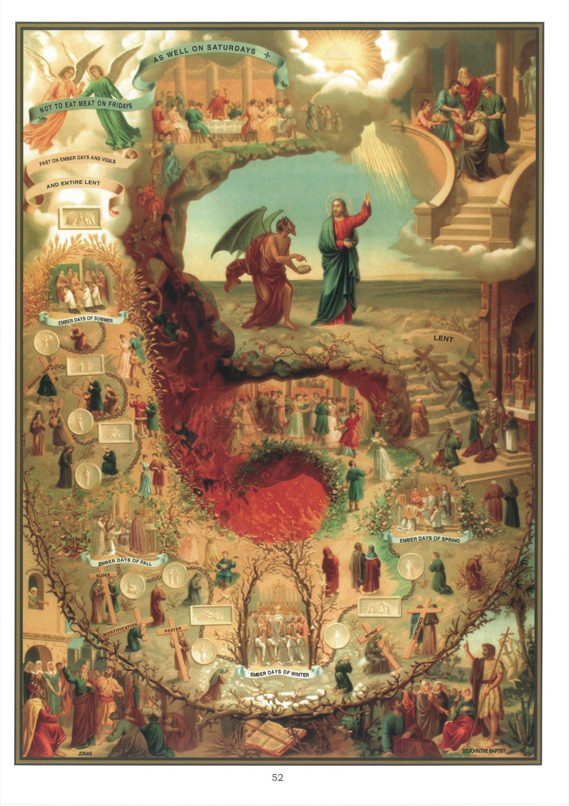

# Tableau 50 — Commandements de l'Église (suite)

## Troisième Commandement de l’Église :

Tous tes péchés confesseras, À tout le moins une fois l’an.

## Quatrième Commandement de l’Église :

Ton Créateur tu recevras, Au moins à Pâques humblement.

1. Le troisième commandement de l’Église nous ordonne de nous confesser au moins une fois chaque année avec les dispositions nécessaires.

## Exposé de la Doctrine

2. C’est un péché mortel de laisser passer une année entière sans se confesser, parce que c’est désobéir à l’Église en matière grave.

3. Celui qui ferait une mauvaise confession ne satisferait pas au précepte de la confession annuelle, parce que Jésus-Christ et l’Église n’ordonne pas seulement qu’on se confesse, mais encore qu’on fasse une bonne confession.

4. Il est à propos de faire cette confession dans le Carême, afin qu’elle serve de préparation à la communion pascale.

5. On doit commencer à se confesser quand on est capable d’offenser Dieu mortellement, c’est-à-dire vers l’âge de 7 ans.

6. Par le quatrième commandement, l’Église ordonne à tous les fidèles qui ont atteint l’âge de discrétion de communier au moins une fois chaque année au temps de Pâques.

7. Il faut faire la communion pascale dans sa paroisse, à moins qu’on n’ait la permission de le faire ailleurs.

8. C’est un grand péché de ne pas communier à Pâques, car c’est désobéir à Dieu en matière grave, mépriser le plus grand bienfait de Dieu et scandaliser le prochain.

9. Quand l’Église ordonne de se confesser au moins une fois l’an, et de communier au moins à Pâques, elle nous fait entendre qu’elle désire que les fidèles se confessent et communient plus d’une fois l’an.

10. L’Église le désire, parce qu’il est difficile de vivre chrétiennement si l’on ne se confesse et si l’on ne communie qu’une fois l’an. Elle conseille même à tous les fidèles de communier chaque jour.

## Explication du Tableau

11. En haut du tableau, à droite, nous voyons s’ouvrir la série des fêtes que l’Église recommande aux chrétiens de sanctifier par la réception des sacrements de Pénitence et d’Eucharistie. Ces fêtes sont : la Pentecôte, la Sainte Trinité, la Fête-Dieu, saint Pierre et saint Paul, l’Assomption, la Nativité de la Sainte Vierge, le Saint Rosaire, la Toussaint, la Commémoration des fidèles trépassés, l’Immaculée Conception, Noël, l’Épiphanie et la Présentation.

12. À gauche, on voit la Porte du Carême, que l’Église ouvre aux bons chrétiens pour les préparer par la prière et la pénitence à la confession et à la communion pascale. Tous les chrétiens ne se rendent pas à l’appel de l’Église : un grand nombre préfèrent les plaisirs du monde à l’accomplissement des devoirs religieux.

13. Nous voyons, au centre du tableau, un bal où se rendent ceux qui font passer les divertissements du monde avant le soin de leur salut.

14. Au-dessus de la Porte du Carême se trouve un confessionnal où des fidèles, se confessant, reçoivent le pardon de leurs fautes, recouvrent la paix de leur âme et l’amitié de Dieu. Du haut de la Croix, qui s’élève au-dessus du confessionnal, Jésus-Christ leur applique les mérites de son sang et de sa mort. À droite du confessionnal, on voit des fidèles qui remplissent le devoir de la communion pascale, et qui reçoivent, avec la sainte Eucharistie, le gage de la vie éternelle. Aussi se dirigent-ils, après avoir communié, vers Jésus montant au ciel, comme pour prendre possession du bonheur qu’il leur a promis en disant : « Celui qui mange ma chair et qui boit mon sang a la vie éternelle. »

15. Nous voyons, au bas du tableau, dans l’angle de droite, des Israélites réunis autour d’une table pour manger l’agneau pascal. Au-dessus d’eux, un ange, armé d’une épée flamboyante, s’élance pour aller frapper de mort les premiers-nés des Égyptiens. De même que les Israélites qui marquèrent leurs portes du sang de l’agneau pascal et se nourrirent de sa chair furent épargnés par l’ange exterminateur, de même les chrétiens qui, par le sacrement de Pénitence, purifient leurs âmes dans le sang de Jésus-Christ, et qui, dans l’Eucharistie, se nourrissent de sa chair, éviteront la mort éternelle de l’enfer.

16. On s’est toujours confessé dans l’Église, même du temps des apôtres. Dans l’angle de gauche, nous voyons des chrétiens venir tour à tour se confesser à saint Paul ; c’est ce qui arriva à Éphèse lorsque plusieurs de ceux qui avaient cru à la prédication de saint Paul vinrent confesser ce qu’ils avaient fait.
