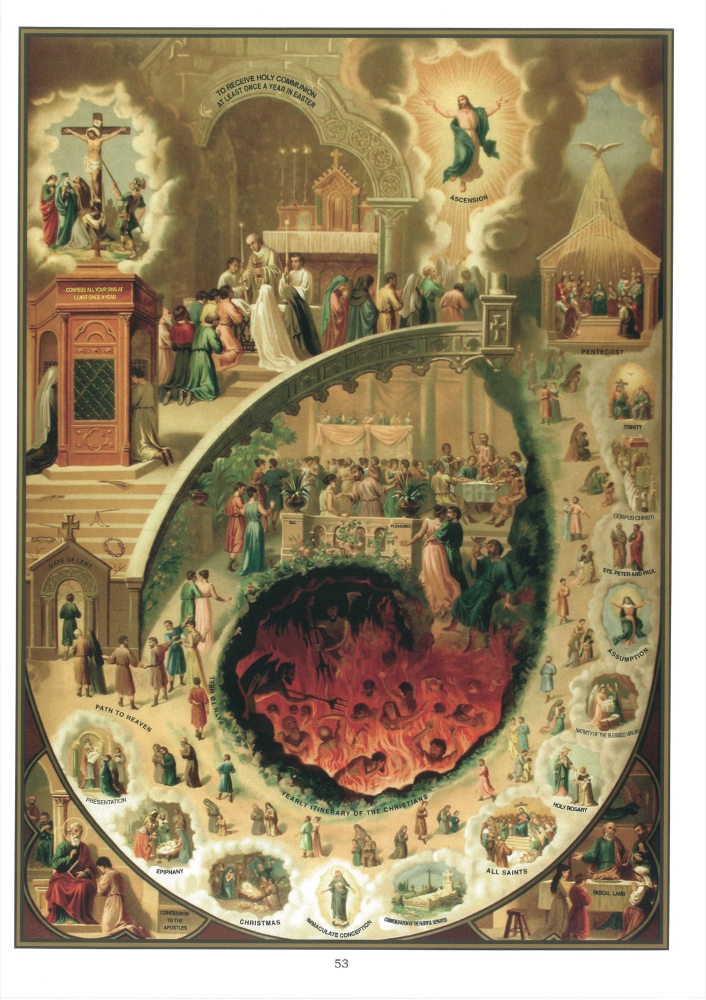

# Tableau 51 — Commandements de l'Église (suite)

## Cinquième Commandement de l’Église :

Quatre-Temps, vigile jeûneras, Et le Carême entièrement.

## Sixième Commandement de l’Église :

Vendredi chair ne mangeras, Ni le samedi mêmement.

1. Le cinquième commandement de l’Église nous ordonne de jeûner le Carême, les Quatre-Temps et les veilles de certaines fêtes.

2. Jeûner, c’est ne faire par jour qu’un seul repas, auquel on peut ajouter une légère collation.

3. Le repas doit se faire à midi et la collation le soir ; ou bien on peut faire la collation vers midi, et dîner le soir.

4. Le jeûne entraîne souvent l’obligation de l’abstinence.

5. L’abstinence consiste à ne pas faire usage d’aliments gras, tels que viandes, bouillon, etc., défendus par l’Église à certains jours : mercredi des Cendres, samedis de Carême, Quatre-Temps et Vigiles, et tous les vendredis de l’année (1).

6. Ceux qui ne sont pas tenus au jeûne doivent garder l’abstinence, aussi bien les jours de jeûne que les autres jours fixés par l’Église.

7. Tous ceux qui ont vingt et un ans accomplis sont obligés de jeûner.

8. L’Église dispense de cette obligation les malades et ceux à qui la vieillesse ou des travaux trop pénibles ne permettent pas de jeûner.

9. Le Carême est un jeûne de quarante jours qui précède la fête de Pâques. Il a été institué : 1° pour honorer le jeûne de Jésus-Christ dans le désert ; 2° pour nous faire expier nos péchés ; 3° pour nous préparer par la pénitence à célébrer dignement la fête de Pâques.

10. Le sixième commandement de l’Église nous défend d’user, sans nécessité ou sans permission, d’aliments gras le vendredi, sous peine de péché mortel.

11. L’Église a établi l’abstinence du vendredi pour honorer la mort de Notre-Seigneur et pour nous rappeler chaque semaine la nécessité de faire pénitence.

## Explication du Tableau

12. Vers le haut de ce tableau, nous voyons Notre-Seigneur Jésus-Christ tenté par le démon dans le désert, après qu’il eut jeûné quarante jours et quarante nuits. « Si vous êtes le Fils de Dieu, commandez que ces pierres se changent en pain. » Jésus répondit : « L’homme ne vit pas seulement de pain, mais de toutes paroles qui sort de la bouche de Dieu. »

13. À droite, un prêtre met des cendres sur la tête des fidèles le premier jour du Carême, en disant à chacun : « Souviens-toi, ô homme, que tu es poussière, et que tu retourneras en poussière. »

14. L’Église a institué le jeûne des Quatre-Temps : 1° pour consacrer à Dieu, par la pénitence, toutes les saisons de l’année ; 3° pour appeler les grâces de Dieu sur les ministres de l’Église, qui reçoivent l’ordination habituellement le samedi des Quatre-Temps. À gauche, aux Quatre-Temps d’été, est représentée l’ordination des sous-diacres. En descendant, aux Quatre-Temps d’automne, est représentée l’ordination des diacres. En bas, aux Quatre-Temps d’hiver, est représentée l’imposition des mains dans l’ordination des prêtres. Plus haut, à droite, aux Quatre-Temps de printemps, est représentée la consécration des mains dans l’ordination des prêtres.

15. Par Vigile, il faut entendre un jour d’abstinence et de jeûne qui précède certaines fêtes. L’Église a institué les Vigiles pour nous disposer, par la mortification, aux fêtes qui les suivent.

16. Les Vigiles sont indiquées ici par des médaillons rectangulaires ou ronds. Les premiers indiquent les Vigiles anciennement obligatoires en France ; les seconds marquent les Vigiles qui n’obligeaient pas en France.

17. Les Vigiles obligatoires actuellement dans l’Église entière sont celles de la Pentecôte, de l’Assomption, de la Toussaint et de Noël.

18. En haut du tableau, à droite, nous voyons le vieillard Eléazar, un des plus illustres Israélites qui périrent durant la persécution d’Antiochus. On le pressait de manger des viandes défendues par la loi, et on voulait l’y contraindre en lui ouvrant la bouche par force.

19. Le haut de ce tableau représente un festin dans lequel on sert de la viande un jour de vendredi. Au centre, nous voyons des personnes des deux sexes prendre part à un bal en temps de Carême, Plus bas, on voit l’enfer, dans lequel tombent ces mêmes personnages.

20. En bas de ce tableau, dans l’angle de gauche, le prophète Jonas prédit la ruine de Ninive.

21. Dans l’angle de droite, on voit saint Jean-Baptiste prêchant la pénitence aux Juifs, pour les disposer à recevoir les grâces de salut que Jésus-Christ devait leur apporter. « Faites pénitence, disait-il, car le royaume des cieux est proche. » ___________ (I) L’abstinence des samedis de Carême est souvent reportée dans les diocèses à un autre jour.
