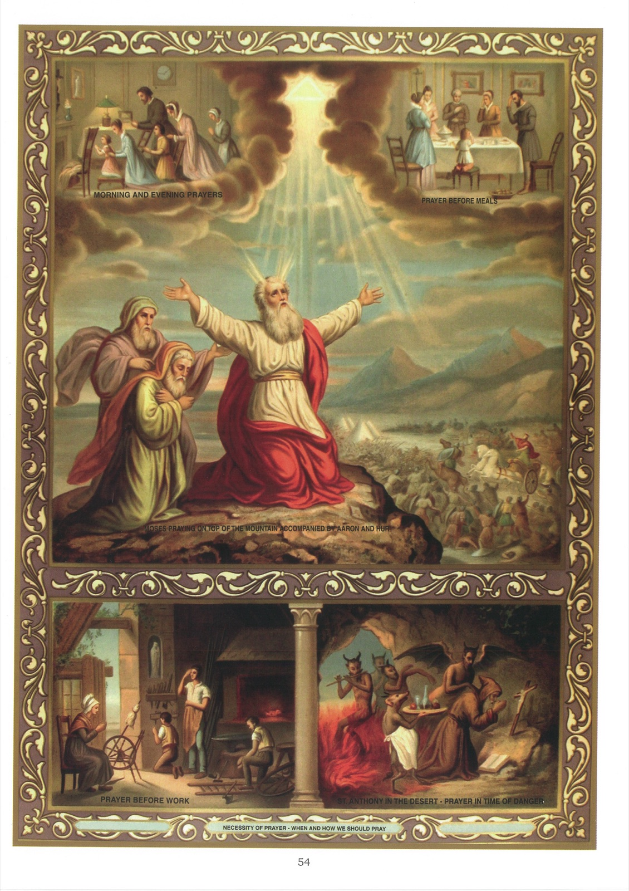

# Tableau 52 — La Prière

1. La prière est une élévation de notre âme vers Dieu pour lui rendre nos devoirs et lui demander ses grâces.

2. Les principaux devoirs que nous devons rendre à Dieu dans la prière sont : l’adoration, la louange, l’amour et l’action de grâce.

3. Nous sommes obligés de prier : 1° parce que Dieu l’a commandé dans tous les temps ; 2° parce que Jésus-Christ, dans l’Évangile, nous a enseigné à prier par ses paroles et par ses exemples ; 3° parce que nous avons continuellement besoin du secours de Dieu.

4. Il y a deux sortes de prières : la prière vocale et la prière mentale.

5. La prière vocale est celle qui se fait en employant des paroles.

6. La prière mentale, qu’on appelle aussi méditation, est celle qui ne se fait qu’en esprit, sans employer de paroles.

7. La méditation est un des exercices les plus utiles de la vie chrétienne : en nous portant à réfléchir sur les vérités de la religion, elle nous les fait goûter davantage et nous rend plus fervents dans l’accomplissement de tous nos devoirs.

8. Il faut prier pour soi-même, pour ses parents, pour ses supérieurs, pour tous les hommes et même pour ses ennemis.

9. Nous devons aussi prier pour les âmes du Purgatoire, afin qu’elles soient bientôt délivrées de leurs peines et admises à jouir du bonheur céleste.

10. Quand nos prières sont bien faites, Dieu les exauce toujours, mais de la manière et dans le temps qu’il juge convenable.

11. C’est Jésus-Christ lui-même qui nous a donné cette assurance en disant : « Tout ce que vous demanderez à mon Père en mon nom, il vous l’accordera. »

12. Nous devons demander dans nos prières ce qui a rapport à la gloire de Dieu, à notre salut et au salut du prochain.

13. On peut demander des biens temporels, comme la santé, le succès dans les entreprises, etc., pourvu qu’on les demande pour une bonne fin et avec soumission à la volonté de Dieu.

14. Il faut prier souvent, mais surtout le matin et le soir, avant et après les repas, avant le travail, quand on se trouve en quelque danger, ou en butte aux tentations.

15. C’est Jésus-Christ qui nous a recommandé de prier souvent, lorsqu’il a dit : « Il faut toujours prier et ne jamais se lasser. » On prie continuellement : 1° en élevant souvent son esprit et son cœur vers Dieu ; 2° en faisant toutes ses actions en vue de plaire à Dieu.

16. Il est bon de réciter les prières en commun dans les familles, parce que c’est le meilleur moyen d’honorer Dieu, d’attirer ses bénédictions sur les familles et d’élever chrétiennement les enfants. Jésus-Christ a dit que si deux ou trois personnes s’assemblent en son nom pour prier, il sera au milieu d’elles.

17. Il faut prier avec attention, humilité confiance et persévérance.

18. Prier avec attention, c’est prier en pensant à qui l’on parle et à ce qu’on lui dit.

19. Prier avec humilité, c’est reconnaître que nous ne sommes que néant devant Dieu, et que nous ne pouvons rien que par son secours.

20. Prier avec confiance, c’est avoir la ferme assurance que Dieu nous exaucera, selon sa promesse.

21. Prier avec persévérance, c’est de ne pas se lasser de prier, jusqu’à ce qu’on ait obtenu l’effet de sa demande.

22. Nous devons prier au nom de Jésus-Christ, parce que nos prières ne sont exaucées qu’à cause des mérites de Jésus-Christ.

## Explication du Tableau

23. Ce tableau représente, dans sa partie centrale, Moïse priant sur une colline pendant que, dans la plaine, les Israélites combattaient contre les Amalécites. Lorsque Moïse tenait les mains élevées, Israël était victorieux ; mais lorsqu’il les abaissait un peu, Amalec avait l’avantage.

24. Ce tableau nous offre plusieurs exemples de la prière faite en commun dans les familles. En haut, à gauche, une famille chrétienne récite en commun, devant un crucifix et une image de la Sainte Vierge, la prière du matin et du soir. À droite, tous les membres d’une famille récitent, en commun, la prière avant le repas. En bas, à gauche, tous les membres d’une famille prient, en commun, avant le travail.

25. Ce tableau nous montre, en bas, à droite, le modèle d’une prière attentive dans la personne de saint Antoine. Les yeux constamment fixés sur le Crucifix, il prie avec ferveur pendant que les démons, sous toutes sortes de formes, cherchent à le distraire et à le porter au mal.
