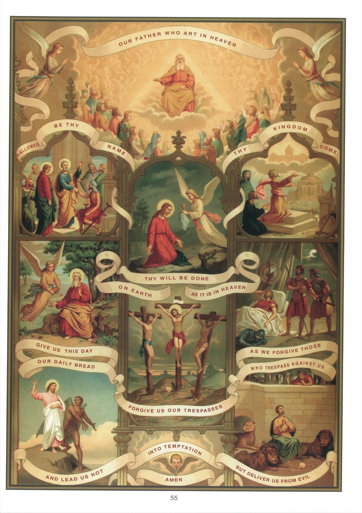

# Tableau 53 — Le Pater

## L’ORAISON DOMINICALE

## Explication du Tableau

1. Le sujet de ce tableau est l’Oraison dominicale, ou prière du Seigneur. On l’appelle ainsi, parce que c’est Notre-Seigneur Jésus-Christ lui-même qui nous l’a enseignée.

2. L’Oraison dominicale renferme une courte préface et sept demandes. Dans les trois premières, nous demandons à Dieu ce qui contribue à sa gloire ; nous demandons à Dieu ce qui contribue à sa gloire ; dans les quatre dernières, nous demandons ce qui contribue à notre bonheur spirituel et temporel.

3. La préface de l’Oraison dominicale, Notre Père qui êtes aux cieux, est représentée dans le haut de ce tableau par le ciel, où Dieu manifeste sa gloire aux anges et aux saints.

4. L’Oraison dominicale commence par ces mots : Notre Père, pour nous rappeler que nous sommes les enfants de Dieu et qu’en cette qualité nous devons prier avec confiance et amour.

5. Nous ajoutons : Qui êtes aux cieux, pour nous exciter à prier avec respect, en pensant que nous parlons à celui qui est le souverain Maître du ciel et de la terre.

6. Première demande : Que votre nom soit sanctifié. Par ces paroles, nous demandons que Dieu soit connu et servi par tous les hommes.

7. Cette demande est représentée à gauche du tableau par la guérison d’un boiteux, à qui saint Pierre dit : « Au nom de Jésus-Christ de Nazareth, lève-toi et marche. » Par ces paroles, suivies de la guérison du boiteux, saint Pierre a sanctifié le nom de Dieu en faisant connaître la sainteté et le pouvoir divin du nom de Jésus-Christ.

8. Deuxième demande : Que votre règne arrive. Par ces paroles, nous demandons à Dieu : 1° qu’il règne dans nos cœurs par sa grâce ; 2° qu’il nous fasse régner avec lui dans le ciel ; 3° que tous les peuples et ceux qui les gouvernent soient soumis à Dieu et à Notre-Seigneur Jésus-Christ, son Fils.

9. Cette demande est représentée, à droite par Tobie qui prédit l’avènement du règne de Dieu dans l’Église en disant : « Jérusalem, tu brilleras d’une lumière éclatante ; les nations adoreront en toi le Seigneur et considéreront ta terre comme une terre sainte. »

10. Troisième demande : Que votre volonté soit faite sur la terre comme au ciel. Par ces paroles, nous demandons à Dieu la grâce de lui obéir sur la terre comme les anges lui obéissent dans le ciel.

11. Cette demande est représentée, au centre du tableau, par Jésus disant à son Père pendant son agonie : Mon Père, que ce calice s’éloigne de moi ; cependant, que votre volonté soit faite et non pas la mienne. »

12. Quatrième demande : Donnez-nous aujourd’hui notre pain de chaque jour. Par ces paroles, nous demandons à Dieu ce qui nous est nécessaire pour la vie du corps et pour celle de l’âme.

13. Les choses qui nous sont nécessaires pour la vie du corps sont : la nourriture, le vêtement et le logement.

14. Jésus-Christ nous ordonne de ne demander que du pain, pour nous avertir de nous contenter du nécessaire, sans demander ni désirer le superflu.

15. Les choses nécessaires pour la vie de l’âme sont : 1° la parole de Dieu ; 2° la grâce habituelle et la grâce actuelle ; 3° la sainte Eucharistie, qui est le « Pain vivant descendu du ciel ».

16. La quatrième demande est représentée, à gauche, par un ange qui apporte un pain au prophète Élie dans le désert.

17. Cinquième demande : Pardonnez-nous nos offenses, comme nous pardonnons à ceux qui nous ont offensés. Ces paroles nous apprennent que, si nous voulons que Dieu nous pardonne, nous devons pardonner nous-mêmes les offenses que nous avons reçues de notre prochain.

18. Cette demande est ici représentée : 1° par Jésus-Christ sur la Croix, pardonnant à ses bourreaux et au bon larron ; 2° par David, épargnant Saül qui le poursuivait pour le faire mourir.

19. Sixième demande : Ne nous laissez pas succomber à la tentation. La tentation est un mouvement intérieur qui nous porte au péché, et qui est causé en nous par le démon ou par la concupiscence.

20. Dieu permet que nous soyons tentés, pour nous faire connaître notre misère, et pour nous donner lieu d’acquérir des mérites en résistant aux tentations avec le secours de sa grâce.

21. La sixième demande est ici représentée par Jésus, tenté dans le désert par le démon, mais ne succombant pas à la tentation.

22. Septième demande : Mais délivrez-nous du mal. Par ces paroles, nous demandons à Dieu qu’il nous délivre des maux de l’âme et du corps, du péché et de la damnation éternelle.

23. Cette demande est ici représentée par le prophète Daniel, qui fut jeté dans la fosse aux lions et miraculeusement préservé de tout danger.
