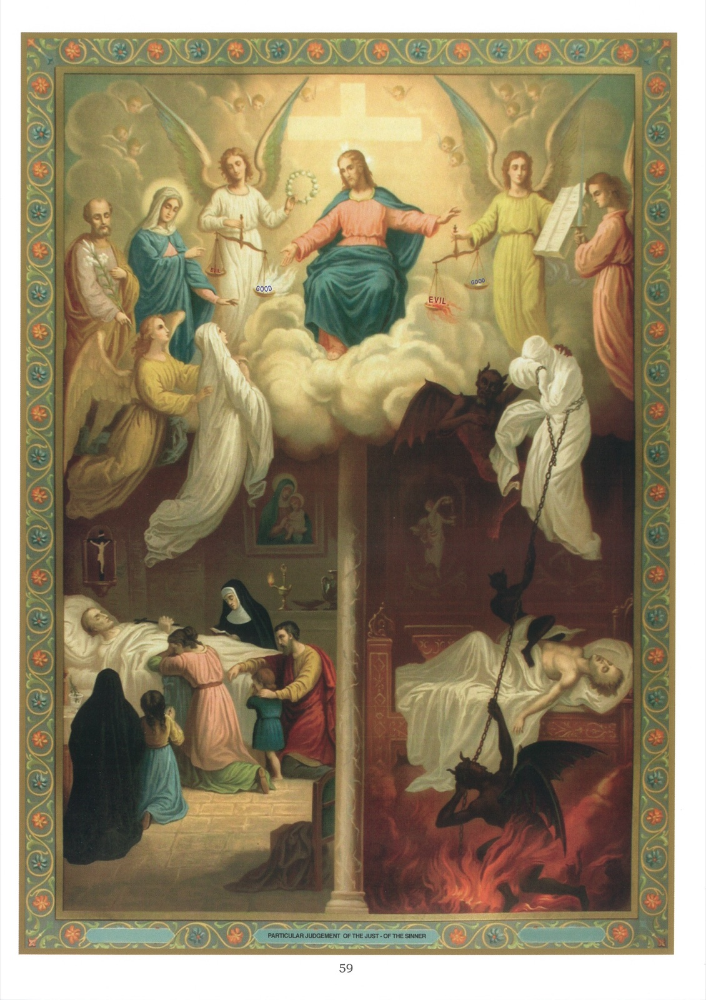

# Tableau 57 — Le Jugement

1. D’après l’opinion commune, le jugement particulier a lieu à l’endroit même où l’homme rend le dernier soupir.

2. Après notre mort, notre âme se trouvera donc en présence de Jésus-Christ, pour être jugée selon ses œuvres, et entendre la sentence qui réglera à jamais son sort heureux ou malheureux.

3. L’Évangile, dans les passages suivants, nous montre combien nous devons penser à ce jugement et nous y préparer : 1 Cependant, une grande multitude s’étant assemblée autour de lui, à ce point qu’ils se foulaient les uns les autres, il se mit à dire à ses disciples : Gardez-vous du levain des pharisiens, qui est l’hypocrisie. 2 Car rien de secret qui ne soit révélé, rien de caché qui ne soit su. 3 Ce que vous avez dit dans les ténèbres, on le dira dans la lumière ; et ce que vous avez dit à l’oreille, dans l’intérieur de la maison, sera publié sur les toits. 4 Je vous dis donc à vous, qui êtes mes amis : Ne craignez point ceux qui tuent le corps, et après ne peuvent rien faire de plus. 5 Mais je vous montrerai qui vous devez craindre : Craignez celui qui, après avoir ôté la vie, a le pouvoir de jeter dans la géhenne ; oui je vous le dis, celui-là, craignez-le. 6 Cinq passereaux ne se vendent-ils pas deux as ? et pas un d’eux n’est en oubli devant Dieu. 7 Les cheveux même de votre tête sont tous comptés. Ne craignez donc point, vous valez mieux que beaucoup de passereaux. 8 Or, je vous le dis : Quiconque m’aura confessé devant les hommes, le Fils de l’homme le confessera devant les anges de Dieu. 9 Mais qui m’aura renié devant les hommes sera renié devant les anges de Dieu. 10 Et quiconque parle contre le Fils de l’homme, il lui sera remis ; mais à celui qui aura blasphémé contre l’Esprit-Saint, il ne lui sera point remis… 35 Que vos reins soient ceints, et ayez en vos mains des lampes allumées, 36 semblables vous-même à des gens qui attendent leur maître à son retour des noces, afin que dès qu’il arrivera et frappera à la porte, ils lui ouvrent aussitôt. 37 Heureux ces serviteurs, que le maître, à son retour, trouvera veillant ; en vérité, je vous le dis, il se ceindra et les fera mettre à table, et, passant de l’un après l’autre, il les servira. 38 Et s’il vient à la seconde veille, et s’il vient à la troisième veille, et il les trouve ainsi, heureux sont ces serviteurs ! 39 Or, sachez que, si le père de famille savait à quelle heure le voleur doit venir, il veillerait certainement et ne laisserait point percer sa maison. 40 Et vous aussi, soyez prêts, parce qu’à l’heure que vous ne pensez pas, le Fils de l’homme viendra. 41 Pierre lui dit : Seigneur, est-ce pour nous que vous dites cette parabole ou bien pour tout le monde ? 42 Le Seigneur dit : Quel est, pensez-vous, le dispensateur fidèle et prudent que le maître a établi sur les gens de sa maison, pour leur donner, au temps fixé, la mesure de froment ? 43 Heureux ce serviteur que le maître à son arrivée, trouvera agissant de la sorte. 44 En vérité, je vous le dis, il l’établira sur tous ses biens. 45 Que si ce serviteur dit en son cœur : Mon maître tarde à venir, et qu’il se mette à battre les serviteurs et les servantes, et à manger, et à boire, et à s’enivrer, 46 le maître de ce serviteur viendra au jour où il ne s’y attend point, et à l’heure qu’il ignore, et il le mettra à part et il lui assignera son lot avec les infidèles. (Luc. XII.)

## Explication du tableau

4. Ce tableau représente le jugement particulier, qui aura lieu à notre mort.

5. Nous voyons sur ce tableau, à gauche, le jugement du juste, et, à droite, celui du pécheur. Le tribunal de Jésus-Christ est dressé au-dessus de leurs cadavres, dans l’appartement même où ils viennent d’expirer. Les parents du juste sont encore en prière près du lit de leur cher défunt.

6. L’âme du juste est présentée à Jésus-Christ par son ange gardien, précédé de la Sainte Vierge et de saint Joseph. Un ange tient d’une main la couronne qui lui est réservée et, de l’autre, la balance de la justice, où ses mérites sont pesés, et dans laquelle le plateau du bien l’emporte. Jésus-Christ l’accueille avec bonté et prononce sur elle un jugement favorable.

7. L’âme du pécheur comparaît aussi devant le souverain Juge, mais elle se voile la face, ne pouvant soutenir son regard. Elle est escortée par les démons et liée par une chaîne que tire Lucifer. Le plateau du mal l’emporte sur celui du bien dans la balance de sa justice ; et, aucune bonne œuvre n’étant écrite sur le livre de vie tenu par l’ange, Jésus-Christ la repousse et prononce contre elle la terrible sentence de l’éternelle réprobation. N.B. – On a vu, dans le dernier article du Symbole des Apôtres, les tableaux du Jugement dernier, du Ciel et de l’Enfer.
