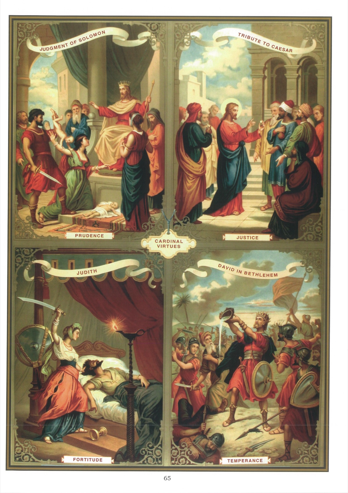

# Tableau 63 — Les Vertus cardinales

1. On appelle vertus morales celles qui tendent directement à régler nos mœurs et à diriger notre conduite.

2. Les principales vertus morales sont les quatre vertus cardinales : la Prudence, la Justice, la Force et la Tempérance.

3. Les quatre vertus cardinales ont été connues et enseignées par les philosophes païens, en tant que vertus naturelles. Le christianisme les ayant surnaturalisées et fortifiées en nous par la grâce, elles ont tendu vers un but meilleur.

## La Prudence

4. La Prudence surnaturelle est une vertu qui éclaire notre esprit et qui nous fait choisir les moyens les plus sûrs pour opérer notre salut.

## La Justice

5. La Justice surnaturelle est une vertu qui porte à rendre à Dieu et au prochain ce qui leur est dû. Elle règle aussi nos pensées et nos sentiments vis-à-vis des autres, nous rend vis-à-vis de nous-mêmes humbles et défiants, comme l’absolue justice le commande aux pécheurs. « Si votre justice n’abonde pas plus que celle des scribes et des pharisiens, nous dit Notre-Seigneur dans l’Évangile, vous n’entrerez point dans le royaume des cieux. »

## La Force

6. La Force surnaturelle est une vertu qui nous donne le courage de pratiquer tous les devoirs que Dieu nous impose.

## La Tempérance

7. La Tempérance chrétienne est une vertu qui nous porte non seulement à éviter les excès et à user de toutes choses avec modération, mais, dans cet usage même, elle nous demande de ne point y chercher notre bonheur et notre fin.

## Explication du tableau

8. La Prudence est représentée, en haut de ce tableau, à gauche, par le jugement de Salomon. Deux femmes demeurant dans une même maison avaient chacune un enfant nouveau-né. L’un d’eux étant mort dans une nuit, sa mère le mit à la place de l’autre, et plaça celui-ci auprès d’elle, comme s’il était son enfant. L’autre mère, s’étant aperçue de cette fraude, porta l’affaire devant Salomon. Nous voyons ce sage prince assis sur son trône et les deux mères devant lui. L’enfant mort est déposé aux pieds du roi. Un soldat, armé d’un glaive, tient l’enfant vivant réclamé par les deux mères. « Qu’on le coupe en deux, dit Salomon, et qu’on en donne une moitié à chacune. – Seigneur, s’écria la vraie mère, ne le tuez pas ; donnez-le-lui plutôt tout entier. – Non, dit la fausse mère, qu’on le partage en deux, et qu’il ne soit ni à toi ni à moi. » Alors le roi dit : « Donnez l’enfant à la première et ne le tuez pas, car c’est la vraie mère. »

9. Ce tableau nous montre, à droite, comment Jésus-Christ enseigna un jour la justice aux pharisiens et aux hérodiens. Ceux-ci lui ayant demandé, pour le tenter, s’il était permis de payer le tribut à César, Notre-Seigneur se fit présenter une pièce de monnaie et la leur montra en disant : « De qui sont cette image et cette inscription ? – De César », répondirent-ils. Alors Jésus leur dit : « Rendez donc à César ce qui appartient à César, et à Dieu ce qui appartient à Dieu. »

10. Ce tableau nous offre, en bas, à gauche, un trait de force admirable dans la personne de Judith. Cette sainte femme, voyant que la ville de Béthulie, où elle demeurait, était sur le point d’être prise par Holopherne, général assyrien, résolut de sauver sa patrie ou de périr. Elle se para de ses plus beaux vêtements et se rendit au camp d’Holopherne, comme pour se soustraire au désastre qui menaçait Béthulie. Le général, frappé de sa beauté et plus encore de la sagesse de ses discours, donna en son honneur un grand festin, dans lequel il but avec excès. Après le repas, Judith resta seule avec lui. Lorsqu’elle le vit plongé dans un profond sommeil, elle prit son épée qui était suspendue près de lui et lui coupa la tête.

11. Ce tableau nous montre, à droite, un exemple remarquable de tempérance donné par David. Un jour ce prince faisait la guerre aux Philistins, qui occupaient Bethléem. Pressé par la soif, il s’écria : « Qui me donnera à boire de l’eau de la citerne qui est près de la porte de Bethléem ? » Aussitôt trois vaillants hommes passèrent au travers du camp des Philistins, allèrent puiser de l’eau dans la citerne et l’apportèrent à David. Mais celui-ci n’en voulut point boire, et il l’offrit au Seigneur en disant : « Dieu me garde de le faire ! Boirai-je le sang de ces hommes et ce qu’ils ont acheté au prix de leur vie ? »
