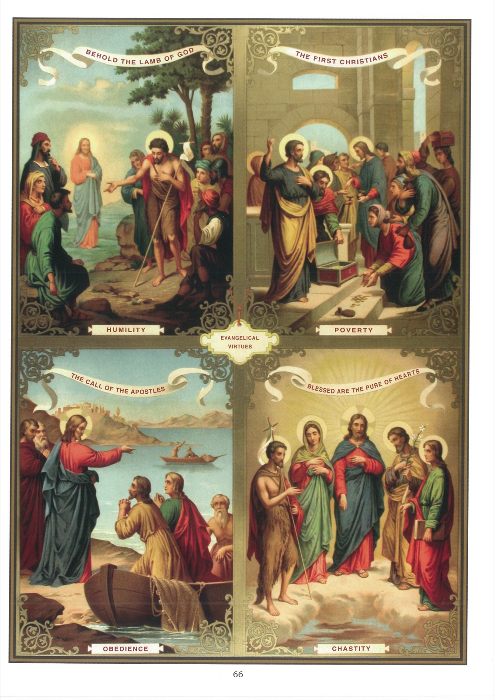

# Tableau 64 — Les Vertus évangéliques

1. Les vertus évangéliques sont des vertus qui se rapportent aux vertus cardinales, et qui sont particulièrement recommandées dans l’Évangile.

2. Il y a quatre vertus évangéliques : l’Humilité, la Pauvreté, la Chasteté et l’Obéissance.

## L’Humilité

3. L’Humilité est une vertu qui nous fait reconnaître nos défauts et rapporter à Dieu le peu de bien qui est en nous.

## La Pauvreté

4. La Pauvreté est une vertu qui nous porte à détacher notre cœur des biens de la terre, pour l’attacher à Dieu seul.

## La Chasteté

5. La Chasteté est une vertu qui nous porte à éviter les plaisirs défendus, et à user avec modération de ceux qui sont permis.

## L’Obéissance

6. L’Obéissance est une vertu qui nous porte à obéir aux ordres légitimes de tous nos supérieurs, en les considérant comme les enfants de Dieu.

7. C’est sur cette base qu’a été élevé l’édifice de la perfection chrétienne. L’Évangile a surnaturalisé ces vertus, les a perfectionnées et a proposé, non comme un devoir mais comme un conseil, non comme une obligation générale mais comme fidélité à une vocation privilégiée, de les porter jusqu’à l’héroïsme dans ce qu’elle appelle la vie religieuse. L’état religieux repose sur 3 vœux ou engagements, qui sont la pratique suréminente des vertus morales, à savoir : les vœux de pauvreté, de chasteté, d’obéissance et la pratique constante de l’humilité.

8. Voici comment Jésus-Christ, dans l’Évangile, appelle un jeune homme à cette voie de perfection : 18 Et un homme de qualité l’interrogea, disant Bon Maître, que ferai-je pour posséder la vie éternelle ? 19 Jésus lui dit : Pourquoi m’appelez-vous bon ? Nul n’est bon que Dieu seul. 20 Vous connaissez les commandements : Tu ne tueras point ; tu ne seras point adultère ; tu ne déroberas point ; tu ne porteras point de faux témoignage ; honore ton père et ta mère. 21 Il répondit : Tous ces commandements, je les ai gardés depuis ma jeunesse. 22 Jésus l’ayant entendu, lui dit : Une chose encore vous manque : Tout ce que vous avez, vendez-le et donnez-le aux pauvres, et vous aurez un trésor dans le ciel ; venez alors et suivez-moi. 23 Mais lui, à ces paroles, fut attristé, parce qu’il était fort riche. 24 Et voyant qu’il était devenu triste, Jésus dit : Qu’il est difficile à ceux qui ont des richesses d’entrer dans le royaume de Dieu. 25 Il est plus facile qu’un chameau passe par le trou d’une aiguille, qu’il ne l’est à un riche d’entrer dans le royaume de Dieu. 26 Ceux qui l’écoutaient dirent : Et qui peut donc être sauvé ? 27 Il leur dit : Ce qui est impossible aux hommes est possible à Dieu. (Luc. 18.)

## Explication du tableau

9. Ce tableau nous offre, en haut, à gauche, un bel exemple d’humilité dans la personne de saint Jean-Baptiste. Un jour, les juifs envoyèrent de Jérusalem des prêtres et des lévites pour lui demander : « Qui êtes-vous ? » Jean leur déclara qu’il n’était ni le Christ, ni Élie, ni prophète. Ils lui dirent alors : « Pourquoi donc baptisez-vous, si vous n’êtes ni le Christ, ni Élie, ni prophète ? » Jean leur répondit : « Pour moi, je baptise dans l’eau : mais il y en a un au milieu de vous que vous ne connaissez pas. C’est lui qui doit venir après moi, qui est au-dessus de moi, et je ne suis pas digne de délier la courroie de sa chaussure. »

10. Les premiers chrétiens pratiquaient parfaitement la vertu de pauvreté. Tous ceux qui avaient des terres et des maisons les vendaient et, comme on le voit sur ce tableau, en haut, à droite, en apportaient le prix aux pieds des apôtres, qui les distribuaient ensuite aux fidèles.

11. Ce tableau nous offre, en bas, à gauche, un exemple de parfaite obéissance dans la conduite de saint Jacques et de saint Jean, fils de Zébédée. Un jour qu’ils étaient occupés à raccommoder leurs filets, Jésus leur dit : « Suivez-moi. » Ils le suivirent aussitôt, laissant dans leur barque Zébédée et ceux qui travaillaient avec lui.

12. Ce tableau représente, à droite, Notre-Seigneur Jésus-Christ, l’ami des âmes pures, et auprès de lui, quatre saints qui se sont particulièrement distingués par la chasteté la plus parfaite, qui est la chasteté virginale. Ce sont, à droite : la Sainte Vierge et saint Jean-Baptiste ; à gauche : saint Joseph et saint Jean l’Évangéliste.
